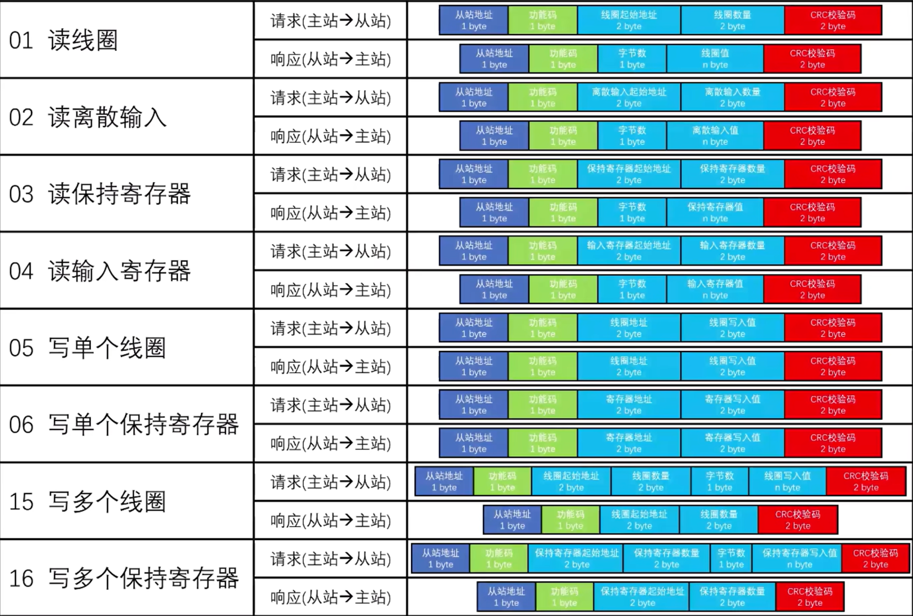
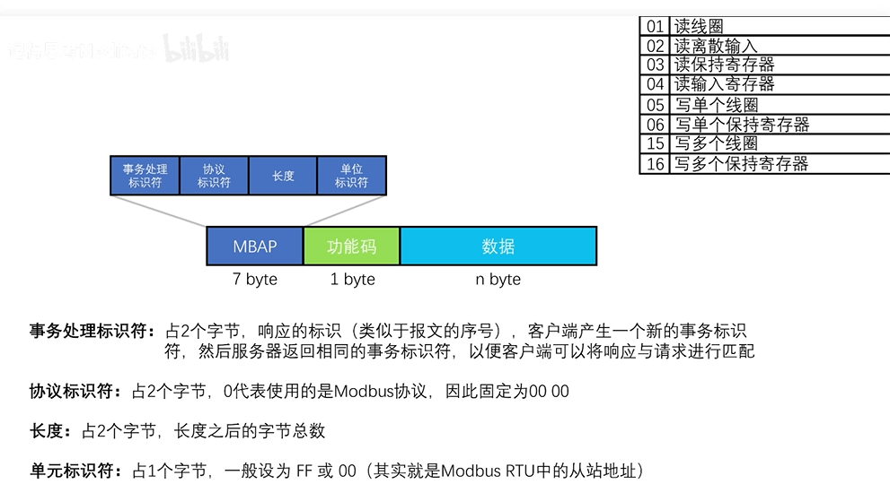

# ModBus rtu
>
>
- 线圈寄存器以位为单位
    - 线圈寄存器主要负责控制电机启停、灯的开关
- 离散寄存器也以位为单位（可写可读）
    - 离散输入寄存器的主要作用是检查开关是否被触发，故障信号输入等 (只读)
- 保持寄存器以半字(16位)为单位
    - 该寄存器的主要作用是设置目标参数，例如设定目标温度、设备运行参数等(可读可写)
- 输入寄存器以半字(16位)为单位
    - 输入寄存器的主要作用是读取各种传感器的值(只读)

>特殊的一点就是，写单个线圈寄存器，如果是1 写入值要写**FF00** 如果要改为0 写入值**0000**  (以上值为十六进制)
[教程连接](https://www.bilibili.com/video/BV1AaJ6zpEvR/?spm_id_from=333.337.search-card.all.click&vd_source=273e8027de9ebc54e86dafcb4ab3f434)

# ModBUS TCP

