# Shell脚本
## 结构
>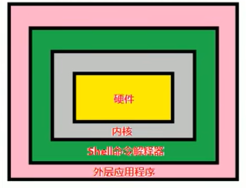
## 基础格式与执行方法
>
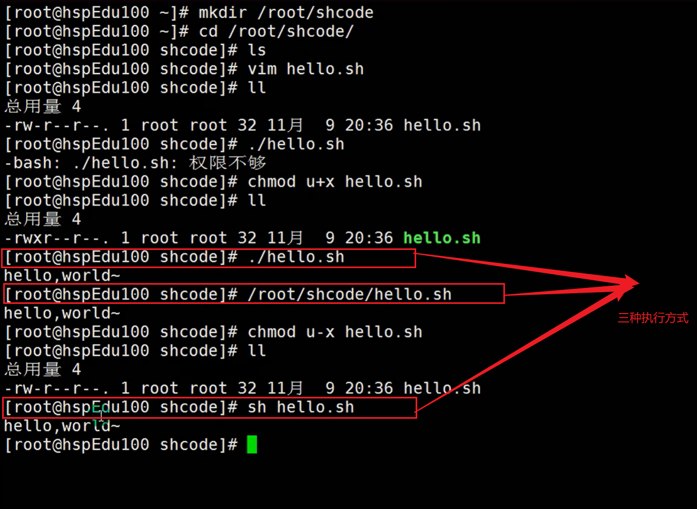

## Shell变量
### 普通变量
>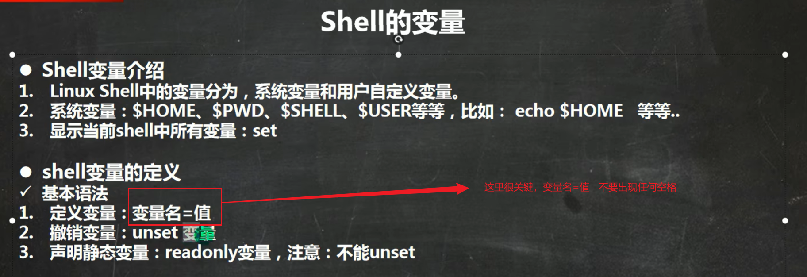
>>例子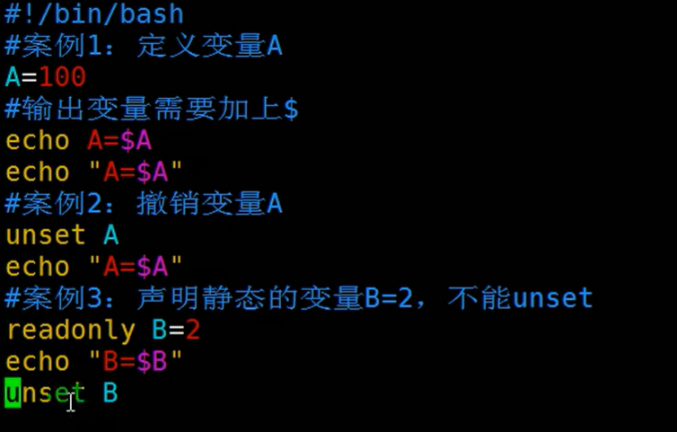
---
>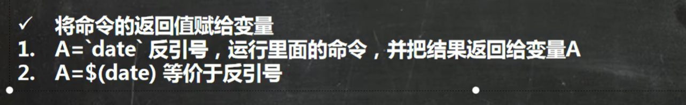
### 环境变量
>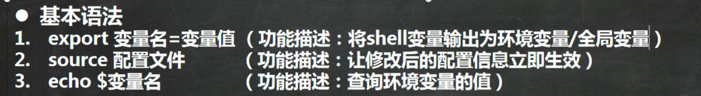
小知识：
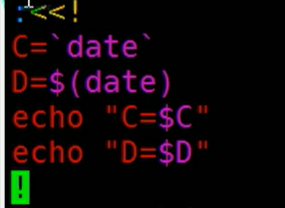
### 位置参数变量
>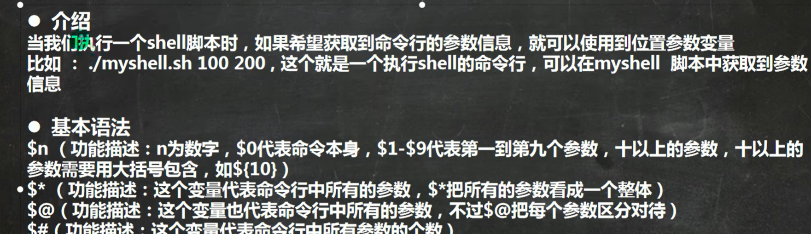
### 预定义变量
>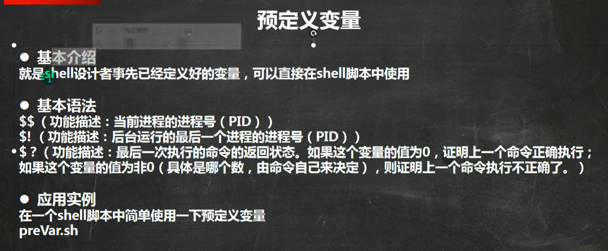

## Shell运算符
>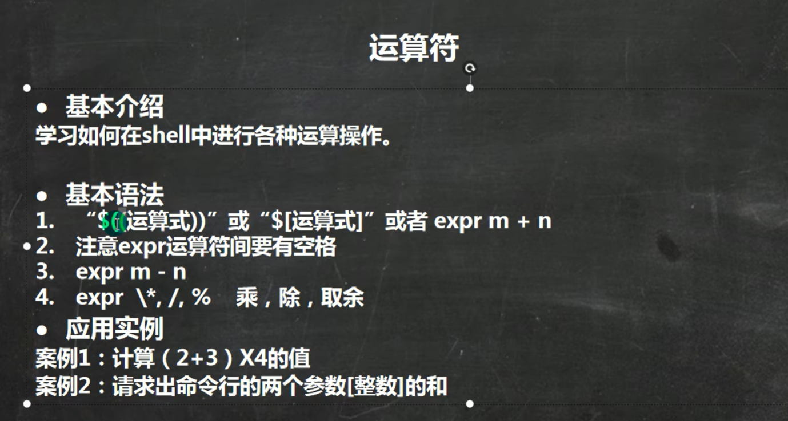
例子
>>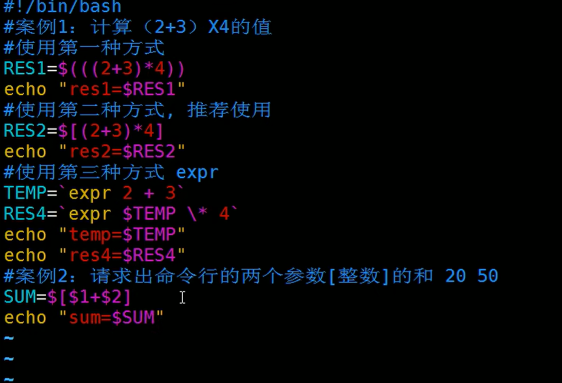
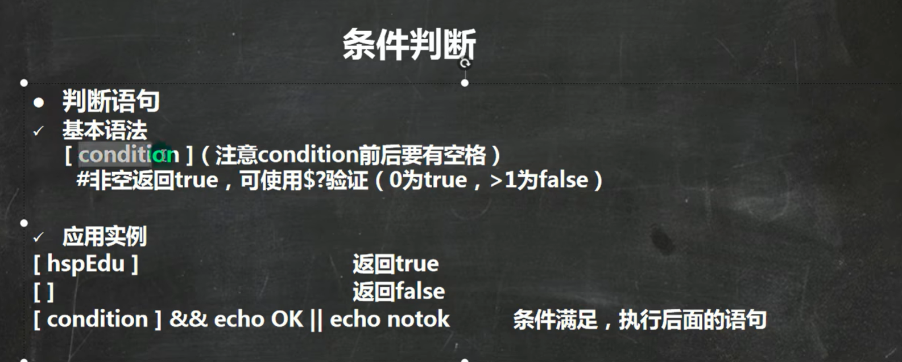

## Shell条件语句
>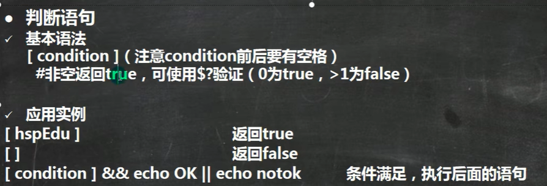
>>判断语句：
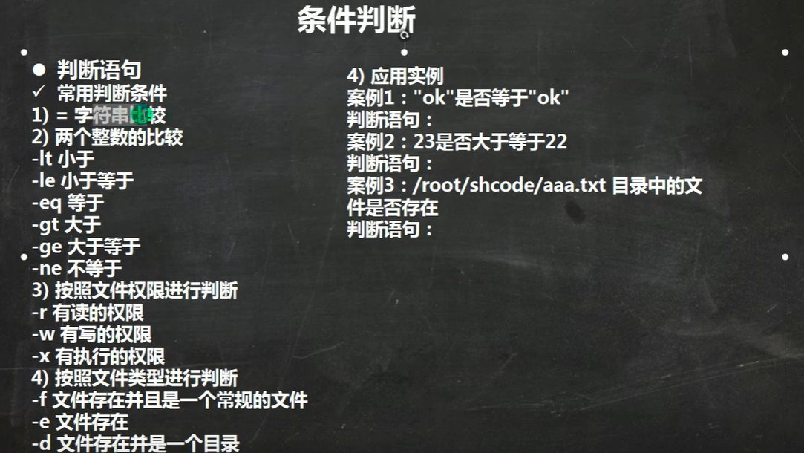

## 流程控制
### if语句
>
---
### case语句
>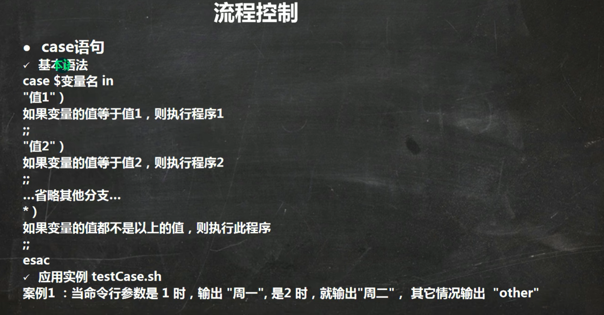
---
### for语句
>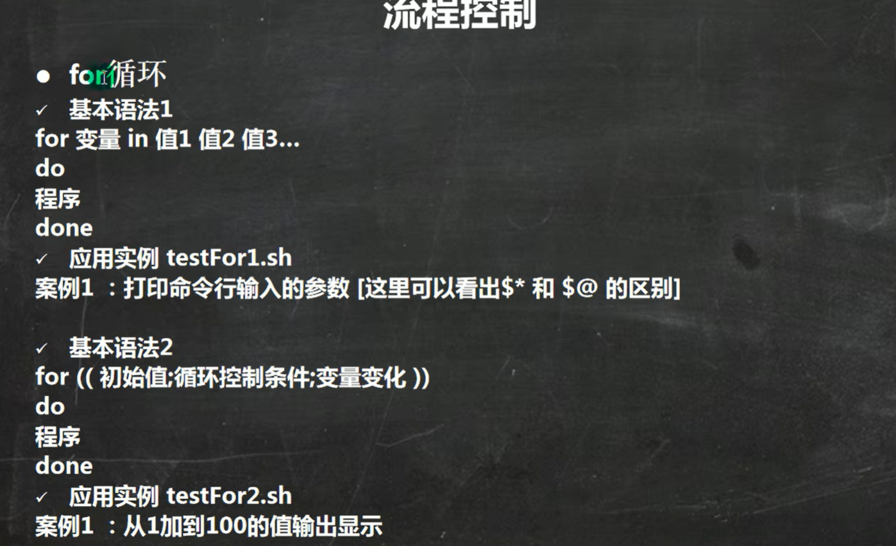
---
### while语句
>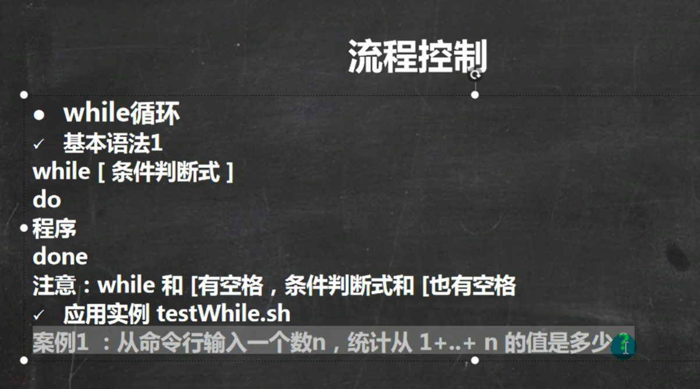

## read读取控制台输入
>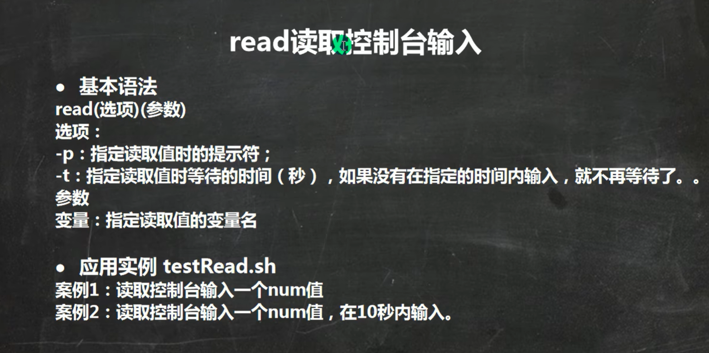
## 函数
### 系统函数
#### basename函数(返回路径中端，并可以去除后缀)
>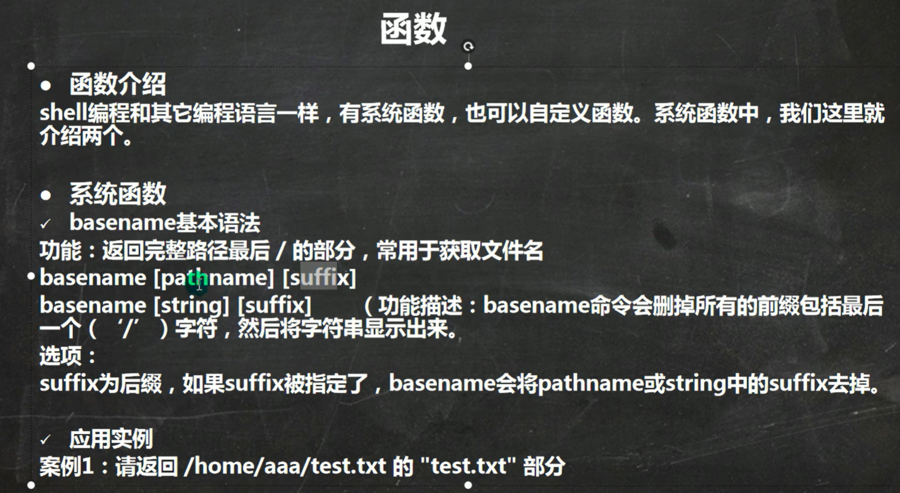
>>例子：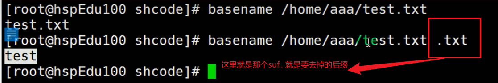
---
#### dirname函数(返回路径，无终端或者路径过程选项)
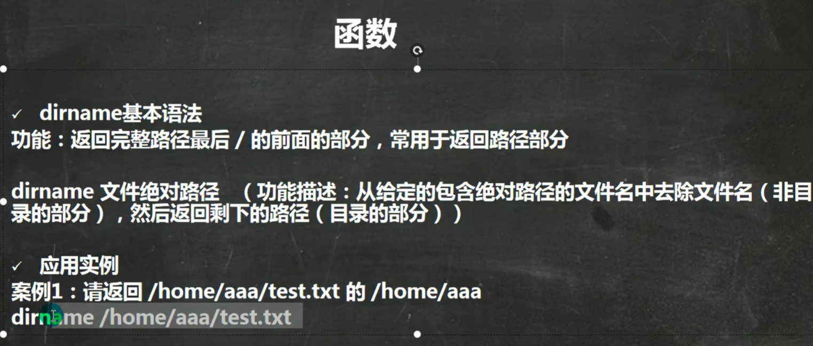
### 自定义函数
>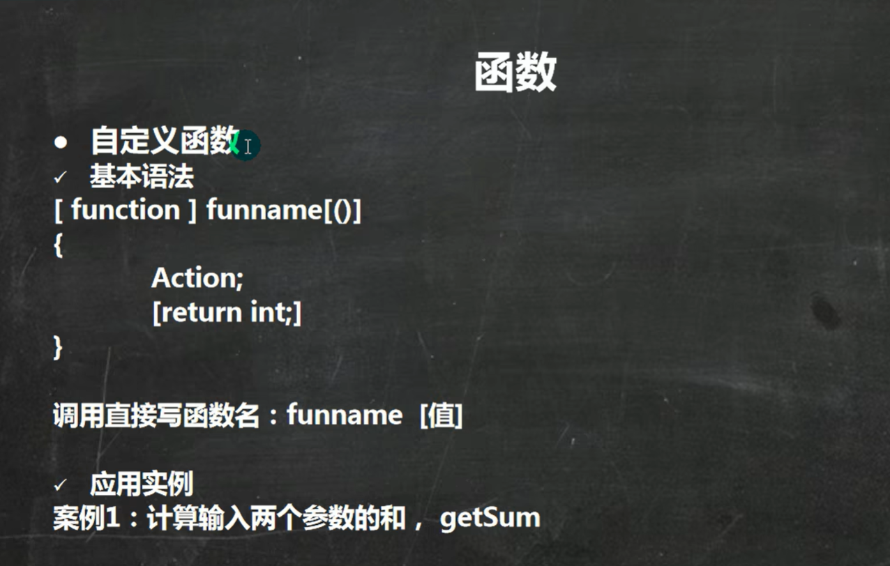
>>例子：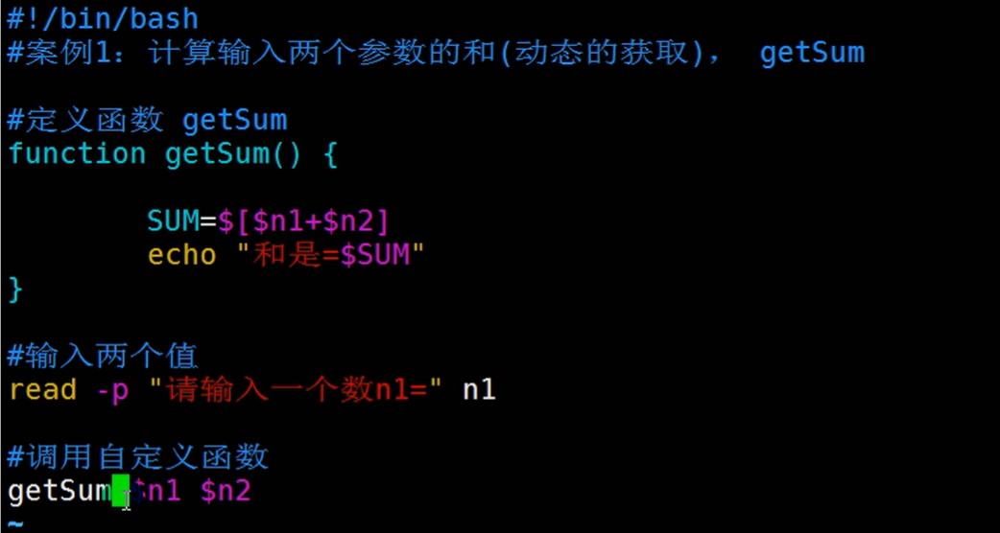

