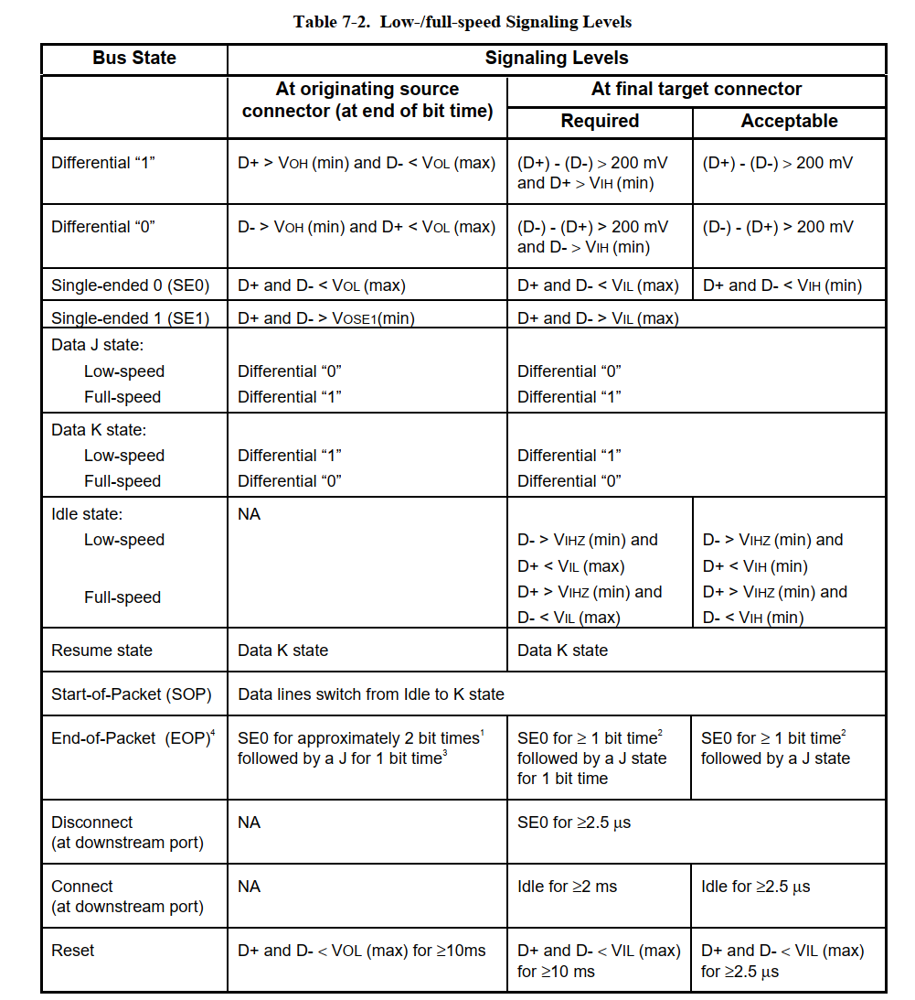
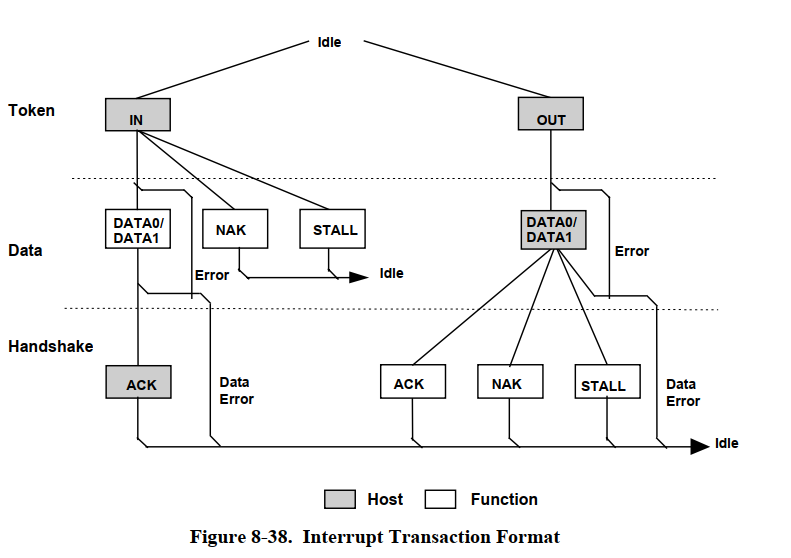
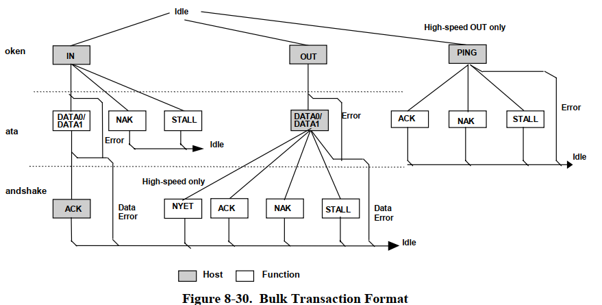
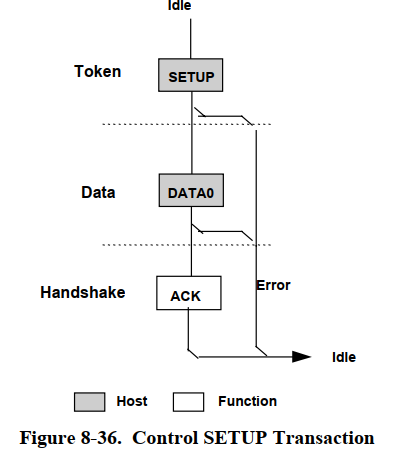
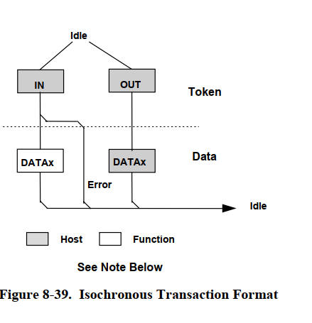

# 前言
- 我们讨论的是USB2.0
    - 这里不会涉及到太多详细位时序，以一个大观例子来看吧
    - 注意，USB协议是低位先行，所以说，正常的要“倒过来看”
    - USB协议采用NRZI编码方式
    - USB以对于D+和D-的上下拉达到一定的时长来判断设备类型（这个时间会长于正常通信里相同电平状态的保持时间，所以普通通信不会出现BUG） 同样的通信中出现和空闲状态一致的电平，因为没达到规定时长，不认为是真正的空闲状态。空闲状态电平由我们之前说的用于判断全/低速设备的上拉电阻和电源决定，所以表格里是NA (Not Applicable)
    - 一个包的各个组成部分的电气特性去看[表7.2<145页>](usb_20.pdf)
    - 几种传输的流程图(来自手册)
      - 中断传输 
      - 批量传输
      - 控制传输
      - 实时传输
# 正文(正文部分只做参考，我们主要讨论协议部分，直接参考手册即可)

## USB 2.0 全速键盘：从接入到拔出的完整逐位协议实例

> 性质：按 USB 2.0 与 HID 规则构造、可逐位复算的教学实例，不是某把商业键盘的实测抓包。设备描述符、主机枚举顺序、时间安排和按键动作均为本例明确设定。真实系统可选择不同请求顺序、地址、帧号，出现 NAK、重试或额外类请求。
>
> 范围：键盘直接接到**电脑根集线器（root hub）的一个下行端口**；主机控制器及root hub已经初始化，端口已供电。观察这一个端口到键盘的12 Mbit/s线段。root hub的连接状态读取、端口复位控制由主机控制器内部处理，不是这根线上额外发送给键盘的USB包。本例的40个SOF和全部请求、报告、ACK、NAK都在逐位附录列出，没有省略包。
>
> 若改接外置HUB，主机还要与外置HUB进行USB管理通信；若外置HUB上行是高速，还涉及高速SPLIT/事务转换器。那是另一种拓扑，不能把本例当成那条高速上行线的全部抓包。


### 1. 固定本例的设备，避免字段随意变化

| 项目 | 本例值 |
|---|---|
| 速度 | Full-speed，12 Mbit/s；一位时间 = 1/12 μs ≈ 83.333 ns |
| 观察线段 | 主机root hub的下行端口 ↔ 全速键盘；用 H 表示主机方向，K 表示键盘 |
| 默认控制端点 | EP0，最大数据字段 8 字节；控制管道支持 IN 和 OUT |
| 正常按键端点 | 端点地址 0x81：IN 方向、端点号 1；Interrupt，最大 8 字节，bInterval=1（每 1 ms 的服务周期） |
| 接入后的设备地址 | 复位后为 0；本例 SET_ADDRESS 分配为 5 |
| 配置 / 接口 | 配置值 1，接口号 0，备用设置 0；HID Boot Keyboard 接口 |
| VID / PID | 0x1234 / 0x5678，仅是本例占位数值，不对应本例声称实测的某款产品 |
| 字符串描述符 | iManufacturer、iProduct、iSerialNumber 均为 0，因此本例没有字符串读取请求 |
| 按键报告 | 8 字节，无 Report ID 字节；A 按下/松开、Caps Lock 按下/松开 |
| LED 输出 | 1 字节 Output report；用 EP0 的 SET_REPORT 点亮 Caps Lock LED，没有另设中断 OUT 端点 |
| 电源 | 总线供电，配置声明 100 mA；不声明 Remote Wakeup |
| 传输分支 | 成功传输，无 CRC 错误、丢 ACK、STALL、重试或挂起；没有新报告时返回 NAK |

**端点号在哪里？** SETUP/IN/OUT 令牌中的 ADDR 占 7 位，ENDP 占 4 位。DATA/ACK/NAK 不重复地址和端点号，而是属于前面的事务。EP0 控制请求与 EP1 按键报告的 DATA0/DATA1 状态互相独立。

### 2. 完整生命周期：非数据包事件也不能漏掉

以下时间是为了使实例唯一而选定的理想调度，不是实测延迟。t=0 为物理插入；对全速位流，整数 tick 的单位定义为一个位时间，即 1/12 μs。电缆模拟波形、边沿上升/下降时间和传播延迟不在本例的逐符号模型内。

| 相对时间 | 动作及线路状态 | 是否有键盘数据包 |
|---|---|---|
| t < 0 | 端口没有设备，HUB 的下拉使 D+/D− 均低（SE0） | 无 |
| 0 ms | 插入键盘，VBUS 给设备供电 | 无 |
| 0.500 ms | 键盘初始化到可连接状态，接通 D+ 上拉；线段变为 J，表明全速连接 | 无 |
| 0.600 ms | 本例 HUB 在持续 100 μs 的 Idle 后检测连接；位于允许的检测范围内 | 无；这是电气检测 |
| 2.000 ms | 本例主机通过控制器的root hub状态得知连接，开始至少100ms的软件连接防抖等待 | 控制器内部访问，不在线段上发包 |
| 2～102 ms | 等待连接稳定；下行端口尚未启用，键盘线段维持 J，不向它转发 SOF | 无 |
| 102～152 ms | root hub在线段上主动保持SE0共50ms，以满足根端口复位时长要求 | 不是一个“RESET 包”；不含 PID/CRC |
| 152 ms | 复位释放，回到 J；键盘进入 Default 状态，地址 0；端口启用 | 开始复位恢复期 |
| 152.100 ms 起 | 已启用端口开始发送每 1 ms 一个的 SOF | 附录逐个列出 SOF 帧号 0～39 |
| 152～162 ms | 至少 10 ms 复位恢复；本例此间只有 SOF，没有发给地址 0 的控制请求 | SOF 不是发给某地址/端点的请求 |
| 162.110 ms 起 | C01 开始枚举，后续请求见下一节 | 有 |
| C02 状态阶段完成后 | 地址 0→5；本例再等待超过 2 ms 才发送使用新地址的控制请求 | 不能在 C02 状态阶段提前用地址 5 |
| 169.110 ms 起 | C06 选择配置 1，使 EP1 可用；随后完成 HID 初始化 | 有 |
| 173.110 ms 起 | 每帧轮询 EP1；用户按键时收到报告，没有新报告时 NAK | 有 |
| 179 ms 附近 | 接收 Caps Lock 松开报告，并用 EP0 发送 LED 输出报告 0x02 | 有 |
| 191.700 ms | 拔出键盘，上拉从线段移除；HUB 下拉使线段进入 SE0 | 没有“拔出通知包” |
| 191.7025 ms 及以后 | root hub检测持续SE0，报告断开；主机取消传输并移除设备 | 通过控制器内部状态报告，本线段不再有键盘包 |

这里的 SOF 帧号 0 是假定主机全局 11 位帧计数器恰好取 0；**不是说端口复位会把主机 SOF 计数器清零**。本例下一帧本应在192.100ms到来，但设备此前已拔出并被检测，所以逐包记录止于帧39。

USB 2.0 §7.1.7.5规定一般端口复位驱动至少10ms，并对root port另有至少50ms的要求。本例选择根端口连续SE0 50ms；不能用表7-2的10ms概括所有根端口复位时长。

复位和拔出都能产生 SE0，区别包括驱动来源及端口状态：HUB 正主动执行 Reset 时，不把自己驱动的 SE0 当作设备拔出；HUB 未驱动时检测持续 SE0 才用于断开判断。

### 3. 设备实际返回的描述符字节

下列十六进制都是**字节值按传输先后列出**；每个字节内部在线上仍先发最低位。这里给出所有字节，后面的数据包会按 EP0=8 字节分片发送。

#### 3.1 设备描述符：18 字节

```text
12 01 00 02 00 00 00 08 34 12 78 56 00 01 00 00 00 01
```

| 偏移 | 字节 | 字段及解释 |
|---|---|---|
| 0 | 12 | bLength=18 |
| 1 | 01 | bDescriptorType=DEVICE |
| 2～3 | 00 02 | bcdUSB=0x0200；支持的规范版本不是当前线路速度 |
| 4～6 | 00 00 00 | 类/子类/协议在接口描述符中指定 |
| 7 | 08 | bMaxPacketSize0=8；主机首次读取前8字节就是为了获知它 |
| 8～9 | 34 12 | idVendor=0x1234 |
| 10～11 | 78 56 | idProduct=0x5678 |
| 12～13 | 00 01 | bcdDevice=0x0100 |
| 14～16 | 00 00 00 | 不提供厂商、产品、序列号字符串索引 |
| 17 | 01 | bNumConfigurations=1 |

#### 3.2 配置描述符集合：34 字节

```text
09 02 22 00 01 01 00 80 32
09 04 00 00 01 03 01 01 00
09 21 11 01 00 01 22 3F 00
07 05 81 03 08 00 01
```

| 子描述符 | 关键字段 |
|---|---|
| Configuration，9字节 | wTotalLength=0x0022=34；接口数1；配置值1；bmAttributes=0x80（总线供电）；bMaxPower=0x32，以2mA为单位，即100mA |
| Interface，9字节 | 接口0、备用0；bNumEndpoints=1（**不包括EP0**）；Class=0x03 HID，SubClass=1 Boot，Protocol=1 Keyboard |
| HID，9字节 | bcdHID=0x0111；国家码0；一个从属描述符；类型0x22 Report，长度0x003F=63 |
| Endpoint，7字节 | bEndpointAddress=0x81；bmAttributes=0x03中断；wMaxPacketSize=8；bInterval=1ms |

#### 3.3 HID 报告描述符：63 字节

```text
05 01 09 06 A1 01 05 07 19 E0 29 E7 15 00 25 01
75 01 95 08 81 02 95 01 75 08 81 01 95 05 75 01
05 08 19 01 29 05 91 02 95 01 75 03 91 01 95 06
75 08 15 00 25 65 05 07 19 00 29 65 81 00 C0
```

| 报告描述符偏移 | 字节 | 含义 |
|---|---|---|
| 0～5 | 05 01 09 06 A1 01 | Generic Desktop Usage Page，Keyboard Usage，Application Collection |
| 6～15 | 05 07 19 E0 29 E7 15 00 25 01 | Keyboard Usage Page；修饰键Usage E0～E7；逻辑值0/1 |
| 16～21 | 75 01 95 08 81 02 | 每项1bit，共8项；Input(Data,Variable,Absolute)，即第0字节的8个修饰键位 |
| 22～27 | 95 01 75 08 81 01 | 1项×8bit，常量输入，作为第1字节保留位 |
| 28～39 | 95 05 75 01 05 08 19 01 29 05 91 02 | 5项×1bit，LED Usage 1～5，Output(Data,Variable,Absolute) |
| 40～45 | 95 01 75 03 91 01 | 1项×3bit，常量输出，补足LED输出报告的1字节 |
| 46～61 | 95 06 75 08 15 00 25 65 05 07 19 00 29 65 81 00 | 6项×8bit的按键数组，Usage/逻辑范围0～0x65 |
| 62 | C0 | End Collection |

因此输入报告格式固定为：

```text
字节0：修饰键位图，bit0～7为左Ctrl、左Shift、左Alt、左GUI、右Ctrl、右Shift、右Alt、右GUI
字节1：保留，本例为00
字节2～7：最多6个当前按下的普通键Usage；00表示该槽没有键
```

本例没有 Report ID 项，因此输入报告前面**不额外增加编号字节**。Usage 0x04 是键盘 A 键，0x39 是 Caps Lock；它们不是 ASCII 码。设备报告按键状态，由主机决定字符和锁定状态。

LED 输出报告：bit0 Num Lock，bit1 Caps Lock，bit2 Scroll Lock，bit3 Compose，bit4 Kana；bit5～7为常量填充位。本例0x02只置bit1。这里的HID报告常量位是报告描述符定义的内容，**不是USB为了凑最大包长额外补的字节**。

### 4. 枚举请求：8字节SETUP内容如何解释

```text
偏移        0              1           2、3       4、5       6、7
字段   bmRequestType    bRequest       wValue     wIndex    wLength
宽度       8bit           8bit          16bit      16bit     16bit
```

- bmRequestType 的 bit7 是**数据阶段**方向；bit6:5 指定标准/类/厂商请求；bit4:0 指定设备/接口/端点等接收者。8字节建立请求本身始终由主机发送。
- bRequest 要结合请求类型解释。标准请求0x09是 SET_CONFIGURATION；HID类请求0x09是 SET_REPORT。
- wValue/wIndex 随请求改变含义；例如读取描述符时wValue高字节是类型、低字节是索引，而SET_ADDRESS的wValue是新地址。
- wLength 是这一次控制传输**数据阶段的总长度参数**，不包含建立阶段8字节，也不包含状态阶段。读取时为请求上限，实际返回还受可用数据量限制；并不是每包长度。
- 16位字段以低字节在前编码；USB线上每个普通数据字节内部再按低位先发送。CRC的两种算法表示方式见第7节。

下面所有控制请求都走EP0；C01/C02令牌的ADDR=0，其余ADDR=5；ENDP始终为0。

| 请求 | SOF帧 | 操作 | 建立阶段8字节（十六进制） | 数据阶段分包长度 | 包编号 |
|---|---:|---|---|---|---|
| C01 | 10 | 读取设备描述符前8字节 | `80 06 00 01 00 00 08 00` | 8 | P012～P020 |
| C02 | 11 | 设置地址为5 | `00 05 05 00 00 00 00 00` | 无 | P022～P027 |
| C03 | 14 | 读取完整设备描述符 | `80 06 00 01 00 00 12 00` | 8 + 8 + 2 | P031～P045 |
| C04 | 15 | 读取配置描述符前9字节 | `80 06 00 02 00 00 09 00` | 8 + 1 | P047～P058 |
| C05 | 16 | 读取完整配置描述符集合 | `80 06 00 02 00 00 22 00` | 8 + 8 + 8 + 8 + 2 | P060～P080 |
| C06 | 17 | 选择配置1 | `00 09 01 00 00 00 00 00` | 无 | P082～P087 |
| C07 | 18 | 读取HID报告描述符 | `81 06 00 22 00 00 3F 00` | 8 + 8 + 8 + 8 + 8 + 8 + 8 + 7 | P089～P118 |
| C08 | 19 | SET_IDLE：仅报告变化 | `21 0A 00 00 00 00 00 00` | 无 | P120～P125 |
| C09 | 20 | SET_PROTOCOL：Report协议 | `21 0B 01 00 00 00 00 00` | 无 | P127～P132 |
| C10 | 27 | SET_REPORT：点亮Caps Lock LED | `21 09 00 02 00 00 01 00` | 1 | P158～P166 |

逐条解释容易误读的字段：

| 请求 | bmRequestType / bRequest | wValue | wIndex | wLength |
|---|---|---|---|---|
| C01 | 80 / 06：设备→主机、标准、设备接收者，GET_DESCRIPTOR | 0100：DEVICE类型1，索引0 | 0 | 8 |
| C02 | 00 / 05：标准SET_ADDRESS | 0005：新地址5 | 0 | 0 |
| C03 | 80 / 06：GET_DESCRIPTOR | 0100：DEVICE | 0 | 18 |
| C04 | 80 / 06：GET_DESCRIPTOR | 0200：CONFIGURATION类型2，索引0 | 0 | 9 |
| C05 | 80 / 06：GET_DESCRIPTOR | 0200：CONFIGURATION | 0 | 34，由C04读到的wTotalLength获知 |
| C06 | 00 / 09：标准SET_CONFIGURATION | 0001：配置值1，不是配置索引 | 0 | 0 |
| C07 | 81 / 06：设备→主机、标准、接口接收者，GET_DESCRIPTOR | 2200：REPORT类型0x22，索引0 | 0：接口0 | 63，由HID描述符获知 |
| C08 | 21 / 0A：主机→设备、类请求、接口接收者，SET_IDLE | 高字节0：不定时重复未变化报告；低字节0：作用于报告ID0/本例无编号报告 | 0：接口0 | 0 |
| C09 | 21 / 0B：HID SET_PROTOCOL | 0001：Report protocol；0000才是Boot protocol | 0：接口0 | 0 |
| C10 | 21 / 09：HID SET_REPORT | 0200：Output报告类型2，Report ID0 | 0：接口0 | 1：数据阶段只发一个字节02 |

C08不会停止主机发IN轮询；它让设备对没有变化的报告不按Idle计时器重复发送。因此本例空轮询返回NAK。

C09虽选择Report protocol，但本例报告描述符本身采用8字节键盘输入格式，外观看起来与Boot键盘报告相同。**“8字节”由此报告格式决定，不是所有全速USB键盘都必须只有8字节。**

### 5. 三种控制传输，在本例中分别怎样走

#### 5.1 控制读取：C03读取18字节设备描述符

```text
建立阶段：H→K SETUP(ADDR5,EP0)；H→K DATA0(8字节请求)；K→H ACK
数据阶段：H→K IN(ADDR5,EP0)；K→H DATA1(描述符字节0～7)；H→K ACK
          H→K IN(ADDR5,EP0)；K→H DATA0(描述符字节8～15)；H→K ACK
          H→K IN(ADDR5,EP0)；K→H DATA1(描述符字节16～17)；H→K ACK
状态阶段：H→K OUT(ADDR5,EP0)；H→K DATA1(0字节)；K→H ACK
```

最后一个数据阶段包只有2字节数据，随后直接跟2字节CRC，不补成8字节。每个数据包前面均有主机的IN令牌，不会让设备未经IN就连续发送三个数据包。

#### 5.2 无数据阶段：C02设置地址为5

```text
建立阶段：H→K SETUP(ADDR0,EP0)；H→K DATA0(00 05 05 00 00 00 00 00)；K→H ACK
数据阶段：无。新地址已写在wValue中，wLength=0。
状态阶段：H→K IN(ADDR0,EP0)；K→H DATA1(0字节)；H→K ACK
状态完成：设备启用ADDR5；主机给它至少2ms地址设置恢复时间。
```

“无数据阶段”不等于“没有DATA包”。建立阶段仍有8字节DATA0，状态阶段仍有零长度DATA1。

#### 5.3 控制写入：C10点亮Caps Lock LED

```text
建立阶段：H→K SETUP(ADDR5,EP0)；H→K DATA0(21 09 00 02 00 00 01 00)；K→H ACK
数据阶段：H→K OUT(ADDR5,EP0)；H→K DATA1(02)；K→H ACK
状态阶段：H→K IN(ADDR5,EP0)；K→H DATA1(0字节)；H→K ACK
```

这里数据阶段与状态阶段相邻的数据包都叫DATA1，是正确的：**状态阶段固定使用DATA1**，不是把全部USB数据包放在一起机械交替。每个新SETUP都重置EP0本次控制传输的序列；数据阶段从DATA1开始交替。

### 6. 配置后的按键、NAK和LED

SET_CONFIGURATION使本例EP1的第一次数据发送从DATA0开始。NAK不推进DATA0/DATA1；成功报告后才切换。主机轮询是IN令牌，不是SOF；SOF提供帧时基，并不包含地址/端点。

| 帧 | 用户/设备状态 | EP1返回 | 输入报告字节 | 包编号 |
|---:|---|---|---|---|
| 21 | 没有待发送的新报告 | NAK | 无DATA包 | P134～P135 |
| 22 | 按下 A | DATA0 | `00 00 04 00 00 00 00 00` | P137～P139 |
| 23 | 没有待发送的新报告 | NAK | 无DATA包 | P141～P142 |
| 24 | 松开 A | DATA1 | `00 00 00 00 00 00 00 00` | P144～P146 |
| 25 | 没有待发送的新报告 | NAK | 无DATA包 | P148～P149 |
| 26 | 按下 Caps Lock | DATA0 | `00 00 39 00 00 00 00 00` | P151～P153 |
| 27 | 松开 Caps Lock | DATA1 | `00 00 00 00 00 00 00 00` | P155～P157 |
| 28 | 没有待发送的新报告 | NAK | 无DATA包 | P168～P169 |
| 29 | 没有待发送的新报告 | NAK | 无DATA包 | P171～P172 |
| 30 | 没有待发送的新报告 | NAK | 无DATA包 | P174～P175 |
| 31 | 没有待发送的新报告 | NAK | 无DATA包 | P177～P178 |
| 32 | 没有待发送的新报告 | NAK | 无DATA包 | P180～P181 |
| 33 | 没有待发送的新报告 | NAK | 无DATA包 | P183～P184 |
| 34 | 没有待发送的新报告 | NAK | 无DATA包 | P186～P187 |
| 35 | 没有待发送的新报告 | NAK | 无DATA包 | P189～P190 |
| 36 | 没有待发送的新报告 | NAK | 无DATA包 | P192～P193 |
| 37 | 没有待发送的新报告 | NAK | 无DATA包 | P195～P196 |
| 38 | 没有待发送的新报告 | NAK | 无DATA包 | P198～P199 |
| 39 | 没有待发送的新报告 | NAK | 无DATA包 | P201～P202 |

收到NAK时，本次IN事务直接结束，主机**不会再给NAK回复ACK**。松开按键则发送全零的8字节报告；它与NAK不同：前者是“现在没有任何键按下”的新状态，后者是“当前没有待发送的新报告”。

本例Caps Lock初始关闭；主机收到Caps Lock按下报告后改变锁定状态，并在帧27通过C10发送Output report 02。真实操作系统选择哪一帧发送LED请求属于主机调度，不由USB固定。

### 7. 把字节变成线上每一个bit

#### 7.1 本例用到的PID

| 包类型 | PID字节 | 线上位序（左边先发） |
|---|---|---|
| SETUP | 2D | 10110100 |
| IN | 69 | 10010110 |
| OUT | E1 | 10000111 |
| SOF | A5 | 10100101 |
| DATA0 | C3 | 11000011 |
| DATA1 | 4B | 11010010 |
| ACK | D2 | 01001011 |
| NAK | 5A | 01011010 |

PID低4位为包类型，高4位是其逐位取反。PID不进入后面的CRC；握手包没有CRC字段。

#### 7.2 CRC的计算范围和记法

| 包类型 | 参与CRC的数据 | 多项式 |
|---|---|---|
| SETUP/IN/OUT | ADDR的7位 + ENDP的4位，按实际发送顺序 | CRC5：x⁵+x²+1 |
| SOF | FrameNumber的11位 | 同一CRC5 |
| DATA0/DATA1 | 数据字段本身，可为0字节；不含PID/SYNC/填充位 | CRC16：x¹⁶+x¹⁵+x²+1 |

CRC寄存器初值全1，结果取反。**本笔记的CRC十六进制数值采用右移反射算法表示**：CRC5反馈常数0x14，CRC16反馈常数0xA001；按所列数值低位先发即可获得附录里的CRC位串。

USB规范§8.3.5用的是另一种等价描述：左移寄存器、多项式0x05/0x8005，并把最终寄存器取反后按MSB先发。两种算法的寄存器数值互为位反转，**最终发出的CRC位串完全相同**。不能把反射算法结果又按MSB先发。

例如C02的8字节请求 `00 05 05 00 00 00 00 00`：

```text
反射CRC16数值：A1EA
CRC在数据后面的字节值：EA A1
CRC线上位串：01010111 10000101
规范左移算法取反后的数值：5785，其MSB先发同样是0101011110000101
```

空数据CRC16为0000，因此零长度DATA1包仍含PID、16位CRC、SYNC和EOP。

#### 7.3 位填充和NRZI

1. 先形成 `SYNC + PID + 各字段 + CRC` 的逻辑位流L。全速SYNC是 `00000001`，线上NRZI状态为 `KJKJKJKK`。
2. 从SYNC起统计连续1，连续6个1后插入一个0，得到W；即使这6个1正好结束于CRC末尾，仍要插0。
3. 从包前Idle=J开始，对W编码：逻辑0翻转J/K，逻辑1保持，得到线路符号串S。
4. 最后附加EOP：`[SE0][SE0][J]`，每个方括号代表一个位时间。这三个位时间不作为普通0/1输入NRZI。

全速 J：D+高、D−低；K：D+低、D−高；SE0：两线同时低。位填充只改变线上长度，不改变数据字节数，也不参与CRC计算。

#### 7.4 实际包长由EOP确定，不靠填充到8字节

接收端识别EOP并完成去位填充后，DATA包的PID之后最后16位为CRC，其前面的整数字节才是数据。硬件可保留最近两字节或使用CRC余数检查，不需要提前知道CRC边界。

```text
2字节数据包：SYNC | PID | 2字节数据 | 2字节CRC | EOP
8字节数据包：SYNC | PID | 8字节数据 | 2字节CRC | EOP
零长度数据包：SYNC | PID | 2字节CRC | EOP
```

除最后一包外，控制数据阶段按最大包长8字节发送。读取达到wLength或收到短包即完成数据阶段；若实际数据短于wLength且恰好为8的整数倍，还需数据阶段零长度包终止。本例各次读取都恰好请求已有长度，所以没有这种额外的数据阶段零长度包；附录的零长度DATA1均标明为状态阶段。

### 8. 逐包全集的阅读规则

附录中的每个P编号就是一个完整USB包，不是一个事务，更不是一次控制传输。

- `协议字节`：不含SYNC/EOP，且尚未插入填充位。令牌的ADDR+ENDP+CRC共16位也按连续8位打包成两个显示字节。
- 字段表中的位串全部**左边先发送**；DATA按字节分组只是排版。空DATA字段不占任何位。
- `L`：含SYNC，未做位填充的全包逻辑位串。
- `W`：含SYNC，完成位填充、尚未NRZI编码的位串。
- `S`：W经NRZI编码后D+/D−对应的J/K符号；随后明确列出EOP的三个符号。
- 插入位位置从W的第一位开始，以1为起点编号，包括SYNC；空格和换行都不占位。
- 包时长为 `len(W)+3` 个tick，包括EOP的J一位，不包括包间空闲。
- 包开始tick以t=0为原点；tick/12000即毫秒，是本例时间的精确表达。显示到小数点后6位的毫秒数只是方便阅读。
- 每帧SOF起点相差12000tick。帧内第一个事务安排在SOF起点后120tick（10μs）；同一帧连续包之间留3tick空闲J。包间J时间=后一包开始tick−前一包结束tick，因此帧内及跨帧空闲均可精确重建。
- 附录S中的最后 `[J]` 是EOP的一部分；之后的包间Idle为J但属于另外的时间段。没有包的恢复帧也保留其SOF。

以下全集只固定一条无错误成功路径。真实抓包若遇到NAK、丢包或重试，包数与时刻会变化；不能拿这里的P编号当USB规定的固定编号。

#### 8.1 每帧的事务索引

| 帧号 | SOF起始时间（ms） | 帧内内容 | 包编号 |
|---:|---:|---|---|
| 0 | 152.100 | SOF；其余为Idle | P001～P001 |
| 1 | 153.100 | SOF；其余为Idle | P002～P002 |
| 2 | 154.100 | SOF；其余为Idle | P003～P003 |
| 3 | 155.100 | SOF；其余为Idle | P004～P004 |
| 4 | 156.100 | SOF；其余为Idle | P005～P005 |
| 5 | 157.100 | SOF；其余为Idle | P006～P006 |
| 6 | 158.100 | SOF；其余为Idle | P007～P007 |
| 7 | 159.100 | SOF；其余为Idle | P008～P008 |
| 8 | 160.100 | SOF；其余为Idle | P009～P009 |
| 9 | 161.100 | SOF；其余为Idle | P010～P010 |
| 10 | 162.100 | SOF；C01 读取设备描述符前8字节 | P011～P020 |
| 11 | 163.100 | SOF；C02 设置地址为5 | P021～P027 |
| 12 | 164.100 | SOF；其余为Idle | P028～P028 |
| 13 | 165.100 | SOF；其余为Idle | P029～P029 |
| 14 | 166.100 | SOF；C03 读取完整设备描述符 | P030～P045 |
| 15 | 167.100 | SOF；C04 读取配置描述符前9字节 | P046～P058 |
| 16 | 168.100 | SOF；C05 读取完整配置描述符集合 | P059～P080 |
| 17 | 169.100 | SOF；C06 选择配置1 | P081～P087 |
| 18 | 170.100 | SOF；C07 读取HID报告描述符 | P088～P118 |
| 19 | 171.100 | SOF；C08 SET_IDLE：仅报告变化 | P119～P125 |
| 20 | 172.100 | SOF；C09 SET_PROTOCOL：Report协议 | P126～P132 |
| 21 | 173.100 | SOF；EP1轮询：没有待发送的新报告 | P133～P135 |
| 22 | 174.100 | SOF；EP1轮询：按下 A | P136～P139 |
| 23 | 175.100 | SOF；EP1轮询：没有待发送的新报告 | P140～P142 |
| 24 | 176.100 | SOF；EP1轮询：松开 A | P143～P146 |
| 25 | 177.100 | SOF；EP1轮询：没有待发送的新报告 | P147～P149 |
| 26 | 178.100 | SOF；EP1轮询：按下 Caps Lock | P150～P153 |
| 27 | 179.100 | SOF；C10 SET_REPORT：点亮Caps Lock LED；EP1轮询：松开 Caps Lock | P154～P166 |
| 28 | 180.100 | SOF；EP1轮询：没有待发送的新报告 | P167～P169 |
| 29 | 181.100 | SOF；EP1轮询：没有待发送的新报告 | P170～P172 |
| 30 | 182.100 | SOF；EP1轮询：没有待发送的新报告 | P173～P175 |
| 31 | 183.100 | SOF；EP1轮询：没有待发送的新报告 | P176～P178 |
| 32 | 184.100 | SOF；EP1轮询：没有待发送的新报告 | P179～P181 |
| 33 | 185.100 | SOF；EP1轮询：没有待发送的新报告 | P182～P184 |
| 34 | 186.100 | SOF；EP1轮询：没有待发送的新报告 | P185～P187 |
| 35 | 187.100 | SOF；EP1轮询：没有待发送的新报告 | P188～P190 |
| 36 | 188.100 | SOF；EP1轮询：没有待发送的新报告 | P191～P193 |
| 37 | 189.100 | SOF；EP1轮询：没有待发送的新报告 | P194～P196 |
| 38 | 190.100 | SOF；EP1轮询：没有待发送的新报告 | P197～P199 |
| 39 | 191.100 | SOF；EP1轮询：没有待发送的新报告 | P200～P202 |

#### 8.2 全部数据包，含CRC、填充与线路符号

##### P001 · 帧0 · H→K · SOF · 帧 0 开始

开始 `tick=1825200`（`t=152.100000 ms`）；结束 `tick=1825235`；含EOP共 **35 bit time**。

协议字节（不含SYNC/EOP，去位填充）：`A5 00 10`。

| 字段 | 数值/内容 | 实际发送位序 |
|---|---|---|
| SYNC | 0x80（按字节记法） | `00000001` |
| PID | SOF = 0xA5 | `10100101` |
| FrameNumber | 0 | `00000000000` |
| CRC5 | 反射表示 0x02 | `01000` |

位填充：无。L=32位，W=32位。

```text

L:

00000001101001010000000000001000

W:

00000001101001010000000000001000

S:

KJKJKJKKKJJKJJKKJKJKJKJKJKJKKJKJ

EOP（接在S后）：[SE0][SE0][J]

```

##### P002 · 帧1 · H→K · SOF · 帧 1 开始

开始 `tick=1837200`（`t=153.100000 ms`）；结束 `tick=1837235`；含EOP共 **35 bit time**。

协议字节（不含SYNC/EOP，去位填充）：`A5 01 E8`。

| 字段 | 数值/内容 | 实际发送位序 |
|---|---|---|
| SYNC | 0x80（按字节记法） | `00000001` |
| PID | SOF = 0xA5 | `10100101` |
| FrameNumber | 1 | `10000000000` |
| CRC5 | 反射表示 0x1D | `10111` |

位填充：无。L=32位，W=32位。

```text

L:

00000001101001011000000000010111

W:

00000001101001011000000000010111

S:

KJKJKJKKKJJKJJKKKJKJKJKJKJKKJJJJ

EOP（接在S后）：[SE0][SE0][J]

```

##### P003 · 帧2 · H→K · SOF · 帧 2 开始

开始 `tick=1849200`（`t=154.100000 ms`）；结束 `tick=1849235`；含EOP共 **35 bit time**。

协议字节（不含SYNC/EOP，去位填充）：`A5 02 A8`。

| 字段 | 数值/内容 | 实际发送位序 |
|---|---|---|
| SYNC | 0x80（按字节记法） | `00000001` |
| PID | SOF = 0xA5 | `10100101` |
| FrameNumber | 2 | `01000000000` |
| CRC5 | 反射表示 0x15 | `10101` |

位填充：无。L=32位，W=32位。

```text

L:

00000001101001010100000000010101

W:

00000001101001010100000000010101

S:

KJKJKJKKKJJKJJKKJJKJKJKJKJKKJJKK

EOP（接在S后）：[SE0][SE0][J]

```

##### P004 · 帧3 · H→K · SOF · 帧 3 开始

开始 `tick=1861200`（`t=155.100000 ms`）；结束 `tick=1861235`；含EOP共 **35 bit time**。

协议字节（不含SYNC/EOP，去位填充）：`A5 03 50`。

| 字段 | 数值/内容 | 实际发送位序 |
|---|---|---|
| SYNC | 0x80（按字节记法） | `00000001` |
| PID | SOF = 0xA5 | `10100101` |
| FrameNumber | 3 | `11000000000` |
| CRC5 | 反射表示 0x0A | `01010` |

位填充：无。L=32位，W=32位。

```text

L:

00000001101001011100000000001010

W:

00000001101001011100000000001010

S:

KJKJKJKKKJJKJJKKKKJKJKJKJKJKKJJK

EOP（接在S后）：[SE0][SE0][J]

```

##### P005 · 帧4 · H→K · SOF · 帧 4 开始

开始 `tick=1873200`（`t=156.100000 ms`）；结束 `tick=1873235`；含EOP共 **35 bit time**。

协议字节（不含SYNC/EOP，去位填充）：`A5 04 28`。

| 字段 | 数值/内容 | 实际发送位序 |
|---|---|---|
| SYNC | 0x80（按字节记法） | `00000001` |
| PID | SOF = 0xA5 | `10100101` |
| FrameNumber | 4 | `00100000000` |
| CRC5 | 反射表示 0x05 | `10100` |

位填充：无。L=32位，W=32位。

```text

L:

00000001101001010010000000010100

W:

00000001101001010010000000010100

S:

KJKJKJKKKJJKJJKKJKKJKJKJKJKKJJKJ

EOP（接在S后）：[SE0][SE0][J]

```

##### P006 · 帧5 · H→K · SOF · 帧 5 开始

开始 `tick=1885200`（`t=157.100000 ms`）；结束 `tick=1885235`；含EOP共 **35 bit time**。

协议字节（不含SYNC/EOP，去位填充）：`A5 05 D0`。

| 字段 | 数值/内容 | 实际发送位序 |
|---|---|---|
| SYNC | 0x80（按字节记法） | `00000001` |
| PID | SOF = 0xA5 | `10100101` |
| FrameNumber | 5 | `10100000000` |
| CRC5 | 反射表示 0x1A | `01011` |

位填充：无。L=32位，W=32位。

```text

L:

00000001101001011010000000001011

W:

00000001101001011010000000001011

S:

KJKJKJKKKJJKJJKKKJJKJKJKJKJKKJJJ

EOP（接在S后）：[SE0][SE0][J]

```

##### P007 · 帧6 · H→K · SOF · 帧 6 开始

开始 `tick=1897200`（`t=158.100000 ms`）；结束 `tick=1897235`；含EOP共 **35 bit time**。

协议字节（不含SYNC/EOP，去位填充）：`A5 06 90`。

| 字段 | 数值/内容 | 实际发送位序 |
|---|---|---|
| SYNC | 0x80（按字节记法） | `00000001` |
| PID | SOF = 0xA5 | `10100101` |
| FrameNumber | 6 | `01100000000` |
| CRC5 | 反射表示 0x12 | `01001` |

位填充：无。L=32位，W=32位。

```text

L:

00000001101001010110000000001001

W:

00000001101001010110000000001001

S:

KJKJKJKKKJJKJJKKJJJKJKJKJKJKKJKK

EOP（接在S后）：[SE0][SE0][J]

```

##### P008 · 帧7 · H→K · SOF · 帧 7 开始

开始 `tick=1909200`（`t=159.100000 ms`）；结束 `tick=1909235`；含EOP共 **35 bit time**。

协议字节（不含SYNC/EOP，去位填充）：`A5 07 68`。

| 字段 | 数值/内容 | 实际发送位序 |
|---|---|---|
| SYNC | 0x80（按字节记法） | `00000001` |
| PID | SOF = 0xA5 | `10100101` |
| FrameNumber | 7 | `11100000000` |
| CRC5 | 反射表示 0x0D | `10110` |

位填充：无。L=32位，W=32位。

```text

L:

00000001101001011110000000010110

W:

00000001101001011110000000010110

S:

KJKJKJKKKJJKJJKKKKKJKJKJKJKKJJJK

EOP（接在S后）：[SE0][SE0][J]

```

##### P009 · 帧8 · H→K · SOF · 帧 8 开始

开始 `tick=1921200`（`t=160.100000 ms`）；结束 `tick=1921235`；含EOP共 **35 bit time**。

协议字节（不含SYNC/EOP，去位填充）：`A5 08 60`。

| 字段 | 数值/内容 | 实际发送位序 |
|---|---|---|
| SYNC | 0x80（按字节记法） | `00000001` |
| PID | SOF = 0xA5 | `10100101` |
| FrameNumber | 8 | `00010000000` |
| CRC5 | 反射表示 0x0C | `00110` |

位填充：无。L=32位，W=32位。

```text

L:

00000001101001010001000000000110

W:

00000001101001010001000000000110

S:

KJKJKJKKKJJKJJKKJKJJKJKJKJKJKKKJ

EOP（接在S后）：[SE0][SE0][J]

```

##### P010 · 帧9 · H→K · SOF · 帧 9 开始

开始 `tick=1933200`（`t=161.100000 ms`）；结束 `tick=1933235`；含EOP共 **35 bit time**。

协议字节（不含SYNC/EOP，去位填充）：`A5 09 98`。

| 字段 | 数值/内容 | 实际发送位序 |
|---|---|---|
| SYNC | 0x80（按字节记法） | `00000001` |
| PID | SOF = 0xA5 | `10100101` |
| FrameNumber | 9 | `10010000000` |
| CRC5 | 反射表示 0x13 | `11001` |

位填充：无。L=32位，W=32位。

```text

L:

00000001101001011001000000011001

W:

00000001101001011001000000011001

S:

KJKJKJKKKJJKJJKKKJKKJKJKJKJJJKJJ

EOP（接在S后）：[SE0][SE0][J]

```

##### P011 · 帧10 · H→K · SOF · 帧 10 开始

开始 `tick=1945200`（`t=162.100000 ms`）；结束 `tick=1945235`；含EOP共 **35 bit time**。

协议字节（不含SYNC/EOP，去位填充）：`A5 0A D8`。

| 字段 | 数值/内容 | 实际发送位序 |
|---|---|---|
| SYNC | 0x80（按字节记法） | `00000001` |
| PID | SOF = 0xA5 | `10100101` |
| FrameNumber | 10 | `01010000000` |
| CRC5 | 反射表示 0x1B | `11011` |

位填充：无。L=32位，W=32位。

```text

L:

00000001101001010101000000011011

W:

00000001101001010101000000011011

S:

KJKJKJKKKJJKJJKKJJKKJKJKJKJJJKKK

EOP（接在S后）：[SE0][SE0][J]

```

##### P012 · 帧10 · H→K · SETUP · C01 建立：读取设备描述符前8字节

开始 `tick=1945320`（`t=162.110000 ms`）；结束 `tick=1945355`；含EOP共 **35 bit time**。

协议字节（不含SYNC/EOP，去位填充）：`2D 00 10`。

| 字段 | 数值/内容 | 实际发送位序 |
|---|---|---|
| SYNC | 0x80（按字节记法） | `00000001` |
| PID | SETUP = 0x2D | `10110100` |
| ADDR | 0 | `0000000` |
| ENDP | 0 | `0000` |
| CRC5 | 反射表示 0x02 | `01000` |

位填充：无。L=32位，W=32位。

```text

L:

00000001101101000000000000001000

W:

00000001101101000000000000001000

S:

KJKJKJKKKJJJKKJKJKJKJKJKJKJKKJKJ

EOP（接在S后）：[SE0][SE0][J]

```

##### P013 · 帧10 · H→K · DATA0 · C01 建立：8字节请求

开始 `tick=1945358`（`t=162.113167 ms`）；结束 `tick=1945457`；含EOP共 **99 bit time**。

协议字节（不含SYNC/EOP，去位填充）：`C3 80 06 00 01 00 00 08 00 EB 94`。

| 字段 | 数值/内容 | 实际发送位序 |
|---|---|---|
| SYNC | 0x80（按字节记法） | `00000001` |
| PID | DATA0 = 0xC3 | `11000011` |
| DATA | 8 字节：80 06 00 01 00 00 08 00 | `00000001 01100000 00000000 10000000 00000000 00000000 00010000 00000000` |
| CRC16 | 反射表示 0x94EB；CRC字节 EB 94 | `11010111 00101001` |

位填充：无。L=96位，W=96位。

```text

L:

0000000111000011000000010110000000000000100000000000000000000000
00010000000000001101011100101001

W:

0000000111000011000000010110000000000000100000000000000000000000
00010000000000001101011100101001

S:

KJKJKJKKKKJKJKKKJKJKJKJJKKKJKJKJKJKJKJKJJKJKJKJKJKJKJKJKJKJKJKJK
JKJJKJKJKJKJKJKJJJKKJJJJKJJKKJKK

EOP（接在S后）：[SE0][SE0][J]

```

##### P014 · 帧10 · K→H · ACK · C01 确认收到建立请求

开始 `tick=1945460`（`t=162.121667 ms`）；结束 `tick=1945479`；含EOP共 **19 bit time**。

协议字节（不含SYNC/EOP，去位填充）：`D2`。

| 字段 | 数值/内容 | 实际发送位序 |
|---|---|---|
| SYNC | 0x80（按字节记法） | `00000001` |
| PID | ACK = 0xD2 | `01001011` |

位填充：无。L=16位，W=16位。

```text

L:

0000000101001011

W:

0000000101001011

S:

KJKJKJKKJJKJJKKK

EOP（接在S后）：[SE0][SE0][J]

```

##### P015 · 帧10 · H→K · IN · C01 数据阶段第1次读取

开始 `tick=1945482`（`t=162.123500 ms`）；结束 `tick=1945517`；含EOP共 **35 bit time**。

协议字节（不含SYNC/EOP，去位填充）：`69 00 10`。

| 字段 | 数值/内容 | 实际发送位序 |
|---|---|---|
| SYNC | 0x80（按字节记法） | `00000001` |
| PID | IN = 0x69 | `10010110` |
| ADDR | 0 | `0000000` |
| ENDP | 0 | `0000` |
| CRC5 | 反射表示 0x02 | `01000` |

位填充：无。L=32位，W=32位。

```text

L:

00000001100101100000000000001000

W:

00000001100101100000000000001000

S:

KJKJKJKKKJKKJJJKJKJKJKJKJKJKKJKJ

EOP（接在S后）：[SE0][SE0][J]

```

##### P016 · 帧10 · K→H · DATA1 · C01 返回字节 0～7

开始 `tick=1945520`（`t=162.126667 ms`）；结束 `tick=1945619`；含EOP共 **99 bit time**。

协议字节（不含SYNC/EOP，去位填充）：`4B 12 01 00 02 00 00 00 08 57 E7`。

| 字段 | 数值/内容 | 实际发送位序 |
|---|---|---|
| SYNC | 0x80（按字节记法） | `00000001` |
| PID | DATA1 = 0x4B | `11010010` |
| DATA | 8 字节：12 01 00 02 00 00 00 08 | `01001000 10000000 00000000 01000000 00000000 00000000 00000000 00010000` |
| CRC16 | 反射表示 0xE757；CRC字节 57 E7 | `11101010 11100111` |

位填充：无。L=96位，W=96位。

```text

L:

0000000111010010010010001000000000000000010000000000000000000000
00000000000100001110101011100111

W:

0000000111010010010010001000000000000000010000000000000000000000
00000000000100001110101011100111

S:

KJKJKJKKKKJJKJJKJJKJJKJKKJKJKJKJKJKJKJKJKKJKJKJKJKJKJKJKJKJKJKJK
JKJKJKJKJKJJKJKJJJJKKJJKKKKJKKKK

EOP（接在S后）：[SE0][SE0][J]

```

##### P017 · 帧10 · H→K · ACK · C01 确认数据

开始 `tick=1945622`（`t=162.135167 ms`）；结束 `tick=1945641`；含EOP共 **19 bit time**。

协议字节（不含SYNC/EOP，去位填充）：`D2`。

| 字段 | 数值/内容 | 实际发送位序 |
|---|---|---|
| SYNC | 0x80（按字节记法） | `00000001` |
| PID | ACK = 0xD2 | `01001011` |

位填充：无。L=16位，W=16位。

```text

L:

0000000101001011

W:

0000000101001011

S:

KJKJKJKKJJKJJKKK

EOP（接在S后）：[SE0][SE0][J]

```

##### P018 · 帧10 · H→K · OUT · C01 状态阶段

开始 `tick=1945644`（`t=162.137000 ms`）；结束 `tick=1945679`；含EOP共 **35 bit time**。

协议字节（不含SYNC/EOP，去位填充）：`E1 00 10`。

| 字段 | 数值/内容 | 实际发送位序 |
|---|---|---|
| SYNC | 0x80（按字节记法） | `00000001` |
| PID | OUT = 0xE1 | `10000111` |
| ADDR | 0 | `0000000` |
| ENDP | 0 | `0000` |
| CRC5 | 反射表示 0x02 | `01000` |

位填充：无。L=32位，W=32位。

```text

L:

00000001100001110000000000001000

W:

00000001100001110000000000001000

S:

KJKJKJKKKJKJKKKKJKJKJKJKJKJKKJKJ

EOP（接在S后）：[SE0][SE0][J]

```

##### P019 · 帧10 · H→K · DATA1 · C01 状态阶段零长度包

开始 `tick=1945682`（`t=162.140167 ms`）；结束 `tick=1945717`；含EOP共 **35 bit time**。

协议字节（不含SYNC/EOP，去位填充）：`4B 00 00`。

| 字段 | 数值/内容 | 实际发送位序 |
|---|---|---|
| SYNC | 0x80（按字节记法） | `00000001` |
| PID | DATA1 = 0x4B | `11010010` |
| DATA | 0 字节；这个字段没有任何位 | 空 |
| CRC16 | 反射表示 0x0000；CRC字节 00 00 | `00000000 00000000` |

位填充：无。L=32位，W=32位。

```text

L:

00000001110100100000000000000000

W:

00000001110100100000000000000000

S:

KJKJKJKKKKJJKJJKJKJKJKJKJKJKJKJK

EOP（接在S后）：[SE0][SE0][J]

```

##### P020 · 帧10 · K→H · ACK · C01 控制读取完成

开始 `tick=1945720`（`t=162.143333 ms`）；结束 `tick=1945739`；含EOP共 **19 bit time**。

协议字节（不含SYNC/EOP，去位填充）：`D2`。

| 字段 | 数值/内容 | 实际发送位序 |
|---|---|---|
| SYNC | 0x80（按字节记法） | `00000001` |
| PID | ACK = 0xD2 | `01001011` |

位填充：无。L=16位，W=16位。

```text

L:

0000000101001011

W:

0000000101001011

S:

KJKJKJKKJJKJJKKK

EOP（接在S后）：[SE0][SE0][J]

```

##### P021 · 帧11 · H→K · SOF · 帧 11 开始

开始 `tick=1957200`（`t=163.100000 ms`）；结束 `tick=1957235`；含EOP共 **35 bit time**。

协议字节（不含SYNC/EOP，去位填充）：`A5 0B 20`。

| 字段 | 数值/内容 | 实际发送位序 |
|---|---|---|
| SYNC | 0x80（按字节记法） | `00000001` |
| PID | SOF = 0xA5 | `10100101` |
| FrameNumber | 11 | `11010000000` |
| CRC5 | 反射表示 0x04 | `00100` |

位填充：无。L=32位，W=32位。

```text

L:

00000001101001011101000000000100

W:

00000001101001011101000000000100

S:

KJKJKJKKKJJKJJKKKKJJKJKJKJKJKKJK

EOP（接在S后）：[SE0][SE0][J]

```

##### P022 · 帧11 · H→K · SETUP · C02 建立：设置地址为5

开始 `tick=1957320`（`t=163.110000 ms`）；结束 `tick=1957355`；含EOP共 **35 bit time**。

协议字节（不含SYNC/EOP，去位填充）：`2D 00 10`。

| 字段 | 数值/内容 | 实际发送位序 |
|---|---|---|
| SYNC | 0x80（按字节记法） | `00000001` |
| PID | SETUP = 0x2D | `10110100` |
| ADDR | 0 | `0000000` |
| ENDP | 0 | `0000` |
| CRC5 | 反射表示 0x02 | `01000` |

位填充：无。L=32位，W=32位。

```text

L:

00000001101101000000000000001000

W:

00000001101101000000000000001000

S:

KJKJKJKKKJJJKKJKJKJKJKJKJKJKKJKJ

EOP（接在S后）：[SE0][SE0][J]

```

##### P023 · 帧11 · H→K · DATA0 · C02 建立：8字节请求

开始 `tick=1957358`（`t=163.113167 ms`）；结束 `tick=1957457`；含EOP共 **99 bit time**。

协议字节（不含SYNC/EOP，去位填充）：`C3 00 05 05 00 00 00 00 00 EA A1`。

| 字段 | 数值/内容 | 实际发送位序 |
|---|---|---|
| SYNC | 0x80（按字节记法） | `00000001` |
| PID | DATA0 = 0xC3 | `11000011` |
| DATA | 8 字节：00 05 05 00 00 00 00 00 | `00000000 10100000 10100000 00000000 00000000 00000000 00000000 00000000` |
| CRC16 | 反射表示 0xA1EA；CRC字节 EA A1 | `01010111 10000101` |

位填充：无。L=96位，W=96位。

```text

L:

0000000111000011000000001010000010100000000000000000000000000000
00000000000000000101011110000101

W:

0000000111000011000000001010000010100000000000000000000000000000
00000000000000000101011110000101

S:

KJKJKJKKKKJKJKKKJKJKJKJKKJJKJKJKKJJKJKJKJKJKJKJKJKJKJKJKJKJKJKJK
JKJKJKJKJKJKJKJKJJKKJJJJJKJKJJKK

EOP（接在S后）：[SE0][SE0][J]

```

##### P024 · 帧11 · K→H · ACK · C02 确认收到建立请求

开始 `tick=1957460`（`t=163.121667 ms`）；结束 `tick=1957479`；含EOP共 **19 bit time**。

协议字节（不含SYNC/EOP，去位填充）：`D2`。

| 字段 | 数值/内容 | 实际发送位序 |
|---|---|---|
| SYNC | 0x80（按字节记法） | `00000001` |
| PID | ACK = 0xD2 | `01001011` |

位填充：无。L=16位，W=16位。

```text

L:

0000000101001011

W:

0000000101001011

S:

KJKJKJKKJJKJJKKK

EOP（接在S后）：[SE0][SE0][J]

```

##### P025 · 帧11 · H→K · IN · C02 状态阶段

开始 `tick=1957482`（`t=163.123500 ms`）；结束 `tick=1957517`；含EOP共 **35 bit time**。

协议字节（不含SYNC/EOP，去位填充）：`69 00 10`。

| 字段 | 数值/内容 | 实际发送位序 |
|---|---|---|
| SYNC | 0x80（按字节记法） | `00000001` |
| PID | IN = 0x69 | `10010110` |
| ADDR | 0 | `0000000` |
| ENDP | 0 | `0000` |
| CRC5 | 反射表示 0x02 | `01000` |

位填充：无。L=32位，W=32位。

```text

L:

00000001100101100000000000001000

W:

00000001100101100000000000001000

S:

KJKJKJKKKJKKJJJKJKJKJKJKJKJKKJKJ

EOP（接在S后）：[SE0][SE0][J]

```

##### P026 · 帧11 · K→H · DATA1 · C02 状态阶段零长度包

开始 `tick=1957520`（`t=163.126667 ms`）；结束 `tick=1957555`；含EOP共 **35 bit time**。

协议字节（不含SYNC/EOP，去位填充）：`4B 00 00`。

| 字段 | 数值/内容 | 实际发送位序 |
|---|---|---|
| SYNC | 0x80（按字节记法） | `00000001` |
| PID | DATA1 = 0x4B | `11010010` |
| DATA | 0 字节；这个字段没有任何位 | 空 |
| CRC16 | 反射表示 0x0000；CRC字节 00 00 | `00000000 00000000` |

位填充：无。L=32位，W=32位。

```text

L:

00000001110100100000000000000000

W:

00000001110100100000000000000000

S:

KJKJKJKKKKJJKJJKJKJKJKJKJKJKJKJK

EOP（接在S后）：[SE0][SE0][J]

```

##### P027 · 帧11 · H→K · ACK · C02 控制请求完成

开始 `tick=1957558`（`t=163.129833 ms`）；结束 `tick=1957577`；含EOP共 **19 bit time**。

协议字节（不含SYNC/EOP，去位填充）：`D2`。

| 字段 | 数值/内容 | 实际发送位序 |
|---|---|---|
| SYNC | 0x80（按字节记法） | `00000001` |
| PID | ACK = 0xD2 | `01001011` |

位填充：无。L=16位，W=16位。

```text

L:

0000000101001011

W:

0000000101001011

S:

KJKJKJKKJJKJJKKK

EOP（接在S后）：[SE0][SE0][J]

```

##### P028 · 帧12 · H→K · SOF · 帧 12 开始

开始 `tick=1969200`（`t=164.100000 ms`）；结束 `tick=1969235`；含EOP共 **35 bit time**。

协议字节（不含SYNC/EOP，去位填充）：`A5 0C 58`。

| 字段 | 数值/内容 | 实际发送位序 |
|---|---|---|
| SYNC | 0x80（按字节记法） | `00000001` |
| PID | SOF = 0xA5 | `10100101` |
| FrameNumber | 12 | `00110000000` |
| CRC5 | 反射表示 0x0B | `11010` |

位填充：无。L=32位，W=32位。

```text

L:

00000001101001010011000000011010

W:

00000001101001010011000000011010

S:

KJKJKJKKKJJKJJKKJKKKJKJKJKJJJKKJ

EOP（接在S后）：[SE0][SE0][J]

```

##### P029 · 帧13 · H→K · SOF · 帧 13 开始

开始 `tick=1981200`（`t=165.100000 ms`）；结束 `tick=1981235`；含EOP共 **35 bit time**。

协议字节（不含SYNC/EOP，去位填充）：`A5 0D A0`。

| 字段 | 数值/内容 | 实际发送位序 |
|---|---|---|
| SYNC | 0x80（按字节记法） | `00000001` |
| PID | SOF = 0xA5 | `10100101` |
| FrameNumber | 13 | `10110000000` |
| CRC5 | 反射表示 0x14 | `00101` |

位填充：无。L=32位，W=32位。

```text

L:

00000001101001011011000000000101

W:

00000001101001011011000000000101

S:

KJKJKJKKKJJKJJKKKJJJKJKJKJKJKKJJ

EOP（接在S后）：[SE0][SE0][J]

```

##### P030 · 帧14 · H→K · SOF · 帧 14 开始

开始 `tick=1993200`（`t=166.100000 ms`）；结束 `tick=1993235`；含EOP共 **35 bit time**。

协议字节（不含SYNC/EOP，去位填充）：`A5 0E E0`。

| 字段 | 数值/内容 | 实际发送位序 |
|---|---|---|
| SYNC | 0x80（按字节记法） | `00000001` |
| PID | SOF = 0xA5 | `10100101` |
| FrameNumber | 14 | `01110000000` |
| CRC5 | 反射表示 0x1C | `00111` |

位填充：无。L=32位，W=32位。

```text

L:

00000001101001010111000000000111

W:

00000001101001010111000000000111

S:

KJKJKJKKKJJKJJKKJJJJKJKJKJKJKKKK

EOP（接在S后）：[SE0][SE0][J]

```

##### P031 · 帧14 · H→K · SETUP · C03 建立：读取完整设备描述符

开始 `tick=1993320`（`t=166.110000 ms`）；结束 `tick=1993355`；含EOP共 **35 bit time**。

协议字节（不含SYNC/EOP，去位填充）：`2D 05 D0`。

| 字段 | 数值/内容 | 实际发送位序 |
|---|---|---|
| SYNC | 0x80（按字节记法） | `00000001` |
| PID | SETUP = 0x2D | `10110100` |
| ADDR | 5 | `1010000` |
| ENDP | 0 | `0000` |
| CRC5 | 反射表示 0x1A | `01011` |

位填充：无。L=32位，W=32位。

```text

L:

00000001101101001010000000001011

W:

00000001101101001010000000001011

S:

KJKJKJKKKJJJKKJKKJJKJKJKJKJKKJJJ

EOP（接在S后）：[SE0][SE0][J]

```

##### P032 · 帧14 · H→K · DATA0 · C03 建立：8字节请求

开始 `tick=1993358`（`t=166.113167 ms`）；结束 `tick=1993457`；含EOP共 **99 bit time**。

协议字节（不含SYNC/EOP，去位填充）：`C3 80 06 00 01 00 00 12 00 E0 F4`。

| 字段 | 数值/内容 | 实际发送位序 |
|---|---|---|
| SYNC | 0x80（按字节记法） | `00000001` |
| PID | DATA0 = 0xC3 | `11000011` |
| DATA | 8 字节：80 06 00 01 00 00 12 00 | `00000001 01100000 00000000 10000000 00000000 00000000 01001000 00000000` |
| CRC16 | 反射表示 0xF4E0；CRC字节 E0 F4 | `00000111 00101111` |

位填充：无。L=96位，W=96位。

```text

L:

0000000111000011000000010110000000000000100000000000000000000000
01001000000000000000011100101111

W:

0000000111000011000000010110000000000000100000000000000000000000
01001000000000000000011100101111

S:

KJKJKJKKKKJKJKKKJKJKJKJJKKKJKJKJKJKJKJKJJKJKJKJKJKJKJKJKJKJKJKJK
JJKJJKJKJKJKJKJKJKJKJJJJKJJKKKKK

EOP（接在S后）：[SE0][SE0][J]

```

##### P033 · 帧14 · K→H · ACK · C03 确认收到建立请求

开始 `tick=1993460`（`t=166.121667 ms`）；结束 `tick=1993479`；含EOP共 **19 bit time**。

协议字节（不含SYNC/EOP，去位填充）：`D2`。

| 字段 | 数值/内容 | 实际发送位序 |
|---|---|---|
| SYNC | 0x80（按字节记法） | `00000001` |
| PID | ACK = 0xD2 | `01001011` |

位填充：无。L=16位，W=16位。

```text

L:

0000000101001011

W:

0000000101001011

S:

KJKJKJKKJJKJJKKK

EOP（接在S后）：[SE0][SE0][J]

```

##### P034 · 帧14 · H→K · IN · C03 数据阶段第1次读取

开始 `tick=1993482`（`t=166.123500 ms`）；结束 `tick=1993517`；含EOP共 **35 bit time**。

协议字节（不含SYNC/EOP，去位填充）：`69 05 D0`。

| 字段 | 数值/内容 | 实际发送位序 |
|---|---|---|
| SYNC | 0x80（按字节记法） | `00000001` |
| PID | IN = 0x69 | `10010110` |
| ADDR | 5 | `1010000` |
| ENDP | 0 | `0000` |
| CRC5 | 反射表示 0x1A | `01011` |

位填充：无。L=32位，W=32位。

```text

L:

00000001100101101010000000001011

W:

00000001100101101010000000001011

S:

KJKJKJKKKJKKJJJKKJJKJKJKJKJKKJJJ

EOP（接在S后）：[SE0][SE0][J]

```

##### P035 · 帧14 · K→H · DATA1 · C03 返回字节 0～7

开始 `tick=1993520`（`t=166.126667 ms`）；结束 `tick=1993619`；含EOP共 **99 bit time**。

协议字节（不含SYNC/EOP，去位填充）：`4B 12 01 00 02 00 00 00 08 57 E7`。

| 字段 | 数值/内容 | 实际发送位序 |
|---|---|---|
| SYNC | 0x80（按字节记法） | `00000001` |
| PID | DATA1 = 0x4B | `11010010` |
| DATA | 8 字节：12 01 00 02 00 00 00 08 | `01001000 10000000 00000000 01000000 00000000 00000000 00000000 00010000` |
| CRC16 | 反射表示 0xE757；CRC字节 57 E7 | `11101010 11100111` |

位填充：无。L=96位，W=96位。

```text

L:

0000000111010010010010001000000000000000010000000000000000000000
00000000000100001110101011100111

W:

0000000111010010010010001000000000000000010000000000000000000000
00000000000100001110101011100111

S:

KJKJKJKKKKJJKJJKJJKJJKJKKJKJKJKJKJKJKJKJKKJKJKJKJKJKJKJKJKJKJKJK
JKJKJKJKJKJJKJKJJJJKKJJKKKKJKKKK

EOP（接在S后）：[SE0][SE0][J]

```

##### P036 · 帧14 · H→K · ACK · C03 确认数据

开始 `tick=1993622`（`t=166.135167 ms`）；结束 `tick=1993641`；含EOP共 **19 bit time**。

协议字节（不含SYNC/EOP，去位填充）：`D2`。

| 字段 | 数值/内容 | 实际发送位序 |
|---|---|---|
| SYNC | 0x80（按字节记法） | `00000001` |
| PID | ACK = 0xD2 | `01001011` |

位填充：无。L=16位，W=16位。

```text

L:

0000000101001011

W:

0000000101001011

S:

KJKJKJKKJJKJJKKK

EOP（接在S后）：[SE0][SE0][J]

```

##### P037 · 帧14 · H→K · IN · C03 数据阶段第2次读取

开始 `tick=1993644`（`t=166.137000 ms`）；结束 `tick=1993679`；含EOP共 **35 bit time**。

协议字节（不含SYNC/EOP，去位填充）：`69 05 D0`。

| 字段 | 数值/内容 | 实际发送位序 |
|---|---|---|
| SYNC | 0x80（按字节记法） | `00000001` |
| PID | IN = 0x69 | `10010110` |
| ADDR | 5 | `1010000` |
| ENDP | 0 | `0000` |
| CRC5 | 反射表示 0x1A | `01011` |

位填充：无。L=32位，W=32位。

```text

L:

00000001100101101010000000001011

W:

00000001100101101010000000001011

S:

KJKJKJKKKJKKJJJKKJJKJKJKJKJKKJJJ

EOP（接在S后）：[SE0][SE0][J]

```

##### P038 · 帧14 · K→H · DATA0 · C03 返回字节 8～15

开始 `tick=1993682`（`t=166.140167 ms`）；结束 `tick=1993781`；含EOP共 **99 bit time**。

协议字节（不含SYNC/EOP，去位填充）：`C3 34 12 78 56 00 01 00 00 9C A6`。

| 字段 | 数值/内容 | 实际发送位序 |
|---|---|---|
| SYNC | 0x80（按字节记法） | `00000001` |
| PID | DATA0 = 0xC3 | `11000011` |
| DATA | 8 字节：34 12 78 56 00 01 00 00 | `00101100 01001000 00011110 01101010 00000000 10000000 00000000 00000000` |
| CRC16 | 反射表示 0xA69C；CRC字节 9C A6 | `00111001 01100101` |

位填充：无。L=96位，W=96位。

```text

L:

0000000111000011001011000100100000011110011010100000000010000000
00000000000000000011100101100101

W:

0000000111000011001011000100100000011110011010100000000010000000
00000000000000000011100101100101

S:

KJKJKJKKKKJKJKKKJKKJJJKJKKJKKJKJKJKKKKKJKKKJJKKJKJKJKJKJJKJKJKJK
JKJKJKJKJKJKJKJKJKKKKJKKJJJKJJKK

EOP（接在S后）：[SE0][SE0][J]

```

##### P039 · 帧14 · H→K · ACK · C03 确认数据

开始 `tick=1993784`（`t=166.148667 ms`）；结束 `tick=1993803`；含EOP共 **19 bit time**。

协议字节（不含SYNC/EOP，去位填充）：`D2`。

| 字段 | 数值/内容 | 实际发送位序 |
|---|---|---|
| SYNC | 0x80（按字节记法） | `00000001` |
| PID | ACK = 0xD2 | `01001011` |

位填充：无。L=16位，W=16位。

```text

L:

0000000101001011

W:

0000000101001011

S:

KJKJKJKKJJKJJKKK

EOP（接在S后）：[SE0][SE0][J]

```

##### P040 · 帧14 · H→K · IN · C03 数据阶段第3次读取

开始 `tick=1993806`（`t=166.150500 ms`）；结束 `tick=1993841`；含EOP共 **35 bit time**。

协议字节（不含SYNC/EOP，去位填充）：`69 05 D0`。

| 字段 | 数值/内容 | 实际发送位序 |
|---|---|---|
| SYNC | 0x80（按字节记法） | `00000001` |
| PID | IN = 0x69 | `10010110` |
| ADDR | 5 | `1010000` |
| ENDP | 0 | `0000` |
| CRC5 | 反射表示 0x1A | `01011` |

位填充：无。L=32位，W=32位。

```text

L:

00000001100101101010000000001011

W:

00000001100101101010000000001011

S:

KJKJKJKKKJKKJJJKKJJKJKJKJKJKKJJJ

EOP（接在S后）：[SE0][SE0][J]

```

##### P041 · 帧14 · K→H · DATA1 · C03 返回字节 16～17

开始 `tick=1993844`（`t=166.153667 ms`）；结束 `tick=1993896`；含EOP共 **52 bit time**。

协议字节（不含SYNC/EOP，去位填充）：`4B 00 01 3F 8F`。

| 字段 | 数值/内容 | 实际发送位序 |
|---|---|---|
| SYNC | 0x80（按字节记法） | `00000001` |
| PID | DATA1 = 0x4B | `11010010` |
| DATA | 2 字节：00 01 | `00000000 10000000` |
| CRC16 | 反射表示 0x8F3F；CRC字节 3F 8F | `11111100 11110001` |

位填充：在W的第 39 位插入0。L=48位，W=49位。

```text

L:

000000011101001000000000100000001111110011110001

W:

0000000111010010000000001000000011111100011110001

S:

KJKJKJKKKKJJKJJKJKJKJKJKKJKJKJKJJJJJJJKJKKKKKJKJJ

EOP（接在S后）：[SE0][SE0][J]

```

##### P042 · 帧14 · H→K · ACK · C03 确认数据

开始 `tick=1993899`（`t=166.158250 ms`）；结束 `tick=1993918`；含EOP共 **19 bit time**。

协议字节（不含SYNC/EOP，去位填充）：`D2`。

| 字段 | 数值/内容 | 实际发送位序 |
|---|---|---|
| SYNC | 0x80（按字节记法） | `00000001` |
| PID | ACK = 0xD2 | `01001011` |

位填充：无。L=16位，W=16位。

```text

L:

0000000101001011

W:

0000000101001011

S:

KJKJKJKKJJKJJKKK

EOP（接在S后）：[SE0][SE0][J]

```

##### P043 · 帧14 · H→K · OUT · C03 状态阶段

开始 `tick=1993921`（`t=166.160083 ms`）；结束 `tick=1993956`；含EOP共 **35 bit time**。

协议字节（不含SYNC/EOP，去位填充）：`E1 05 D0`。

| 字段 | 数值/内容 | 实际发送位序 |
|---|---|---|
| SYNC | 0x80（按字节记法） | `00000001` |
| PID | OUT = 0xE1 | `10000111` |
| ADDR | 5 | `1010000` |
| ENDP | 0 | `0000` |
| CRC5 | 反射表示 0x1A | `01011` |

位填充：无。L=32位，W=32位。

```text

L:

00000001100001111010000000001011

W:

00000001100001111010000000001011

S:

KJKJKJKKKJKJKKKKKJJKJKJKJKJKKJJJ

EOP（接在S后）：[SE0][SE0][J]

```

##### P044 · 帧14 · H→K · DATA1 · C03 状态阶段零长度包

开始 `tick=1993959`（`t=166.163250 ms`）；结束 `tick=1993994`；含EOP共 **35 bit time**。

协议字节（不含SYNC/EOP，去位填充）：`4B 00 00`。

| 字段 | 数值/内容 | 实际发送位序 |
|---|---|---|
| SYNC | 0x80（按字节记法） | `00000001` |
| PID | DATA1 = 0x4B | `11010010` |
| DATA | 0 字节；这个字段没有任何位 | 空 |
| CRC16 | 反射表示 0x0000；CRC字节 00 00 | `00000000 00000000` |

位填充：无。L=32位，W=32位。

```text

L:

00000001110100100000000000000000

W:

00000001110100100000000000000000

S:

KJKJKJKKKKJJKJJKJKJKJKJKJKJKJKJK

EOP（接在S后）：[SE0][SE0][J]

```

##### P045 · 帧14 · K→H · ACK · C03 控制读取完成

开始 `tick=1993997`（`t=166.166417 ms`）；结束 `tick=1994016`；含EOP共 **19 bit time**。

协议字节（不含SYNC/EOP，去位填充）：`D2`。

| 字段 | 数值/内容 | 实际发送位序 |
|---|---|---|
| SYNC | 0x80（按字节记法） | `00000001` |
| PID | ACK = 0xD2 | `01001011` |

位填充：无。L=16位，W=16位。

```text

L:

0000000101001011

W:

0000000101001011

S:

KJKJKJKKJJKJJKKK

EOP（接在S后）：[SE0][SE0][J]

```

##### P046 · 帧15 · H→K · SOF · 帧 15 开始

开始 `tick=2005200`（`t=167.100000 ms`）；结束 `tick=2005235`；含EOP共 **35 bit time**。

协议字节（不含SYNC/EOP，去位填充）：`A5 0F 18`。

| 字段 | 数值/内容 | 实际发送位序 |
|---|---|---|
| SYNC | 0x80（按字节记法） | `00000001` |
| PID | SOF = 0xA5 | `10100101` |
| FrameNumber | 15 | `11110000000` |
| CRC5 | 反射表示 0x03 | `11000` |

位填充：无。L=32位，W=32位。

```text

L:

00000001101001011111000000011000

W:

00000001101001011111000000011000

S:

KJKJKJKKKJJKJJKKKKKKJKJKJKJJJKJK

EOP（接在S后）：[SE0][SE0][J]

```

##### P047 · 帧15 · H→K · SETUP · C04 建立：读取配置描述符前9字节

开始 `tick=2005320`（`t=167.110000 ms`）；结束 `tick=2005355`；含EOP共 **35 bit time**。

协议字节（不含SYNC/EOP，去位填充）：`2D 05 D0`。

| 字段 | 数值/内容 | 实际发送位序 |
|---|---|---|
| SYNC | 0x80（按字节记法） | `00000001` |
| PID | SETUP = 0x2D | `10110100` |
| ADDR | 5 | `1010000` |
| ENDP | 0 | `0000` |
| CRC5 | 反射表示 0x1A | `01011` |

位填充：无。L=32位，W=32位。

```text

L:

00000001101101001010000000001011

W:

00000001101101001010000000001011

S:

KJKJKJKKKJJJKKJKKJJKJKJKJKJKKJJJ

EOP（接在S后）：[SE0][SE0][J]

```

##### P048 · 帧15 · H→K · DATA0 · C04 建立：8字节请求

开始 `tick=2005358`（`t=167.113167 ms`）；结束 `tick=2005457`；含EOP共 **99 bit time**。

协议字节（不含SYNC/EOP，去位填充）：`C3 80 06 00 02 00 00 09 00 AE 04`。

| 字段 | 数值/内容 | 实际发送位序 |
|---|---|---|
| SYNC | 0x80（按字节记法） | `00000001` |
| PID | DATA0 = 0xC3 | `11000011` |
| DATA | 8 字节：80 06 00 02 00 00 09 00 | `00000001 01100000 00000000 01000000 00000000 00000000 10010000 00000000` |
| CRC16 | 反射表示 0x04AE；CRC字节 AE 04 | `01110101 00100000` |

位填充：无。L=96位，W=96位。

```text

L:

0000000111000011000000010110000000000000010000000000000000000000
10010000000000000111010100100000

W:

0000000111000011000000010110000000000000010000000000000000000000
10010000000000000111010100100000

S:

KJKJKJKKKKJKJKKKJKJKJKJJKKKJKJKJKJKJKJKJKKJKJKJKJKJKJKJKJKJKJKJK
KJKKJKJKJKJKJKJKJJJJKKJJKJJKJKJK

EOP（接在S后）：[SE0][SE0][J]

```

##### P049 · 帧15 · K→H · ACK · C04 确认收到建立请求

开始 `tick=2005460`（`t=167.121667 ms`）；结束 `tick=2005479`；含EOP共 **19 bit time**。

协议字节（不含SYNC/EOP，去位填充）：`D2`。

| 字段 | 数值/内容 | 实际发送位序 |
|---|---|---|
| SYNC | 0x80（按字节记法） | `00000001` |
| PID | ACK = 0xD2 | `01001011` |

位填充：无。L=16位，W=16位。

```text

L:

0000000101001011

W:

0000000101001011

S:

KJKJKJKKJJKJJKKK

EOP（接在S后）：[SE0][SE0][J]

```

##### P050 · 帧15 · H→K · IN · C04 数据阶段第1次读取

开始 `tick=2005482`（`t=167.123500 ms`）；结束 `tick=2005517`；含EOP共 **35 bit time**。

协议字节（不含SYNC/EOP，去位填充）：`69 05 D0`。

| 字段 | 数值/内容 | 实际发送位序 |
|---|---|---|
| SYNC | 0x80（按字节记法） | `00000001` |
| PID | IN = 0x69 | `10010110` |
| ADDR | 5 | `1010000` |
| ENDP | 0 | `0000` |
| CRC5 | 反射表示 0x1A | `01011` |

位填充：无。L=32位，W=32位。

```text

L:

00000001100101101010000000001011

W:

00000001100101101010000000001011

S:

KJKJKJKKKJKKJJJKKJJKJKJKJKJKKJJJ

EOP（接在S后）：[SE0][SE0][J]

```

##### P051 · 帧15 · K→H · DATA1 · C04 返回字节 0～7

开始 `tick=2005520`（`t=167.126667 ms`）；结束 `tick=2005619`；含EOP共 **99 bit time**。

协议字节（不含SYNC/EOP，去位填充）：`4B 09 02 22 00 01 01 00 80 0B 40`。

| 字段 | 数值/内容 | 实际发送位序 |
|---|---|---|
| SYNC | 0x80（按字节记法） | `00000001` |
| PID | DATA1 = 0x4B | `11010010` |
| DATA | 8 字节：09 02 22 00 01 01 00 80 | `10010000 01000000 01000100 00000000 10000000 10000000 00000000 00000001` |
| CRC16 | 反射表示 0x400B；CRC字节 0B 40 | `11010000 00000010` |

位填充：无。L=96位，W=96位。

```text

L:

0000000111010010100100000100000001000100000000001000000010000000
00000000000000011101000000000010

W:

0000000111010010100100000100000001000100000000001000000010000000
00000000000000011101000000000010

S:

KJKJKJKKKKJJKJJKKJKKJKJKJJKJKJKJKKJKJJKJKJKJKJKJJKJKJKJKKJKJKJKJ
KJKJKJKJKJKJKJKKKKJJKJKJKJKJKJJK

EOP（接在S后）：[SE0][SE0][J]

```

##### P052 · 帧15 · H→K · ACK · C04 确认数据

开始 `tick=2005622`（`t=167.135167 ms`）；结束 `tick=2005641`；含EOP共 **19 bit time**。

协议字节（不含SYNC/EOP，去位填充）：`D2`。

| 字段 | 数值/内容 | 实际发送位序 |
|---|---|---|
| SYNC | 0x80（按字节记法） | `00000001` |
| PID | ACK = 0xD2 | `01001011` |

位填充：无。L=16位，W=16位。

```text

L:

0000000101001011

W:

0000000101001011

S:

KJKJKJKKJJKJJKKK

EOP（接在S后）：[SE0][SE0][J]

```

##### P053 · 帧15 · H→K · IN · C04 数据阶段第2次读取

开始 `tick=2005644`（`t=167.137000 ms`）；结束 `tick=2005679`；含EOP共 **35 bit time**。

协议字节（不含SYNC/EOP，去位填充）：`69 05 D0`。

| 字段 | 数值/内容 | 实际发送位序 |
|---|---|---|
| SYNC | 0x80（按字节记法） | `00000001` |
| PID | IN = 0x69 | `10010110` |
| ADDR | 5 | `1010000` |
| ENDP | 0 | `0000` |
| CRC5 | 反射表示 0x1A | `01011` |

位填充：无。L=32位，W=32位。

```text

L:

00000001100101101010000000001011

W:

00000001100101101010000000001011

S:

KJKJKJKKKJKKJJJKKJJKJKJKJKJKKJJJ

EOP（接在S后）：[SE0][SE0][J]

```

##### P054 · 帧15 · K→H · DATA0 · C04 返回字节 8～8

开始 `tick=2005682`（`t=167.140167 ms`）；结束 `tick=2005725`；含EOP共 **43 bit time**。

协议字节（不含SYNC/EOP，去位填充）：`C3 32 C1 6A`。

| 字段 | 数值/内容 | 实际发送位序 |
|---|---|---|
| SYNC | 0x80（按字节记法） | `00000001` |
| PID | DATA0 = 0xC3 | `11000011` |
| DATA | 1 字节：32 | `01001100` |
| CRC16 | 反射表示 0x6AC1；CRC字节 C1 6A | `10000011 01010110` |

位填充：无。L=40位，W=40位。

```text

L:

0000000111000011010011001000001101010110

W:

0000000111000011010011001000001101010110

S:

KJKJKJKKKKJKJKKKJJKJJJKJJKJKJKKKJJKKJJJK

EOP（接在S后）：[SE0][SE0][J]

```

##### P055 · 帧15 · H→K · ACK · C04 确认数据

开始 `tick=2005728`（`t=167.144000 ms`）；结束 `tick=2005747`；含EOP共 **19 bit time**。

协议字节（不含SYNC/EOP，去位填充）：`D2`。

| 字段 | 数值/内容 | 实际发送位序 |
|---|---|---|
| SYNC | 0x80（按字节记法） | `00000001` |
| PID | ACK = 0xD2 | `01001011` |

位填充：无。L=16位，W=16位。

```text

L:

0000000101001011

W:

0000000101001011

S:

KJKJKJKKJJKJJKKK

EOP（接在S后）：[SE0][SE0][J]

```

##### P056 · 帧15 · H→K · OUT · C04 状态阶段

开始 `tick=2005750`（`t=167.145833 ms`）；结束 `tick=2005785`；含EOP共 **35 bit time**。

协议字节（不含SYNC/EOP，去位填充）：`E1 05 D0`。

| 字段 | 数值/内容 | 实际发送位序 |
|---|---|---|
| SYNC | 0x80（按字节记法） | `00000001` |
| PID | OUT = 0xE1 | `10000111` |
| ADDR | 5 | `1010000` |
| ENDP | 0 | `0000` |
| CRC5 | 反射表示 0x1A | `01011` |

位填充：无。L=32位，W=32位。

```text

L:

00000001100001111010000000001011

W:

00000001100001111010000000001011

S:

KJKJKJKKKJKJKKKKKJJKJKJKJKJKKJJJ

EOP（接在S后）：[SE0][SE0][J]

```

##### P057 · 帧15 · H→K · DATA1 · C04 状态阶段零长度包

开始 `tick=2005788`（`t=167.149000 ms`）；结束 `tick=2005823`；含EOP共 **35 bit time**。

协议字节（不含SYNC/EOP，去位填充）：`4B 00 00`。

| 字段 | 数值/内容 | 实际发送位序 |
|---|---|---|
| SYNC | 0x80（按字节记法） | `00000001` |
| PID | DATA1 = 0x4B | `11010010` |
| DATA | 0 字节；这个字段没有任何位 | 空 |
| CRC16 | 反射表示 0x0000；CRC字节 00 00 | `00000000 00000000` |

位填充：无。L=32位，W=32位。

```text

L:

00000001110100100000000000000000

W:

00000001110100100000000000000000

S:

KJKJKJKKKKJJKJJKJKJKJKJKJKJKJKJK

EOP（接在S后）：[SE0][SE0][J]

```

##### P058 · 帧15 · K→H · ACK · C04 控制读取完成

开始 `tick=2005826`（`t=167.152167 ms`）；结束 `tick=2005845`；含EOP共 **19 bit time**。

协议字节（不含SYNC/EOP，去位填充）：`D2`。

| 字段 | 数值/内容 | 实际发送位序 |
|---|---|---|
| SYNC | 0x80（按字节记法） | `00000001` |
| PID | ACK = 0xD2 | `01001011` |

位填充：无。L=16位，W=16位。

```text

L:

0000000101001011

W:

0000000101001011

S:

KJKJKJKKJJKJJKKK

EOP（接在S后）：[SE0][SE0][J]

```

##### P059 · 帧16 · H→K · SOF · 帧 16 开始

开始 `tick=2017200`（`t=168.100000 ms`）；结束 `tick=2017235`；含EOP共 **35 bit time**。

协议字节（不含SYNC/EOP，去位填充）：`A5 10 F0`。

| 字段 | 数值/内容 | 实际发送位序 |
|---|---|---|
| SYNC | 0x80（按字节记法） | `00000001` |
| PID | SOF = 0xA5 | `10100101` |
| FrameNumber | 16 | `00001000000` |
| CRC5 | 反射表示 0x1E | `01111` |

位填充：无。L=32位，W=32位。

```text

L:

00000001101001010000100000001111

W:

00000001101001010000100000001111

S:

KJKJKJKKKJJKJJKKJKJKKJKJKJKJJJJJ

EOP（接在S后）：[SE0][SE0][J]

```

##### P060 · 帧16 · H→K · SETUP · C05 建立：读取完整配置描述符集合

开始 `tick=2017320`（`t=168.110000 ms`）；结束 `tick=2017355`；含EOP共 **35 bit time**。

协议字节（不含SYNC/EOP，去位填充）：`2D 05 D0`。

| 字段 | 数值/内容 | 实际发送位序 |
|---|---|---|
| SYNC | 0x80（按字节记法） | `00000001` |
| PID | SETUP = 0x2D | `10110100` |
| ADDR | 5 | `1010000` |
| ENDP | 0 | `0000` |
| CRC5 | 反射表示 0x1A | `01011` |

位填充：无。L=32位，W=32位。

```text

L:

00000001101101001010000000001011

W:

00000001101101001010000000001011

S:

KJKJKJKKKJJJKKJKKJJKJKJKJKJKKJJJ

EOP（接在S后）：[SE0][SE0][J]

```

##### P061 · 帧16 · H→K · DATA0 · C05 建立：8字节请求

开始 `tick=2017358`（`t=168.113167 ms`）；结束 `tick=2017457`；含EOP共 **99 bit time**。

协议字节（不含SYNC/EOP，去位填充）：`C3 80 06 00 02 00 00 22 00 B0 F4`。

| 字段 | 数值/内容 | 实际发送位序 |
|---|---|---|
| SYNC | 0x80（按字节记法） | `00000001` |
| PID | DATA0 = 0xC3 | `11000011` |
| DATA | 8 字节：80 06 00 02 00 00 22 00 | `00000001 01100000 00000000 01000000 00000000 00000000 01000100 00000000` |
| CRC16 | 反射表示 0xF4B0；CRC字节 B0 F4 | `00001101 00101111` |

位填充：无。L=96位，W=96位。

```text

L:

0000000111000011000000010110000000000000010000000000000000000000
01000100000000000000110100101111

W:

0000000111000011000000010110000000000000010000000000000000000000
01000100000000000000110100101111

S:

KJKJKJKKKKJKJKKKJKJKJKJJKKKJKJKJKJKJKJKJKKJKJKJKJKJKJKJKJKJKJKJK
JJKJKKJKJKJKJKJKJKJKKKJJKJJKKKKK

EOP（接在S后）：[SE0][SE0][J]

```

##### P062 · 帧16 · K→H · ACK · C05 确认收到建立请求

开始 `tick=2017460`（`t=168.121667 ms`）；结束 `tick=2017479`；含EOP共 **19 bit time**。

协议字节（不含SYNC/EOP，去位填充）：`D2`。

| 字段 | 数值/内容 | 实际发送位序 |
|---|---|---|
| SYNC | 0x80（按字节记法） | `00000001` |
| PID | ACK = 0xD2 | `01001011` |

位填充：无。L=16位，W=16位。

```text

L:

0000000101001011

W:

0000000101001011

S:

KJKJKJKKJJKJJKKK

EOP（接在S后）：[SE0][SE0][J]

```

##### P063 · 帧16 · H→K · IN · C05 数据阶段第1次读取

开始 `tick=2017482`（`t=168.123500 ms`）；结束 `tick=2017517`；含EOP共 **35 bit time**。

协议字节（不含SYNC/EOP，去位填充）：`69 05 D0`。

| 字段 | 数值/内容 | 实际发送位序 |
|---|---|---|
| SYNC | 0x80（按字节记法） | `00000001` |
| PID | IN = 0x69 | `10010110` |
| ADDR | 5 | `1010000` |
| ENDP | 0 | `0000` |
| CRC5 | 反射表示 0x1A | `01011` |

位填充：无。L=32位，W=32位。

```text

L:

00000001100101101010000000001011

W:

00000001100101101010000000001011

S:

KJKJKJKKKJKKJJJKKJJKJKJKJKJKKJJJ

EOP（接在S后）：[SE0][SE0][J]

```

##### P064 · 帧16 · K→H · DATA1 · C05 返回字节 0～7

开始 `tick=2017520`（`t=168.126667 ms`）；结束 `tick=2017619`；含EOP共 **99 bit time**。

协议字节（不含SYNC/EOP，去位填充）：`4B 09 02 22 00 01 01 00 80 0B 40`。

| 字段 | 数值/内容 | 实际发送位序 |
|---|---|---|
| SYNC | 0x80（按字节记法） | `00000001` |
| PID | DATA1 = 0x4B | `11010010` |
| DATA | 8 字节：09 02 22 00 01 01 00 80 | `10010000 01000000 01000100 00000000 10000000 10000000 00000000 00000001` |
| CRC16 | 反射表示 0x400B；CRC字节 0B 40 | `11010000 00000010` |

位填充：无。L=96位，W=96位。

```text

L:

0000000111010010100100000100000001000100000000001000000010000000
00000000000000011101000000000010

W:

0000000111010010100100000100000001000100000000001000000010000000
00000000000000011101000000000010

S:

KJKJKJKKKKJJKJJKKJKKJKJKJJKJKJKJKKJKJJKJKJKJKJKJJKJKJKJKKJKJKJKJ
KJKJKJKJKJKJKJKKKKJJKJKJKJKJKJJK

EOP（接在S后）：[SE0][SE0][J]

```

##### P065 · 帧16 · H→K · ACK · C05 确认数据

开始 `tick=2017622`（`t=168.135167 ms`）；结束 `tick=2017641`；含EOP共 **19 bit time**。

协议字节（不含SYNC/EOP，去位填充）：`D2`。

| 字段 | 数值/内容 | 实际发送位序 |
|---|---|---|
| SYNC | 0x80（按字节记法） | `00000001` |
| PID | ACK = 0xD2 | `01001011` |

位填充：无。L=16位，W=16位。

```text

L:

0000000101001011

W:

0000000101001011

S:

KJKJKJKKJJKJJKKK

EOP（接在S后）：[SE0][SE0][J]

```

##### P066 · 帧16 · H→K · IN · C05 数据阶段第2次读取

开始 `tick=2017644`（`t=168.137000 ms`）；结束 `tick=2017679`；含EOP共 **35 bit time**。

协议字节（不含SYNC/EOP，去位填充）：`69 05 D0`。

| 字段 | 数值/内容 | 实际发送位序 |
|---|---|---|
| SYNC | 0x80（按字节记法） | `00000001` |
| PID | IN = 0x69 | `10010110` |
| ADDR | 5 | `1010000` |
| ENDP | 0 | `0000` |
| CRC5 | 反射表示 0x1A | `01011` |

位填充：无。L=32位，W=32位。

```text

L:

00000001100101101010000000001011

W:

00000001100101101010000000001011

S:

KJKJKJKKKJKKJJJKKJJKJKJKJKJKKJJJ

EOP（接在S后）：[SE0][SE0][J]

```

##### P067 · 帧16 · K→H · DATA0 · C05 返回字节 8～15

开始 `tick=2017682`（`t=168.140167 ms`）；结束 `tick=2017781`；含EOP共 **99 bit time**。

协议字节（不含SYNC/EOP，去位填充）：`C3 32 09 04 00 00 01 03 01 35 4D`。

| 字段 | 数值/内容 | 实际发送位序 |
|---|---|---|
| SYNC | 0x80（按字节记法） | `00000001` |
| PID | DATA0 = 0xC3 | `11000011` |
| DATA | 8 字节：32 09 04 00 00 01 03 01 | `01001100 10010000 00100000 00000000 00000000 10000000 11000000 10000000` |
| CRC16 | 反射表示 0x4D35；CRC字节 35 4D | `10101100 10110010` |

位填充：无。L=96位，W=96位。

```text

L:

0000000111000011010011001001000000100000000000000000000010000000
11000000100000001010110010110010

W:

0000000111000011010011001001000000100000000000000000000010000000
11000000100000001010110010110010

S:

KJKJKJKKKKJKJKKKJJKJJJKJJKJJKJKJKJJKJKJKJKJKJKJKJKJKJKJKKJKJKJKJ
JJKJKJKJJKJKJKJKKJJKKKJKKJJJKJJK

EOP（接在S后）：[SE0][SE0][J]

```

##### P068 · 帧16 · H→K · ACK · C05 确认数据

开始 `tick=2017784`（`t=168.148667 ms`）；结束 `tick=2017803`；含EOP共 **19 bit time**。

协议字节（不含SYNC/EOP，去位填充）：`D2`。

| 字段 | 数值/内容 | 实际发送位序 |
|---|---|---|
| SYNC | 0x80（按字节记法） | `00000001` |
| PID | ACK = 0xD2 | `01001011` |

位填充：无。L=16位，W=16位。

```text

L:

0000000101001011

W:

0000000101001011

S:

KJKJKJKKJJKJJKKK

EOP（接在S后）：[SE0][SE0][J]

```

##### P069 · 帧16 · H→K · IN · C05 数据阶段第3次读取

开始 `tick=2017806`（`t=168.150500 ms`）；结束 `tick=2017841`；含EOP共 **35 bit time**。

协议字节（不含SYNC/EOP，去位填充）：`69 05 D0`。

| 字段 | 数值/内容 | 实际发送位序 |
|---|---|---|
| SYNC | 0x80（按字节记法） | `00000001` |
| PID | IN = 0x69 | `10010110` |
| ADDR | 5 | `1010000` |
| ENDP | 0 | `0000` |
| CRC5 | 反射表示 0x1A | `01011` |

位填充：无。L=32位，W=32位。

```text

L:

00000001100101101010000000001011

W:

00000001100101101010000000001011

S:

KJKJKJKKKJKKJJJKKJJKJKJKJKJKKJJJ

EOP（接在S后）：[SE0][SE0][J]

```

##### P070 · 帧16 · K→H · DATA1 · C05 返回字节 16～23

开始 `tick=2017844`（`t=168.153667 ms`）；结束 `tick=2017943`；含EOP共 **99 bit time**。

协议字节（不含SYNC/EOP，去位填充）：`4B 01 00 09 21 11 01 00 01 57 9A`。

| 字段 | 数值/内容 | 实际发送位序 |
|---|---|---|
| SYNC | 0x80（按字节记法） | `00000001` |
| PID | DATA1 = 0x4B | `11010010` |
| DATA | 8 字节：01 00 09 21 11 01 00 01 | `10000000 00000000 10010000 10000100 10001000 10000000 00000000 10000000` |
| CRC16 | 反射表示 0x9A57；CRC字节 57 9A | `11101010 01011001` |

位填充：无。L=96位，W=96位。

```text

L:

0000000111010010100000000000000010010000100001001000100010000000
00000000100000001110101001011001

W:

0000000111010010100000000000000010010000100001001000100010000000
00000000100000001110101001011001

S:

KJKJKJKKKKJJKJJKKJKJKJKJKJKJKJKJJKJJKJKJJKJKJJKJJKJKKJKJJKJKJKJK
JKJKJKJKKJKJKJKJJJJKKJJKJJKKKJKK

EOP（接在S后）：[SE0][SE0][J]

```

##### P071 · 帧16 · H→K · ACK · C05 确认数据

开始 `tick=2017946`（`t=168.162167 ms`）；结束 `tick=2017965`；含EOP共 **19 bit time**。

协议字节（不含SYNC/EOP，去位填充）：`D2`。

| 字段 | 数值/内容 | 实际发送位序 |
|---|---|---|
| SYNC | 0x80（按字节记法） | `00000001` |
| PID | ACK = 0xD2 | `01001011` |

位填充：无。L=16位，W=16位。

```text

L:

0000000101001011

W:

0000000101001011

S:

KJKJKJKKJJKJJKKK

EOP（接在S后）：[SE0][SE0][J]

```

##### P072 · 帧16 · H→K · IN · C05 数据阶段第4次读取

开始 `tick=2017968`（`t=168.164000 ms`）；结束 `tick=2018003`；含EOP共 **35 bit time**。

协议字节（不含SYNC/EOP，去位填充）：`69 05 D0`。

| 字段 | 数值/内容 | 实际发送位序 |
|---|---|---|
| SYNC | 0x80（按字节记法） | `00000001` |
| PID | IN = 0x69 | `10010110` |
| ADDR | 5 | `1010000` |
| ENDP | 0 | `0000` |
| CRC5 | 反射表示 0x1A | `01011` |

位填充：无。L=32位，W=32位。

```text

L:

00000001100101101010000000001011

W:

00000001100101101010000000001011

S:

KJKJKJKKKJKKJJJKKJJKJKJKJKJKKJJJ

EOP（接在S后）：[SE0][SE0][J]

```

##### P073 · 帧16 · K→H · DATA0 · C05 返回字节 24～31

开始 `tick=2018006`（`t=168.167167 ms`）；结束 `tick=2018106`；含EOP共 **100 bit time**。

协议字节（不含SYNC/EOP，去位填充）：`C3 22 3F 00 07 05 81 03 08 17 24`。

| 字段 | 数值/内容 | 实际发送位序 |
|---|---|---|
| SYNC | 0x80（按字节记法） | `00000001` |
| PID | DATA0 = 0xC3 | `11000011` |
| DATA | 8 字节：22 3F 00 07 05 81 03 08 | `01000100 11111100 00000000 11100000 10100000 10000001 11000000 00010000` |
| CRC16 | 反射表示 0x2417；CRC字节 17 24 | `11101000 00100100` |

位填充：在W的第 31 位插入0。L=96位，W=97位。

```text

L:

0000000111000011010001001111110000000000111000001010000010000001
11000000000100001110100000100100

W:

0000000111000011010001001111110000000000011100000101000001000000
111000000000100001110100000100100

S:

KJKJKJKKKKJKJKKKJJKJKKJKKKKKKKJKJKJKJKJKJJJJKJKJKKJJKJKJKKJKJKJK
KKKJKJKJKJKJJKJKJJJJKKJKJKJJKJJKJ

EOP（接在S后）：[SE0][SE0][J]

```

##### P074 · 帧16 · H→K · ACK · C05 确认数据

开始 `tick=2018109`（`t=168.175750 ms`）；结束 `tick=2018128`；含EOP共 **19 bit time**。

协议字节（不含SYNC/EOP，去位填充）：`D2`。

| 字段 | 数值/内容 | 实际发送位序 |
|---|---|---|
| SYNC | 0x80（按字节记法） | `00000001` |
| PID | ACK = 0xD2 | `01001011` |

位填充：无。L=16位，W=16位。

```text

L:

0000000101001011

W:

0000000101001011

S:

KJKJKJKKJJKJJKKK

EOP（接在S后）：[SE0][SE0][J]

```

##### P075 · 帧16 · H→K · IN · C05 数据阶段第5次读取

开始 `tick=2018131`（`t=168.177583 ms`）；结束 `tick=2018166`；含EOP共 **35 bit time**。

协议字节（不含SYNC/EOP，去位填充）：`69 05 D0`。

| 字段 | 数值/内容 | 实际发送位序 |
|---|---|---|
| SYNC | 0x80（按字节记法） | `00000001` |
| PID | IN = 0x69 | `10010110` |
| ADDR | 5 | `1010000` |
| ENDP | 0 | `0000` |
| CRC5 | 反射表示 0x1A | `01011` |

位填充：无。L=32位，W=32位。

```text

L:

00000001100101101010000000001011

W:

00000001100101101010000000001011

S:

KJKJKJKKKJKKJJJKKJJKJKJKJKJKKJJJ

EOP（接在S后）：[SE0][SE0][J]

```

##### P076 · 帧16 · K→H · DATA1 · C05 返回字节 32～33

开始 `tick=2018169`（`t=168.180750 ms`）；结束 `tick=2018221`；含EOP共 **52 bit time**。

协议字节（不含SYNC/EOP，去位填充）：`4B 00 01 3F 8F`。

| 字段 | 数值/内容 | 实际发送位序 |
|---|---|---|
| SYNC | 0x80（按字节记法） | `00000001` |
| PID | DATA1 = 0x4B | `11010010` |
| DATA | 2 字节：00 01 | `00000000 10000000` |
| CRC16 | 反射表示 0x8F3F；CRC字节 3F 8F | `11111100 11110001` |

位填充：在W的第 39 位插入0。L=48位，W=49位。

```text

L:

000000011101001000000000100000001111110011110001

W:

0000000111010010000000001000000011111100011110001

S:

KJKJKJKKKKJJKJJKJKJKJKJKKJKJKJKJJJJJJJKJKKKKKJKJJ

EOP（接在S后）：[SE0][SE0][J]

```

##### P077 · 帧16 · H→K · ACK · C05 确认数据

开始 `tick=2018224`（`t=168.185333 ms`）；结束 `tick=2018243`；含EOP共 **19 bit time**。

协议字节（不含SYNC/EOP，去位填充）：`D2`。

| 字段 | 数值/内容 | 实际发送位序 |
|---|---|---|
| SYNC | 0x80（按字节记法） | `00000001` |
| PID | ACK = 0xD2 | `01001011` |

位填充：无。L=16位，W=16位。

```text

L:

0000000101001011

W:

0000000101001011

S:

KJKJKJKKJJKJJKKK

EOP（接在S后）：[SE0][SE0][J]

```

##### P078 · 帧16 · H→K · OUT · C05 状态阶段

开始 `tick=2018246`（`t=168.187167 ms`）；结束 `tick=2018281`；含EOP共 **35 bit time**。

协议字节（不含SYNC/EOP，去位填充）：`E1 05 D0`。

| 字段 | 数值/内容 | 实际发送位序 |
|---|---|---|
| SYNC | 0x80（按字节记法） | `00000001` |
| PID | OUT = 0xE1 | `10000111` |
| ADDR | 5 | `1010000` |
| ENDP | 0 | `0000` |
| CRC5 | 反射表示 0x1A | `01011` |

位填充：无。L=32位，W=32位。

```text

L:

00000001100001111010000000001011

W:

00000001100001111010000000001011

S:

KJKJKJKKKJKJKKKKKJJKJKJKJKJKKJJJ

EOP（接在S后）：[SE0][SE0][J]

```

##### P079 · 帧16 · H→K · DATA1 · C05 状态阶段零长度包

开始 `tick=2018284`（`t=168.190333 ms`）；结束 `tick=2018319`；含EOP共 **35 bit time**。

协议字节（不含SYNC/EOP，去位填充）：`4B 00 00`。

| 字段 | 数值/内容 | 实际发送位序 |
|---|---|---|
| SYNC | 0x80（按字节记法） | `00000001` |
| PID | DATA1 = 0x4B | `11010010` |
| DATA | 0 字节；这个字段没有任何位 | 空 |
| CRC16 | 反射表示 0x0000；CRC字节 00 00 | `00000000 00000000` |

位填充：无。L=32位，W=32位。

```text

L:

00000001110100100000000000000000

W:

00000001110100100000000000000000

S:

KJKJKJKKKKJJKJJKJKJKJKJKJKJKJKJK

EOP（接在S后）：[SE0][SE0][J]

```

##### P080 · 帧16 · K→H · ACK · C05 控制读取完成

开始 `tick=2018322`（`t=168.193500 ms`）；结束 `tick=2018341`；含EOP共 **19 bit time**。

协议字节（不含SYNC/EOP，去位填充）：`D2`。

| 字段 | 数值/内容 | 实际发送位序 |
|---|---|---|
| SYNC | 0x80（按字节记法） | `00000001` |
| PID | ACK = 0xD2 | `01001011` |

位填充：无。L=16位，W=16位。

```text

L:

0000000101001011

W:

0000000101001011

S:

KJKJKJKKJJKJJKKK

EOP（接在S后）：[SE0][SE0][J]

```

##### P081 · 帧17 · H→K · SOF · 帧 17 开始

开始 `tick=2029200`（`t=169.100000 ms`）；结束 `tick=2029235`；含EOP共 **35 bit time**。

协议字节（不含SYNC/EOP，去位填充）：`A5 11 08`。

| 字段 | 数值/内容 | 实际发送位序 |
|---|---|---|
| SYNC | 0x80（按字节记法） | `00000001` |
| PID | SOF = 0xA5 | `10100101` |
| FrameNumber | 17 | `10001000000` |
| CRC5 | 反射表示 0x01 | `10000` |

位填充：无。L=32位，W=32位。

```text

L:

00000001101001011000100000010000

W:

00000001101001011000100000010000

S:

KJKJKJKKKJJKJJKKKJKJJKJKJKJJKJKJ

EOP（接在S后）：[SE0][SE0][J]

```

##### P082 · 帧17 · H→K · SETUP · C06 建立：选择配置1

开始 `tick=2029320`（`t=169.110000 ms`）；结束 `tick=2029355`；含EOP共 **35 bit time**。

协议字节（不含SYNC/EOP，去位填充）：`2D 05 D0`。

| 字段 | 数值/内容 | 实际发送位序 |
|---|---|---|
| SYNC | 0x80（按字节记法） | `00000001` |
| PID | SETUP = 0x2D | `10110100` |
| ADDR | 5 | `1010000` |
| ENDP | 0 | `0000` |
| CRC5 | 反射表示 0x1A | `01011` |

位填充：无。L=32位，W=32位。

```text

L:

00000001101101001010000000001011

W:

00000001101101001010000000001011

S:

KJKJKJKKKJJJKKJKKJJKJKJKJKJKKJJJ

EOP（接在S后）：[SE0][SE0][J]

```

##### P083 · 帧17 · H→K · DATA0 · C06 建立：8字节请求

开始 `tick=2029358`（`t=169.113167 ms`）；结束 `tick=2029457`；含EOP共 **99 bit time**。

协议字节（不含SYNC/EOP，去位填充）：`C3 00 09 01 00 00 00 00 00 27 25`。

| 字段 | 数值/内容 | 实际发送位序 |
|---|---|---|
| SYNC | 0x80（按字节记法） | `00000001` |
| PID | DATA0 = 0xC3 | `11000011` |
| DATA | 8 字节：00 09 01 00 00 00 00 00 | `00000000 10010000 10000000 00000000 00000000 00000000 00000000 00000000` |
| CRC16 | 反射表示 0x2527；CRC字节 27 25 | `11100100 10100100` |

位填充：无。L=96位，W=96位。

```text

L:

0000000111000011000000001001000010000000000000000000000000000000
00000000000000001110010010100100

W:

0000000111000011000000001001000010000000000000000000000000000000
00000000000000001110010010100100

S:

KJKJKJKKKKJKJKKKJKJKJKJKKJKKJKJKKJKJKJKJKJKJKJKJKJKJKJKJKJKJKJKJ
KJKJKJKJKJKJKJKJJJJKJJKJJKKJKKJK

EOP（接在S后）：[SE0][SE0][J]

```

##### P084 · 帧17 · K→H · ACK · C06 确认收到建立请求

开始 `tick=2029460`（`t=169.121667 ms`）；结束 `tick=2029479`；含EOP共 **19 bit time**。

协议字节（不含SYNC/EOP，去位填充）：`D2`。

| 字段 | 数值/内容 | 实际发送位序 |
|---|---|---|
| SYNC | 0x80（按字节记法） | `00000001` |
| PID | ACK = 0xD2 | `01001011` |

位填充：无。L=16位，W=16位。

```text

L:

0000000101001011

W:

0000000101001011

S:

KJKJKJKKJJKJJKKK

EOP（接在S后）：[SE0][SE0][J]

```

##### P085 · 帧17 · H→K · IN · C06 状态阶段

开始 `tick=2029482`（`t=169.123500 ms`）；结束 `tick=2029517`；含EOP共 **35 bit time**。

协议字节（不含SYNC/EOP，去位填充）：`69 05 D0`。

| 字段 | 数值/内容 | 实际发送位序 |
|---|---|---|
| SYNC | 0x80（按字节记法） | `00000001` |
| PID | IN = 0x69 | `10010110` |
| ADDR | 5 | `1010000` |
| ENDP | 0 | `0000` |
| CRC5 | 反射表示 0x1A | `01011` |

位填充：无。L=32位，W=32位。

```text

L:

00000001100101101010000000001011

W:

00000001100101101010000000001011

S:

KJKJKJKKKJKKJJJKKJJKJKJKJKJKKJJJ

EOP（接在S后）：[SE0][SE0][J]

```

##### P086 · 帧17 · K→H · DATA1 · C06 状态阶段零长度包

开始 `tick=2029520`（`t=169.126667 ms`）；结束 `tick=2029555`；含EOP共 **35 bit time**。

协议字节（不含SYNC/EOP，去位填充）：`4B 00 00`。

| 字段 | 数值/内容 | 实际发送位序 |
|---|---|---|
| SYNC | 0x80（按字节记法） | `00000001` |
| PID | DATA1 = 0x4B | `11010010` |
| DATA | 0 字节；这个字段没有任何位 | 空 |
| CRC16 | 反射表示 0x0000；CRC字节 00 00 | `00000000 00000000` |

位填充：无。L=32位，W=32位。

```text

L:

00000001110100100000000000000000

W:

00000001110100100000000000000000

S:

KJKJKJKKKKJJKJJKJKJKJKJKJKJKJKJK

EOP（接在S后）：[SE0][SE0][J]

```

##### P087 · 帧17 · H→K · ACK · C06 控制请求完成

开始 `tick=2029558`（`t=169.129833 ms`）；结束 `tick=2029577`；含EOP共 **19 bit time**。

协议字节（不含SYNC/EOP，去位填充）：`D2`。

| 字段 | 数值/内容 | 实际发送位序 |
|---|---|---|
| SYNC | 0x80（按字节记法） | `00000001` |
| PID | ACK = 0xD2 | `01001011` |

位填充：无。L=16位，W=16位。

```text

L:

0000000101001011

W:

0000000101001011

S:

KJKJKJKKJJKJJKKK

EOP（接在S后）：[SE0][SE0][J]

```

##### P088 · 帧18 · H→K · SOF · 帧 18 开始

开始 `tick=2041200`（`t=170.100000 ms`）；结束 `tick=2041235`；含EOP共 **35 bit time**。

协议字节（不含SYNC/EOP，去位填充）：`A5 12 48`。

| 字段 | 数值/内容 | 实际发送位序 |
|---|---|---|
| SYNC | 0x80（按字节记法） | `00000001` |
| PID | SOF = 0xA5 | `10100101` |
| FrameNumber | 18 | `01001000000` |
| CRC5 | 反射表示 0x09 | `10010` |

位填充：无。L=32位，W=32位。

```text

L:

00000001101001010100100000010010

W:

00000001101001010100100000010010

S:

KJKJKJKKKJJKJJKKJJKJJKJKJKJJKJJK

EOP（接在S后）：[SE0][SE0][J]

```

##### P089 · 帧18 · H→K · SETUP · C07 建立：读取HID报告描述符

开始 `tick=2041320`（`t=170.110000 ms`）；结束 `tick=2041355`；含EOP共 **35 bit time**。

协议字节（不含SYNC/EOP，去位填充）：`2D 05 D0`。

| 字段 | 数值/内容 | 实际发送位序 |
|---|---|---|
| SYNC | 0x80（按字节记法） | `00000001` |
| PID | SETUP = 0x2D | `10110100` |
| ADDR | 5 | `1010000` |
| ENDP | 0 | `0000` |
| CRC5 | 反射表示 0x1A | `01011` |

位填充：无。L=32位，W=32位。

```text

L:

00000001101101001010000000001011

W:

00000001101101001010000000001011

S:

KJKJKJKKKJJJKKJKKJJKJKJKJKJKKJJJ

EOP（接在S后）：[SE0][SE0][J]

```

##### P090 · 帧18 · H→K · DATA0 · C07 建立：8字节请求

开始 `tick=2041358`（`t=170.113167 ms`）；结束 `tick=2041459`；含EOP共 **101 bit time**。

协议字节（不含SYNC/EOP，去位填充）：`C3 81 06 00 22 00 00 3F 00 F9 AF`。

| 字段 | 数值/内容 | 实际发送位序 |
|---|---|---|
| SYNC | 0x80（按字节记法） | `00000001` |
| PID | DATA0 = 0xC3 | `11000011` |
| DATA | 8 字节：81 06 00 22 00 00 3F 00 | `10000001 01100000 00000000 01000100 00000000 00000000 11111100 00000000` |
| CRC16 | 反射表示 0xAFF9；CRC字节 F9 AF | `10011111 11110101` |

位填充：在W的第 71, 91 位插入0。L=96位，W=98位。

```text

L:

0000000111000011100000010110000000000000010001000000000000000000
11111100000000001001111111110101

W:

0000000111000011100000010110000000000000010001000000000000000000
1111110000000000010011111101110101

S:

KJKJKJKKKKJKJKKKKJKJKJKKJJJKJKJKJKJKJKJKJJKJKKJKJKJKJKJKJKJKJKJK
KKKKKKJKJKJKJKJKJJKJJJJJJJKKKKJJKK

EOP（接在S后）：[SE0][SE0][J]

```

##### P091 · 帧18 · K→H · ACK · C07 确认收到建立请求

开始 `tick=2041462`（`t=170.121833 ms`）；结束 `tick=2041481`；含EOP共 **19 bit time**。

协议字节（不含SYNC/EOP，去位填充）：`D2`。

| 字段 | 数值/内容 | 实际发送位序 |
|---|---|---|
| SYNC | 0x80（按字节记法） | `00000001` |
| PID | ACK = 0xD2 | `01001011` |

位填充：无。L=16位，W=16位。

```text

L:

0000000101001011

W:

0000000101001011

S:

KJKJKJKKJJKJJKKK

EOP（接在S后）：[SE0][SE0][J]

```

##### P092 · 帧18 · H→K · IN · C07 数据阶段第1次读取

开始 `tick=2041484`（`t=170.123667 ms`）；结束 `tick=2041519`；含EOP共 **35 bit time**。

协议字节（不含SYNC/EOP，去位填充）：`69 05 D0`。

| 字段 | 数值/内容 | 实际发送位序 |
|---|---|---|
| SYNC | 0x80（按字节记法） | `00000001` |
| PID | IN = 0x69 | `10010110` |
| ADDR | 5 | `1010000` |
| ENDP | 0 | `0000` |
| CRC5 | 反射表示 0x1A | `01011` |

位填充：无。L=32位，W=32位。

```text

L:

00000001100101101010000000001011

W:

00000001100101101010000000001011

S:

KJKJKJKKKJKKJJJKKJJKJKJKJKJKKJJJ

EOP（接在S后）：[SE0][SE0][J]

```

##### P093 · 帧18 · K→H · DATA1 · C07 返回字节 0～7

开始 `tick=2041522`（`t=170.126833 ms`）；结束 `tick=2041621`；含EOP共 **99 bit time**。

协议字节（不含SYNC/EOP，去位填充）：`4B 05 01 09 06 A1 01 05 07 D7 3C`。

| 字段 | 数值/内容 | 实际发送位序 |
|---|---|---|
| SYNC | 0x80（按字节记法） | `00000001` |
| PID | DATA1 = 0x4B | `11010010` |
| DATA | 8 字节：05 01 09 06 A1 01 05 07 | `10100000 10000000 10010000 01100000 10000101 10000000 10100000 11100000` |
| CRC16 | 反射表示 0x3CD7；CRC字节 D7 3C | `11101011 00111100` |

位填充：无。L=96位，W=96位。

```text

L:

0000000111010010101000001000000010010000011000001000010110000000
10100000111000001110101100111100

W:

0000000111010010101000001000000010010000011000001000010110000000
10100000111000001110101100111100

S:

KJKJKJKKKKJJKJJKKJJKJKJKKJKJKJKJJKJJKJKJKKKJKJKJJKJKJJKKKJKJKJKJ
JKKJKJKJJJJKJKJKKKKJJKKKJKKKKKJK

EOP（接在S后）：[SE0][SE0][J]

```

##### P094 · 帧18 · H→K · ACK · C07 确认数据

开始 `tick=2041624`（`t=170.135333 ms`）；结束 `tick=2041643`；含EOP共 **19 bit time**。

协议字节（不含SYNC/EOP，去位填充）：`D2`。

| 字段 | 数值/内容 | 实际发送位序 |
|---|---|---|
| SYNC | 0x80（按字节记法） | `00000001` |
| PID | ACK = 0xD2 | `01001011` |

位填充：无。L=16位，W=16位。

```text

L:

0000000101001011

W:

0000000101001011

S:

KJKJKJKKJJKJJKKK

EOP（接在S后）：[SE0][SE0][J]

```

##### P095 · 帧18 · H→K · IN · C07 数据阶段第2次读取

开始 `tick=2041646`（`t=170.137167 ms`）；结束 `tick=2041681`；含EOP共 **35 bit time**。

协议字节（不含SYNC/EOP，去位填充）：`69 05 D0`。

| 字段 | 数值/内容 | 实际发送位序 |
|---|---|---|
| SYNC | 0x80（按字节记法） | `00000001` |
| PID | IN = 0x69 | `10010110` |
| ADDR | 5 | `1010000` |
| ENDP | 0 | `0000` |
| CRC5 | 反射表示 0x1A | `01011` |

位填充：无。L=32位，W=32位。

```text

L:

00000001100101101010000000001011

W:

00000001100101101010000000001011

S:

KJKJKJKKKJKKJJJKKJJKJKJKJKJKKJJJ

EOP（接在S后）：[SE0][SE0][J]

```

##### P096 · 帧18 · K→H · DATA0 · C07 返回字节 8～15

开始 `tick=2041684`（`t=170.140333 ms`）；结束 `tick=2041783`；含EOP共 **99 bit time**。

协议字节（不含SYNC/EOP，去位填充）：`C3 19 E0 29 E7 15 00 25 01 73 EF`。

| 字段 | 数值/内容 | 实际发送位序 |
|---|---|---|
| SYNC | 0x80（按字节记法） | `00000001` |
| PID | DATA0 = 0xC3 | `11000011` |
| DATA | 8 字节：19 E0 29 E7 15 00 25 01 | `10011000 00000111 10010100 11100111 10101000 00000000 10100100 10000000` |
| CRC16 | 反射表示 0xEF73；CRC字节 73 EF | `11001110 11110111` |

位填充：无。L=96位，W=96位。

```text

L:

0000000111000011100110000000011110010100111001111010100000000000
10100100100000001100111011110111

W:

0000000111000011100110000000011110010100111001111010100000000000
10100100100000001100111011110111

S:

KJKJKJKKKKJKJKKKKJKKKJKJKJKJKKKKKJKKJJKJJJJKJJJJJKKJJKJKJKJKJKJK
KJJKJJKJJKJKJKJKKKJKKKKJJJJJKKKK

EOP（接在S后）：[SE0][SE0][J]

```

##### P097 · 帧18 · H→K · ACK · C07 确认数据

开始 `tick=2041786`（`t=170.148833 ms`）；结束 `tick=2041805`；含EOP共 **19 bit time**。

协议字节（不含SYNC/EOP，去位填充）：`D2`。

| 字段 | 数值/内容 | 实际发送位序 |
|---|---|---|
| SYNC | 0x80（按字节记法） | `00000001` |
| PID | ACK = 0xD2 | `01001011` |

位填充：无。L=16位，W=16位。

```text

L:

0000000101001011

W:

0000000101001011

S:

KJKJKJKKJJKJJKKK

EOP（接在S后）：[SE0][SE0][J]

```

##### P098 · 帧18 · H→K · IN · C07 数据阶段第3次读取

开始 `tick=2041808`（`t=170.150667 ms`）；结束 `tick=2041843`；含EOP共 **35 bit time**。

协议字节（不含SYNC/EOP，去位填充）：`69 05 D0`。

| 字段 | 数值/内容 | 实际发送位序 |
|---|---|---|
| SYNC | 0x80（按字节记法） | `00000001` |
| PID | IN = 0x69 | `10010110` |
| ADDR | 5 | `1010000` |
| ENDP | 0 | `0000` |
| CRC5 | 反射表示 0x1A | `01011` |

位填充：无。L=32位，W=32位。

```text

L:

00000001100101101010000000001011

W:

00000001100101101010000000001011

S:

KJKJKJKKKJKKJJJKKJJKJKJKJKJKKJJJ

EOP（接在S后）：[SE0][SE0][J]

```

##### P099 · 帧18 · K→H · DATA1 · C07 返回字节 16～23

开始 `tick=2041846`（`t=170.153833 ms`）；结束 `tick=2041945`；含EOP共 **99 bit time**。

协议字节（不含SYNC/EOP，去位填充）：`4B 75 01 95 08 81 02 95 01 B3 87`。

| 字段 | 数值/内容 | 实际发送位序 |
|---|---|---|
| SYNC | 0x80（按字节记法） | `00000001` |
| PID | DATA1 = 0x4B | `11010010` |
| DATA | 8 字节：75 01 95 08 81 02 95 01 | `10101110 10000000 10101001 00010000 10000001 01000000 10101001 10000000` |
| CRC16 | 反射表示 0x87B3；CRC字节 B3 87 | `11001101 11100001` |

位填充：无。L=96位，W=96位。

```text

L:

0000000111010010101011101000000010101001000100001000000101000000
10101001100000001100110111100001

W:

0000000111010010101011101000000010101001000100001000000101000000
10101001100000001100110111100001

S:

KJKJKJKKKKJJKJJKKJJKKKKJJKJKJKJKKJJKKJKKJKJJKJKJJKJKJKJJKKJKJKJK
KJJKKJKKKJKJKJKJJJKJJJKKKKKJKJKK

EOP（接在S后）：[SE0][SE0][J]

```

##### P100 · 帧18 · H→K · ACK · C07 确认数据

开始 `tick=2041948`（`t=170.162333 ms`）；结束 `tick=2041967`；含EOP共 **19 bit time**。

协议字节（不含SYNC/EOP，去位填充）：`D2`。

| 字段 | 数值/内容 | 实际发送位序 |
|---|---|---|
| SYNC | 0x80（按字节记法） | `00000001` |
| PID | ACK = 0xD2 | `01001011` |

位填充：无。L=16位，W=16位。

```text

L:

0000000101001011

W:

0000000101001011

S:

KJKJKJKKJJKJJKKK

EOP（接在S后）：[SE0][SE0][J]

```

##### P101 · 帧18 · H→K · IN · C07 数据阶段第4次读取

开始 `tick=2041970`（`t=170.164167 ms`）；结束 `tick=2042005`；含EOP共 **35 bit time**。

协议字节（不含SYNC/EOP，去位填充）：`69 05 D0`。

| 字段 | 数值/内容 | 实际发送位序 |
|---|---|---|
| SYNC | 0x80（按字节记法） | `00000001` |
| PID | IN = 0x69 | `10010110` |
| ADDR | 5 | `1010000` |
| ENDP | 0 | `0000` |
| CRC5 | 反射表示 0x1A | `01011` |

位填充：无。L=32位，W=32位。

```text

L:

00000001100101101010000000001011

W:

00000001100101101010000000001011

S:

KJKJKJKKKJKKJJJKKJJKJKJKJKJKKJJJ

EOP（接在S后）：[SE0][SE0][J]

```

##### P102 · 帧18 · K→H · DATA0 · C07 返回字节 24～31

开始 `tick=2042008`（`t=170.167333 ms`）；结束 `tick=2042107`；含EOP共 **99 bit time**。

协议字节（不含SYNC/EOP，去位填充）：`C3 75 08 81 01 95 05 75 01 08 63`。

| 字段 | 数值/内容 | 实际发送位序 |
|---|---|---|
| SYNC | 0x80（按字节记法） | `00000001` |
| PID | DATA0 = 0xC3 | `11000011` |
| DATA | 8 字节：75 08 81 01 95 05 75 01 | `10101110 00010000 10000001 10000000 10101001 10100000 10101110 10000000` |
| CRC16 | 反射表示 0x6308；CRC字节 08 63 | `00010000 11000110` |

位填充：无。L=96位，W=96位。

```text

L:

0000000111000011101011100001000010000001100000001010100110100000
10101110100000000001000011000110

W:

0000000111000011101011100001000010000001100000001010100110100000
10101110100000000001000011000110

S:

KJKJKJKKKKJKJKKKKJJKKKKJKJKKJKJKKJKJKJKKKJKJKJKJJKKJJKJJJKKJKJKJ
JKKJJJJKKJKJKJKJKJKKJKJKKKJKJJJK

EOP（接在S后）：[SE0][SE0][J]

```

##### P103 · 帧18 · H→K · ACK · C07 确认数据

开始 `tick=2042110`（`t=170.175833 ms`）；结束 `tick=2042129`；含EOP共 **19 bit time**。

协议字节（不含SYNC/EOP，去位填充）：`D2`。

| 字段 | 数值/内容 | 实际发送位序 |
|---|---|---|
| SYNC | 0x80（按字节记法） | `00000001` |
| PID | ACK = 0xD2 | `01001011` |

位填充：无。L=16位，W=16位。

```text

L:

0000000101001011

W:

0000000101001011

S:

KJKJKJKKJJKJJKKK

EOP（接在S后）：[SE0][SE0][J]

```

##### P104 · 帧18 · H→K · IN · C07 数据阶段第5次读取

开始 `tick=2042132`（`t=170.177667 ms`）；结束 `tick=2042167`；含EOP共 **35 bit time**。

协议字节（不含SYNC/EOP，去位填充）：`69 05 D0`。

| 字段 | 数值/内容 | 实际发送位序 |
|---|---|---|
| SYNC | 0x80（按字节记法） | `00000001` |
| PID | IN = 0x69 | `10010110` |
| ADDR | 5 | `1010000` |
| ENDP | 0 | `0000` |
| CRC5 | 反射表示 0x1A | `01011` |

位填充：无。L=32位，W=32位。

```text

L:

00000001100101101010000000001011

W:

00000001100101101010000000001011

S:

KJKJKJKKKJKKJJJKKJJKJKJKJKJKKJJJ

EOP（接在S后）：[SE0][SE0][J]

```

##### P105 · 帧18 · K→H · DATA1 · C07 返回字节 32～39

开始 `tick=2042170`（`t=170.180833 ms`）；结束 `tick=2042269`；含EOP共 **99 bit time**。

协议字节（不含SYNC/EOP，去位填充）：`4B 05 08 19 01 29 05 91 02 3D CE`。

| 字段 | 数值/内容 | 实际发送位序 |
|---|---|---|
| SYNC | 0x80（按字节记法） | `00000001` |
| PID | DATA1 = 0x4B | `11010010` |
| DATA | 8 字节：05 08 19 01 29 05 91 02 | `10100000 00010000 10011000 10000000 10010100 10100000 10001001 01000000` |
| CRC16 | 反射表示 0xCE3D；CRC字节 3D CE | `10111100 01110011` |

位填充：无。L=96位，W=96位。

```text

L:

0000000111010010101000000001000010011000100000001001010010100000
10001001010000001011110001110011

W:

0000000111010010101000000001000010011000100000001001010010100000
10001001010000001011110001110011

S:

KJKJKJKKKKJJKJJKKJJKJKJKJKJJKJKJJKJJJKJKKJKJKJKJJKJJKKJKKJJKJKJK
KJKJJKJJKKJKJKJKKJJJJJKJKKKKJKKK

EOP（接在S后）：[SE0][SE0][J]

```

##### P106 · 帧18 · H→K · ACK · C07 确认数据

开始 `tick=2042272`（`t=170.189333 ms`）；结束 `tick=2042291`；含EOP共 **19 bit time**。

协议字节（不含SYNC/EOP，去位填充）：`D2`。

| 字段 | 数值/内容 | 实际发送位序 |
|---|---|---|
| SYNC | 0x80（按字节记法） | `00000001` |
| PID | ACK = 0xD2 | `01001011` |

位填充：无。L=16位，W=16位。

```text

L:

0000000101001011

W:

0000000101001011

S:

KJKJKJKKJJKJJKKK

EOP（接在S后）：[SE0][SE0][J]

```

##### P107 · 帧18 · H→K · IN · C07 数据阶段第6次读取

开始 `tick=2042294`（`t=170.191167 ms`）；结束 `tick=2042329`；含EOP共 **35 bit time**。

协议字节（不含SYNC/EOP，去位填充）：`69 05 D0`。

| 字段 | 数值/内容 | 实际发送位序 |
|---|---|---|
| SYNC | 0x80（按字节记法） | `00000001` |
| PID | IN = 0x69 | `10010110` |
| ADDR | 5 | `1010000` |
| ENDP | 0 | `0000` |
| CRC5 | 反射表示 0x1A | `01011` |

位填充：无。L=32位，W=32位。

```text

L:

00000001100101101010000000001011

W:

00000001100101101010000000001011

S:

KJKJKJKKKJKKJJJKKJJKJKJKJKJKKJJJ

EOP（接在S后）：[SE0][SE0][J]

```

##### P108 · 帧18 · K→H · DATA0 · C07 返回字节 40～47

开始 `tick=2042332`（`t=170.194333 ms`）；结束 `tick=2042431`；含EOP共 **99 bit time**。

协议字节（不含SYNC/EOP，去位填充）：`C3 95 01 75 03 91 01 95 06 BB 6C`。

| 字段 | 数值/内容 | 实际发送位序 |
|---|---|---|
| SYNC | 0x80（按字节记法） | `00000001` |
| PID | DATA0 = 0xC3 | `11000011` |
| DATA | 8 字节：95 01 75 03 91 01 95 06 | `10101001 10000000 10101110 11000000 10001001 10000000 10101001 01100000` |
| CRC16 | 反射表示 0x6CBB；CRC字节 BB 6C | `11011101 00110110` |

位填充：无。L=96位，W=96位。

```text

L:

0000000111000011101010011000000010101110110000001000100110000000
10101001011000001101110100110110

W:

0000000111000011101010011000000010101110110000001000100110000000
10101001011000001101110100110110

S:

KJKJKJKKKKJKJKKKKJJKKJKKKJKJKJKJJKKJJJJKKKJKJKJKKJKJJKJJJKJKJKJK
KJJKKJKKJJJKJKJKKKJJJJKKJKKKJJJK

EOP（接在S后）：[SE0][SE0][J]

```

##### P109 · 帧18 · H→K · ACK · C07 确认数据

开始 `tick=2042434`（`t=170.202833 ms`）；结束 `tick=2042453`；含EOP共 **19 bit time**。

协议字节（不含SYNC/EOP，去位填充）：`D2`。

| 字段 | 数值/内容 | 实际发送位序 |
|---|---|---|
| SYNC | 0x80（按字节记法） | `00000001` |
| PID | ACK = 0xD2 | `01001011` |

位填充：无。L=16位，W=16位。

```text

L:

0000000101001011

W:

0000000101001011

S:

KJKJKJKKJJKJJKKK

EOP（接在S后）：[SE0][SE0][J]

```

##### P110 · 帧18 · H→K · IN · C07 数据阶段第7次读取

开始 `tick=2042456`（`t=170.204667 ms`）；结束 `tick=2042491`；含EOP共 **35 bit time**。

协议字节（不含SYNC/EOP，去位填充）：`69 05 D0`。

| 字段 | 数值/内容 | 实际发送位序 |
|---|---|---|
| SYNC | 0x80（按字节记法） | `00000001` |
| PID | IN = 0x69 | `10010110` |
| ADDR | 5 | `1010000` |
| ENDP | 0 | `0000` |
| CRC5 | 反射表示 0x1A | `01011` |

位填充：无。L=32位，W=32位。

```text

L:

00000001100101101010000000001011

W:

00000001100101101010000000001011

S:

KJKJKJKKKJKKJJJKKJJKJKJKJKJKKJJJ

EOP（接在S后）：[SE0][SE0][J]

```

##### P111 · 帧18 · K→H · DATA1 · C07 返回字节 48～55

开始 `tick=2042494`（`t=170.207833 ms`）；结束 `tick=2042593`；含EOP共 **99 bit time**。

协议字节（不含SYNC/EOP，去位填充）：`4B 75 08 15 00 25 65 05 07 AA 6B`。

| 字段 | 数值/内容 | 实际发送位序 |
|---|---|---|
| SYNC | 0x80（按字节记法） | `00000001` |
| PID | DATA1 = 0x4B | `11010010` |
| DATA | 8 字节：75 08 15 00 25 65 05 07 | `10101110 00010000 10101000 00000000 10100100 10100110 10100000 11100000` |
| CRC16 | 反射表示 0x6BAA；CRC字节 AA 6B | `01010101 11010110` |

位填充：无。L=96位，W=96位。

```text

L:

0000000111010010101011100001000010101000000000001010010010100110
10100000111000000101010111010110

W:

0000000111010010101011100001000010101000000000001010010010100110
10100000111000000101010111010110

S:

KJKJKJKKKKJJKJJKKJJKKKKJKJKKJKJKKJJKKJKJKJKJKJKJJKKJKKJKKJJKJJJK
KJJKJKJKKKKJKJKJKKJJKKJJJJKKJJJK

EOP（接在S后）：[SE0][SE0][J]

```

##### P112 · 帧18 · H→K · ACK · C07 确认数据

开始 `tick=2042596`（`t=170.216333 ms`）；结束 `tick=2042615`；含EOP共 **19 bit time**。

协议字节（不含SYNC/EOP，去位填充）：`D2`。

| 字段 | 数值/内容 | 实际发送位序 |
|---|---|---|
| SYNC | 0x80（按字节记法） | `00000001` |
| PID | ACK = 0xD2 | `01001011` |

位填充：无。L=16位，W=16位。

```text

L:

0000000101001011

W:

0000000101001011

S:

KJKJKJKKJJKJJKKK

EOP（接在S后）：[SE0][SE0][J]

```

##### P113 · 帧18 · H→K · IN · C07 数据阶段第8次读取

开始 `tick=2042618`（`t=170.218167 ms`）；结束 `tick=2042653`；含EOP共 **35 bit time**。

协议字节（不含SYNC/EOP，去位填充）：`69 05 D0`。

| 字段 | 数值/内容 | 实际发送位序 |
|---|---|---|
| SYNC | 0x80（按字节记法） | `00000001` |
| PID | IN = 0x69 | `10010110` |
| ADDR | 5 | `1010000` |
| ENDP | 0 | `0000` |
| CRC5 | 反射表示 0x1A | `01011` |

位填充：无。L=32位，W=32位。

```text

L:

00000001100101101010000000001011

W:

00000001100101101010000000001011

S:

KJKJKJKKKJKKJJJKKJJKJKJKJKJKKJJJ

EOP（接在S后）：[SE0][SE0][J]

```

##### P114 · 帧18 · K→H · DATA0 · C07 返回字节 56～62

开始 `tick=2042656`（`t=170.221333 ms`）；结束 `tick=2042748`；含EOP共 **92 bit time**。

协议字节（不含SYNC/EOP，去位填充）：`C3 19 00 29 65 81 00 C0 7F 4C`。

| 字段 | 数值/内容 | 实际发送位序 |
|---|---|---|
| SYNC | 0x80（按字节记法） | `00000001` |
| PID | DATA0 = 0xC3 | `11000011` |
| DATA | 7 字节：19 00 29 65 81 00 C0 | `10011000 00000000 10010100 10100110 10000001 00000000 00000011` |
| CRC16 | 反射表示 0x4C7F；CRC字节 7F 4C | `11111110 00110010` |

位填充：在W的第 77 位插入0。L=88位，W=89位。

```text

L:

0000000111000011100110000000000010010100101001101000000100000000
000000111111111000110010

W:

0000000111000011100110000000000010010100101001101000000100000000
0000001111110111000110010

S:

KJKJKJKKKKJKJKKKKJKKKJKJKJKJKJKJJKJJKKJKKJJKJJJKKJKJKJKKJKJKJKJK
JKJKJKKKKKKKJJJJKJKKKJKKJ

EOP（接在S后）：[SE0][SE0][J]

```

##### P115 · 帧18 · H→K · ACK · C07 确认数据

开始 `tick=2042751`（`t=170.229250 ms`）；结束 `tick=2042770`；含EOP共 **19 bit time**。

协议字节（不含SYNC/EOP，去位填充）：`D2`。

| 字段 | 数值/内容 | 实际发送位序 |
|---|---|---|
| SYNC | 0x80（按字节记法） | `00000001` |
| PID | ACK = 0xD2 | `01001011` |

位填充：无。L=16位，W=16位。

```text

L:

0000000101001011

W:

0000000101001011

S:

KJKJKJKKJJKJJKKK

EOP（接在S后）：[SE0][SE0][J]

```

##### P116 · 帧18 · H→K · OUT · C07 状态阶段

开始 `tick=2042773`（`t=170.231083 ms`）；结束 `tick=2042808`；含EOP共 **35 bit time**。

协议字节（不含SYNC/EOP，去位填充）：`E1 05 D0`。

| 字段 | 数值/内容 | 实际发送位序 |
|---|---|---|
| SYNC | 0x80（按字节记法） | `00000001` |
| PID | OUT = 0xE1 | `10000111` |
| ADDR | 5 | `1010000` |
| ENDP | 0 | `0000` |
| CRC5 | 反射表示 0x1A | `01011` |

位填充：无。L=32位，W=32位。

```text

L:

00000001100001111010000000001011

W:

00000001100001111010000000001011

S:

KJKJKJKKKJKJKKKKKJJKJKJKJKJKKJJJ

EOP（接在S后）：[SE0][SE0][J]

```

##### P117 · 帧18 · H→K · DATA1 · C07 状态阶段零长度包

开始 `tick=2042811`（`t=170.234250 ms`）；结束 `tick=2042846`；含EOP共 **35 bit time**。

协议字节（不含SYNC/EOP，去位填充）：`4B 00 00`。

| 字段 | 数值/内容 | 实际发送位序 |
|---|---|---|
| SYNC | 0x80（按字节记法） | `00000001` |
| PID | DATA1 = 0x4B | `11010010` |
| DATA | 0 字节；这个字段没有任何位 | 空 |
| CRC16 | 反射表示 0x0000；CRC字节 00 00 | `00000000 00000000` |

位填充：无。L=32位，W=32位。

```text

L:

00000001110100100000000000000000

W:

00000001110100100000000000000000

S:

KJKJKJKKKKJJKJJKJKJKJKJKJKJKJKJK

EOP（接在S后）：[SE0][SE0][J]

```

##### P118 · 帧18 · K→H · ACK · C07 控制读取完成

开始 `tick=2042849`（`t=170.237417 ms`）；结束 `tick=2042868`；含EOP共 **19 bit time**。

协议字节（不含SYNC/EOP，去位填充）：`D2`。

| 字段 | 数值/内容 | 实际发送位序 |
|---|---|---|
| SYNC | 0x80（按字节记法） | `00000001` |
| PID | ACK = 0xD2 | `01001011` |

位填充：无。L=16位，W=16位。

```text

L:

0000000101001011

W:

0000000101001011

S:

KJKJKJKKJJKJJKKK

EOP（接在S后）：[SE0][SE0][J]

```

##### P119 · 帧19 · H→K · SOF · 帧 19 开始

开始 `tick=2053200`（`t=171.100000 ms`）；结束 `tick=2053235`；含EOP共 **35 bit time**。

协议字节（不含SYNC/EOP，去位填充）：`A5 13 B0`。

| 字段 | 数值/内容 | 实际发送位序 |
|---|---|---|
| SYNC | 0x80（按字节记法） | `00000001` |
| PID | SOF = 0xA5 | `10100101` |
| FrameNumber | 19 | `11001000000` |
| CRC5 | 反射表示 0x16 | `01101` |

位填充：无。L=32位，W=32位。

```text

L:

00000001101001011100100000001101

W:

00000001101001011100100000001101

S:

KJKJKJKKKJJKJJKKKKJKKJKJKJKJJJKK

EOP（接在S后）：[SE0][SE0][J]

```

##### P120 · 帧19 · H→K · SETUP · C08 建立：SET_IDLE：仅报告变化

开始 `tick=2053320`（`t=171.110000 ms`）；结束 `tick=2053355`；含EOP共 **35 bit time**。

协议字节（不含SYNC/EOP，去位填充）：`2D 05 D0`。

| 字段 | 数值/内容 | 实际发送位序 |
|---|---|---|
| SYNC | 0x80（按字节记法） | `00000001` |
| PID | SETUP = 0x2D | `10110100` |
| ADDR | 5 | `1010000` |
| ENDP | 0 | `0000` |
| CRC5 | 反射表示 0x1A | `01011` |

位填充：无。L=32位，W=32位。

```text

L:

00000001101101001010000000001011

W:

00000001101101001010000000001011

S:

KJKJKJKKKJJJKKJKKJJKJKJKJKJKKJJJ

EOP（接在S后）：[SE0][SE0][J]

```

##### P121 · 帧19 · H→K · DATA0 · C08 建立：8字节请求

开始 `tick=2053358`（`t=171.113167 ms`）；结束 `tick=2053457`；含EOP共 **99 bit time**。

协议字节（不含SYNC/EOP，去位填充）：`C3 21 0A 00 00 00 00 00 00 D6 20`。

| 字段 | 数值/内容 | 实际发送位序 |
|---|---|---|
| SYNC | 0x80（按字节记法） | `00000001` |
| PID | DATA0 = 0xC3 | `11000011` |
| DATA | 8 字节：21 0A 00 00 00 00 00 00 | `10000100 01010000 00000000 00000000 00000000 00000000 00000000 00000000` |
| CRC16 | 反射表示 0x20D6；CRC字节 D6 20 | `01101011 00000100` |

位填充：无。L=96位，W=96位。

```text

L:

0000000111000011100001000101000000000000000000000000000000000000
00000000000000000110101100000100

W:

0000000111000011100001000101000000000000000000000000000000000000
00000000000000000110101100000100

S:

KJKJKJKKKKJKJKKKKJKJKKJKJJKKJKJKJKJKJKJKJKJKJKJKJKJKJKJKJKJKJKJK
JKJKJKJKJKJKJKJKJJJKKJJJKJKJKKJK

EOP（接在S后）：[SE0][SE0][J]

```

##### P122 · 帧19 · K→H · ACK · C08 确认收到建立请求

开始 `tick=2053460`（`t=171.121667 ms`）；结束 `tick=2053479`；含EOP共 **19 bit time**。

协议字节（不含SYNC/EOP，去位填充）：`D2`。

| 字段 | 数值/内容 | 实际发送位序 |
|---|---|---|
| SYNC | 0x80（按字节记法） | `00000001` |
| PID | ACK = 0xD2 | `01001011` |

位填充：无。L=16位，W=16位。

```text

L:

0000000101001011

W:

0000000101001011

S:

KJKJKJKKJJKJJKKK

EOP（接在S后）：[SE0][SE0][J]

```

##### P123 · 帧19 · H→K · IN · C08 状态阶段

开始 `tick=2053482`（`t=171.123500 ms`）；结束 `tick=2053517`；含EOP共 **35 bit time**。

协议字节（不含SYNC/EOP，去位填充）：`69 05 D0`。

| 字段 | 数值/内容 | 实际发送位序 |
|---|---|---|
| SYNC | 0x80（按字节记法） | `00000001` |
| PID | IN = 0x69 | `10010110` |
| ADDR | 5 | `1010000` |
| ENDP | 0 | `0000` |
| CRC5 | 反射表示 0x1A | `01011` |

位填充：无。L=32位，W=32位。

```text

L:

00000001100101101010000000001011

W:

00000001100101101010000000001011

S:

KJKJKJKKKJKKJJJKKJJKJKJKJKJKKJJJ

EOP（接在S后）：[SE0][SE0][J]

```

##### P124 · 帧19 · K→H · DATA1 · C08 状态阶段零长度包

开始 `tick=2053520`（`t=171.126667 ms`）；结束 `tick=2053555`；含EOP共 **35 bit time**。

协议字节（不含SYNC/EOP，去位填充）：`4B 00 00`。

| 字段 | 数值/内容 | 实际发送位序 |
|---|---|---|
| SYNC | 0x80（按字节记法） | `00000001` |
| PID | DATA1 = 0x4B | `11010010` |
| DATA | 0 字节；这个字段没有任何位 | 空 |
| CRC16 | 反射表示 0x0000；CRC字节 00 00 | `00000000 00000000` |

位填充：无。L=32位，W=32位。

```text

L:

00000001110100100000000000000000

W:

00000001110100100000000000000000

S:

KJKJKJKKKKJJKJJKJKJKJKJKJKJKJKJK

EOP（接在S后）：[SE0][SE0][J]

```

##### P125 · 帧19 · H→K · ACK · C08 控制请求完成

开始 `tick=2053558`（`t=171.129833 ms`）；结束 `tick=2053577`；含EOP共 **19 bit time**。

协议字节（不含SYNC/EOP，去位填充）：`D2`。

| 字段 | 数值/内容 | 实际发送位序 |
|---|---|---|
| SYNC | 0x80（按字节记法） | `00000001` |
| PID | ACK = 0xD2 | `01001011` |

位填充：无。L=16位，W=16位。

```text

L:

0000000101001011

W:

0000000101001011

S:

KJKJKJKKJJKJJKKK

EOP（接在S后）：[SE0][SE0][J]

```

##### P126 · 帧20 · H→K · SOF · 帧 20 开始

开始 `tick=2065200`（`t=172.100000 ms`）；结束 `tick=2065235`；含EOP共 **35 bit time**。

协议字节（不含SYNC/EOP，去位填充）：`A5 14 C8`。

| 字段 | 数值/内容 | 实际发送位序 |
|---|---|---|
| SYNC | 0x80（按字节记法） | `00000001` |
| PID | SOF = 0xA5 | `10100101` |
| FrameNumber | 20 | `00101000000` |
| CRC5 | 反射表示 0x19 | `10011` |

位填充：无。L=32位，W=32位。

```text

L:

00000001101001010010100000010011

W:

00000001101001010010100000010011

S:

KJKJKJKKKJJKJJKKJKKJJKJKJKJJKJJJ

EOP（接在S后）：[SE0][SE0][J]

```

##### P127 · 帧20 · H→K · SETUP · C09 建立：SET_PROTOCOL：Report协议

开始 `tick=2065320`（`t=172.110000 ms`）；结束 `tick=2065355`；含EOP共 **35 bit time**。

协议字节（不含SYNC/EOP，去位填充）：`2D 05 D0`。

| 字段 | 数值/内容 | 实际发送位序 |
|---|---|---|
| SYNC | 0x80（按字节记法） | `00000001` |
| PID | SETUP = 0x2D | `10110100` |
| ADDR | 5 | `1010000` |
| ENDP | 0 | `0000` |
| CRC5 | 反射表示 0x1A | `01011` |

位填充：无。L=32位，W=32位。

```text

L:

00000001101101001010000000001011

W:

00000001101101001010000000001011

S:

KJKJKJKKKJJJKKJKKJJKJKJKJKJKKJJJ

EOP（接在S后）：[SE0][SE0][J]

```

##### P128 · 帧20 · H→K · DATA0 · C09 建立：8字节请求

开始 `tick=2065358`（`t=172.113167 ms`）；结束 `tick=2065457`；含EOP共 **99 bit time**。

协议字节（不含SYNC/EOP，去位填充）：`C3 21 0B 01 00 00 00 00 00 C7 31`。

| 字段 | 数值/内容 | 实际发送位序 |
|---|---|---|
| SYNC | 0x80（按字节记法） | `00000001` |
| PID | DATA0 = 0xC3 | `11000011` |
| DATA | 8 字节：21 0B 01 00 00 00 00 00 | `10000100 11010000 10000000 00000000 00000000 00000000 00000000 00000000` |
| CRC16 | 反射表示 0x31C7；CRC字节 C7 31 | `11100011 10001100` |

位填充：无。L=96位，W=96位。

```text

L:

0000000111000011100001001101000010000000000000000000000000000000
00000000000000001110001110001100

W:

0000000111000011100001001101000010000000000000000000000000000000
00000000000000001110001110001100

S:

KJKJKJKKKKJKJKKKKJKJKKJKKKJJKJKJJKJKJKJKJKJKJKJKJKJKJKJKJKJKJKJK
JKJKJKJKJKJKJKJKKKKJKJJJJKJKKKJK

EOP（接在S后）：[SE0][SE0][J]

```

##### P129 · 帧20 · K→H · ACK · C09 确认收到建立请求

开始 `tick=2065460`（`t=172.121667 ms`）；结束 `tick=2065479`；含EOP共 **19 bit time**。

协议字节（不含SYNC/EOP，去位填充）：`D2`。

| 字段 | 数值/内容 | 实际发送位序 |
|---|---|---|
| SYNC | 0x80（按字节记法） | `00000001` |
| PID | ACK = 0xD2 | `01001011` |

位填充：无。L=16位，W=16位。

```text

L:

0000000101001011

W:

0000000101001011

S:

KJKJKJKKJJKJJKKK

EOP（接在S后）：[SE0][SE0][J]

```

##### P130 · 帧20 · H→K · IN · C09 状态阶段

开始 `tick=2065482`（`t=172.123500 ms`）；结束 `tick=2065517`；含EOP共 **35 bit time**。

协议字节（不含SYNC/EOP，去位填充）：`69 05 D0`。

| 字段 | 数值/内容 | 实际发送位序 |
|---|---|---|
| SYNC | 0x80（按字节记法） | `00000001` |
| PID | IN = 0x69 | `10010110` |
| ADDR | 5 | `1010000` |
| ENDP | 0 | `0000` |
| CRC5 | 反射表示 0x1A | `01011` |

位填充：无。L=32位，W=32位。

```text

L:

00000001100101101010000000001011

W:

00000001100101101010000000001011

S:

KJKJKJKKKJKKJJJKKJJKJKJKJKJKKJJJ

EOP（接在S后）：[SE0][SE0][J]

```

##### P131 · 帧20 · K→H · DATA1 · C09 状态阶段零长度包

开始 `tick=2065520`（`t=172.126667 ms`）；结束 `tick=2065555`；含EOP共 **35 bit time**。

协议字节（不含SYNC/EOP，去位填充）：`4B 00 00`。

| 字段 | 数值/内容 | 实际发送位序 |
|---|---|---|
| SYNC | 0x80（按字节记法） | `00000001` |
| PID | DATA1 = 0x4B | `11010010` |
| DATA | 0 字节；这个字段没有任何位 | 空 |
| CRC16 | 反射表示 0x0000；CRC字节 00 00 | `00000000 00000000` |

位填充：无。L=32位，W=32位。

```text

L:

00000001110100100000000000000000

W:

00000001110100100000000000000000

S:

KJKJKJKKKKJJKJJKJKJKJKJKJKJKJKJK

EOP（接在S后）：[SE0][SE0][J]

```

##### P132 · 帧20 · H→K · ACK · C09 控制请求完成

开始 `tick=2065558`（`t=172.129833 ms`）；结束 `tick=2065577`；含EOP共 **19 bit time**。

协议字节（不含SYNC/EOP，去位填充）：`D2`。

| 字段 | 数值/内容 | 实际发送位序 |
|---|---|---|
| SYNC | 0x80（按字节记法） | `00000001` |
| PID | ACK = 0xD2 | `01001011` |

位填充：无。L=16位，W=16位。

```text

L:

0000000101001011

W:

0000000101001011

S:

KJKJKJKKJJKJJKKK

EOP（接在S后）：[SE0][SE0][J]

```

##### P133 · 帧21 · H→K · SOF · 帧 21 开始

开始 `tick=2077200`（`t=173.100000 ms`）；结束 `tick=2077235`；含EOP共 **35 bit time**。

协议字节（不含SYNC/EOP，去位填充）：`A5 15 30`。

| 字段 | 数值/内容 | 实际发送位序 |
|---|---|---|
| SYNC | 0x80（按字节记法） | `00000001` |
| PID | SOF = 0xA5 | `10100101` |
| FrameNumber | 21 | `10101000000` |
| CRC5 | 反射表示 0x06 | `01100` |

位填充：无。L=32位，W=32位。

```text

L:

00000001101001011010100000001100

W:

00000001101001011010100000001100

S:

KJKJKJKKKJJKJJKKKJJKKJKJKJKJJJKJ

EOP（接在S后）：[SE0][SE0][J]

```

##### P134 · 帧21 · H→K · IN · 轮询键盘中断 IN 端点

开始 `tick=2077320`（`t=173.110000 ms`）；结束 `tick=2077355`；含EOP共 **35 bit time**。

协议字节（不含SYNC/EOP，去位填充）：`69 85 60`。

| 字段 | 数值/内容 | 实际发送位序 |
|---|---|---|
| SYNC | 0x80（按字节记法） | `00000001` |
| PID | IN = 0x69 | `10010110` |
| ADDR | 5 | `1010000` |
| ENDP | 1 | `1000` |
| CRC5 | 反射表示 0x0C | `00110` |

位填充：无。L=32位，W=32位。

```text

L:

00000001100101101010000100000110

W:

00000001100101101010000100000110

S:

KJKJKJKKKJKKJJJKKJJKJKJJKJKJKKKJ

EOP（接在S后）：[SE0][SE0][J]

```

##### P135 · 帧21 · K→H · NAK · 没有待发送的新报告

开始 `tick=2077358`（`t=173.113167 ms`）；结束 `tick=2077377`；含EOP共 **19 bit time**。

协议字节（不含SYNC/EOP，去位填充）：`5A`。

| 字段 | 数值/内容 | 实际发送位序 |
|---|---|---|
| SYNC | 0x80（按字节记法） | `00000001` |
| PID | NAK = 0x5A | `01011010` |

位填充：无。L=16位，W=16位。

```text

L:

0000000101011010

W:

0000000101011010

S:

KJKJKJKKJJKKKJJK

EOP（接在S后）：[SE0][SE0][J]

```

##### P136 · 帧22 · H→K · SOF · 帧 22 开始

开始 `tick=2089200`（`t=174.100000 ms`）；结束 `tick=2089235`；含EOP共 **35 bit time**。

协议字节（不含SYNC/EOP，去位填充）：`A5 16 70`。

| 字段 | 数值/内容 | 实际发送位序 |
|---|---|---|
| SYNC | 0x80（按字节记法） | `00000001` |
| PID | SOF = 0xA5 | `10100101` |
| FrameNumber | 22 | `01101000000` |
| CRC5 | 反射表示 0x0E | `01110` |

位填充：无。L=32位，W=32位。

```text

L:

00000001101001010110100000001110

W:

00000001101001010110100000001110

S:

KJKJKJKKKJJKJJKKJJJKKJKJKJKJJJJK

EOP（接在S后）：[SE0][SE0][J]

```

##### P137 · 帧22 · H→K · IN · 轮询键盘中断 IN 端点

开始 `tick=2089320`（`t=174.110000 ms`）；结束 `tick=2089355`；含EOP共 **35 bit time**。

协议字节（不含SYNC/EOP，去位填充）：`69 85 60`。

| 字段 | 数值/内容 | 实际发送位序 |
|---|---|---|
| SYNC | 0x80（按字节记法） | `00000001` |
| PID | IN = 0x69 | `10010110` |
| ADDR | 5 | `1010000` |
| ENDP | 1 | `1000` |
| CRC5 | 反射表示 0x0C | `00110` |

位填充：无。L=32位，W=32位。

```text

L:

00000001100101101010000100000110

W:

00000001100101101010000100000110

S:

KJKJKJKKKJKKJJJKKJJKJKJJKJKJKKKJ

EOP（接在S后）：[SE0][SE0][J]

```

##### P138 · 帧22 · K→H · DATA0 · 按下 A

开始 `tick=2089358`（`t=174.113167 ms`）；结束 `tick=2089457`；含EOP共 **99 bit time**。

协议字节（不含SYNC/EOP，去位填充）：`C3 00 00 04 00 00 00 00 00 BE 70`。

| 字段 | 数值/内容 | 实际发送位序 |
|---|---|---|
| SYNC | 0x80（按字节记法） | `00000001` |
| PID | DATA0 = 0xC3 | `11000011` |
| DATA | 8 字节：00 00 04 00 00 00 00 00 | `00000000 00000000 00100000 00000000 00000000 00000000 00000000 00000000` |
| CRC16 | 反射表示 0x70BE；CRC字节 BE 70 | `01111101 00001110` |

位填充：无。L=96位，W=96位。

```text

L:

0000000111000011000000000000000000100000000000000000000000000000
00000000000000000111110100001110

W:

0000000111000011000000000000000000100000000000000000000000000000
00000000000000000111110100001110

S:

KJKJKJKKKKJKJKKKJKJKJKJKJKJKJKJKJKKJKJKJKJKJKJKJKJKJKJKJKJKJKJKJ
KJKJKJKJKJKJKJKJKKKKKKJJKJKJJJJK

EOP（接在S后）：[SE0][SE0][J]

```

##### P139 · 帧22 · H→K · ACK · 主机接受按键报告

开始 `tick=2089460`（`t=174.121667 ms`）；结束 `tick=2089479`；含EOP共 **19 bit time**。

协议字节（不含SYNC/EOP，去位填充）：`D2`。

| 字段 | 数值/内容 | 实际发送位序 |
|---|---|---|
| SYNC | 0x80（按字节记法） | `00000001` |
| PID | ACK = 0xD2 | `01001011` |

位填充：无。L=16位，W=16位。

```text

L:

0000000101001011

W:

0000000101001011

S:

KJKJKJKKJJKJJKKK

EOP（接在S后）：[SE0][SE0][J]

```

##### P140 · 帧23 · H→K · SOF · 帧 23 开始

开始 `tick=2101200`（`t=175.100000 ms`）；结束 `tick=2101235`；含EOP共 **35 bit time**。

协议字节（不含SYNC/EOP，去位填充）：`A5 17 88`。

| 字段 | 数值/内容 | 实际发送位序 |
|---|---|---|
| SYNC | 0x80（按字节记法） | `00000001` |
| PID | SOF = 0xA5 | `10100101` |
| FrameNumber | 23 | `11101000000` |
| CRC5 | 反射表示 0x11 | `10001` |

位填充：无。L=32位，W=32位。

```text

L:

00000001101001011110100000010001

W:

00000001101001011110100000010001

S:

KJKJKJKKKJJKJJKKKKKJJKJKJKJJKJKK

EOP（接在S后）：[SE0][SE0][J]

```

##### P141 · 帧23 · H→K · IN · 轮询键盘中断 IN 端点

开始 `tick=2101320`（`t=175.110000 ms`）；结束 `tick=2101355`；含EOP共 **35 bit time**。

协议字节（不含SYNC/EOP，去位填充）：`69 85 60`。

| 字段 | 数值/内容 | 实际发送位序 |
|---|---|---|
| SYNC | 0x80（按字节记法） | `00000001` |
| PID | IN = 0x69 | `10010110` |
| ADDR | 5 | `1010000` |
| ENDP | 1 | `1000` |
| CRC5 | 反射表示 0x0C | `00110` |

位填充：无。L=32位，W=32位。

```text

L:

00000001100101101010000100000110

W:

00000001100101101010000100000110

S:

KJKJKJKKKJKKJJJKKJJKJKJJKJKJKKKJ

EOP（接在S后）：[SE0][SE0][J]

```

##### P142 · 帧23 · K→H · NAK · 没有待发送的新报告

开始 `tick=2101358`（`t=175.113167 ms`）；结束 `tick=2101377`；含EOP共 **19 bit time**。

协议字节（不含SYNC/EOP，去位填充）：`5A`。

| 字段 | 数值/内容 | 实际发送位序 |
|---|---|---|
| SYNC | 0x80（按字节记法） | `00000001` |
| PID | NAK = 0x5A | `01011010` |

位填充：无。L=16位，W=16位。

```text

L:

0000000101011010

W:

0000000101011010

S:

KJKJKJKKJJKKKJJK

EOP（接在S后）：[SE0][SE0][J]

```

##### P143 · 帧24 · H→K · SOF · 帧 24 开始

开始 `tick=2113200`（`t=176.100000 ms`）；结束 `tick=2113235`；含EOP共 **35 bit time**。

协议字节（不含SYNC/EOP，去位填充）：`A5 18 80`。

| 字段 | 数值/内容 | 实际发送位序 |
|---|---|---|
| SYNC | 0x80（按字节记法） | `00000001` |
| PID | SOF = 0xA5 | `10100101` |
| FrameNumber | 24 | `00011000000` |
| CRC5 | 反射表示 0x10 | `00001` |

位填充：无。L=32位，W=32位。

```text

L:

00000001101001010001100000000001

W:

00000001101001010001100000000001

S:

KJKJKJKKKJJKJJKKJKJJJKJKJKJKJKJJ

EOP（接在S后）：[SE0][SE0][J]

```

##### P144 · 帧24 · H→K · IN · 轮询键盘中断 IN 端点

开始 `tick=2113320`（`t=176.110000 ms`）；结束 `tick=2113355`；含EOP共 **35 bit time**。

协议字节（不含SYNC/EOP，去位填充）：`69 85 60`。

| 字段 | 数值/内容 | 实际发送位序 |
|---|---|---|
| SYNC | 0x80（按字节记法） | `00000001` |
| PID | IN = 0x69 | `10010110` |
| ADDR | 5 | `1010000` |
| ENDP | 1 | `1000` |
| CRC5 | 反射表示 0x0C | `00110` |

位填充：无。L=32位，W=32位。

```text

L:

00000001100101101010000100000110

W:

00000001100101101010000100000110

S:

KJKJKJKKKJKKJJJKKJJKJKJJKJKJKKKJ

EOP（接在S后）：[SE0][SE0][J]

```

##### P145 · 帧24 · K→H · DATA1 · 松开 A

开始 `tick=2113358`（`t=176.113167 ms`）；结束 `tick=2113458`；含EOP共 **100 bit time**。

协议字节（不含SYNC/EOP，去位填充）：`4B 00 00 00 00 00 00 00 00 BF F4`。

| 字段 | 数值/内容 | 实际发送位序 |
|---|---|---|
| SYNC | 0x80（按字节记法） | `00000001` |
| PID | DATA1 = 0x4B | `11010010` |
| DATA | 8 字节：00 00 00 00 00 00 00 00 | `00000000 00000000 00000000 00000000 00000000 00000000 00000000 00000000` |
| CRC16 | 反射表示 0xF4BF；CRC字节 BF F4 | `11111101 00101111` |

位填充：在W的第 87 位插入0。L=96位，W=97位。

```text

L:

0000000111010010000000000000000000000000000000000000000000000000
00000000000000001111110100101111

W:

0000000111010010000000000000000000000000000000000000000000000000
000000000000000011111100100101111

S:

KJKJKJKKKKJJKJJKJKJKJKJKJKJKJKJKJKJKJKJKJKJKJKJKJKJKJKJKJKJKJKJK
JKJKJKJKJKJKJKJKKKKKKKJKKJKKJJJJJ

EOP（接在S后）：[SE0][SE0][J]

```

##### P146 · 帧24 · H→K · ACK · 主机接受按键报告

开始 `tick=2113461`（`t=176.121750 ms`）；结束 `tick=2113480`；含EOP共 **19 bit time**。

协议字节（不含SYNC/EOP，去位填充）：`D2`。

| 字段 | 数值/内容 | 实际发送位序 |
|---|---|---|
| SYNC | 0x80（按字节记法） | `00000001` |
| PID | ACK = 0xD2 | `01001011` |

位填充：无。L=16位，W=16位。

```text

L:

0000000101001011

W:

0000000101001011

S:

KJKJKJKKJJKJJKKK

EOP（接在S后）：[SE0][SE0][J]

```

##### P147 · 帧25 · H→K · SOF · 帧 25 开始

开始 `tick=2125200`（`t=177.100000 ms`）；结束 `tick=2125235`；含EOP共 **35 bit time**。

协议字节（不含SYNC/EOP，去位填充）：`A5 19 78`。

| 字段 | 数值/内容 | 实际发送位序 |
|---|---|---|
| SYNC | 0x80（按字节记法） | `00000001` |
| PID | SOF = 0xA5 | `10100101` |
| FrameNumber | 25 | `10011000000` |
| CRC5 | 反射表示 0x0F | `11110` |

位填充：无。L=32位，W=32位。

```text

L:

00000001101001011001100000011110

W:

00000001101001011001100000011110

S:

KJKJKJKKKJJKJJKKKJKKKJKJKJKKKKKJ

EOP（接在S后）：[SE0][SE0][J]

```

##### P148 · 帧25 · H→K · IN · 轮询键盘中断 IN 端点

开始 `tick=2125320`（`t=177.110000 ms`）；结束 `tick=2125355`；含EOP共 **35 bit time**。

协议字节（不含SYNC/EOP，去位填充）：`69 85 60`。

| 字段 | 数值/内容 | 实际发送位序 |
|---|---|---|
| SYNC | 0x80（按字节记法） | `00000001` |
| PID | IN = 0x69 | `10010110` |
| ADDR | 5 | `1010000` |
| ENDP | 1 | `1000` |
| CRC5 | 反射表示 0x0C | `00110` |

位填充：无。L=32位，W=32位。

```text

L:

00000001100101101010000100000110

W:

00000001100101101010000100000110

S:

KJKJKJKKKJKKJJJKKJJKJKJJKJKJKKKJ

EOP（接在S后）：[SE0][SE0][J]

```

##### P149 · 帧25 · K→H · NAK · 没有待发送的新报告

开始 `tick=2125358`（`t=177.113167 ms`）；结束 `tick=2125377`；含EOP共 **19 bit time**。

协议字节（不含SYNC/EOP，去位填充）：`5A`。

| 字段 | 数值/内容 | 实际发送位序 |
|---|---|---|
| SYNC | 0x80（按字节记法） | `00000001` |
| PID | NAK = 0x5A | `01011010` |

位填充：无。L=16位，W=16位。

```text

L:

0000000101011010

W:

0000000101011010

S:

KJKJKJKKJJKKKJJK

EOP（接在S后）：[SE0][SE0][J]

```

##### P150 · 帧26 · H→K · SOF · 帧 26 开始

开始 `tick=2137200`（`t=178.100000 ms`）；结束 `tick=2137235`；含EOP共 **35 bit time**。

协议字节（不含SYNC/EOP，去位填充）：`A5 1A 38`。

| 字段 | 数值/内容 | 实际发送位序 |
|---|---|---|
| SYNC | 0x80（按字节记法） | `00000001` |
| PID | SOF = 0xA5 | `10100101` |
| FrameNumber | 26 | `01011000000` |
| CRC5 | 反射表示 0x07 | `11100` |

位填充：无。L=32位，W=32位。

```text

L:

00000001101001010101100000011100

W:

00000001101001010101100000011100

S:

KJKJKJKKKJJKJJKKJJKKKJKJKJKKKKJK

EOP（接在S后）：[SE0][SE0][J]

```

##### P151 · 帧26 · H→K · IN · 轮询键盘中断 IN 端点

开始 `tick=2137320`（`t=178.110000 ms`）；结束 `tick=2137355`；含EOP共 **35 bit time**。

协议字节（不含SYNC/EOP，去位填充）：`69 85 60`。

| 字段 | 数值/内容 | 实际发送位序 |
|---|---|---|
| SYNC | 0x80（按字节记法） | `00000001` |
| PID | IN = 0x69 | `10010110` |
| ADDR | 5 | `1010000` |
| ENDP | 1 | `1000` |
| CRC5 | 反射表示 0x0C | `00110` |

位填充：无。L=32位，W=32位。

```text

L:

00000001100101101010000100000110

W:

00000001100101101010000100000110

S:

KJKJKJKKKJKKJJJKKJJKJKJJKJKJKKKJ

EOP（接在S后）：[SE0][SE0][J]

```

##### P152 · 帧26 · K→H · DATA0 · 按下 Caps Lock

开始 `tick=2137358`（`t=178.113167 ms`）；结束 `tick=2137457`；含EOP共 **99 bit time**。

协议字节（不含SYNC/EOP，去位填充）：`C3 00 00 39 00 00 00 00 00 BA 9D`。

| 字段 | 数值/内容 | 实际发送位序 |
|---|---|---|
| SYNC | 0x80（按字节记法） | `00000001` |
| PID | DATA0 = 0xC3 | `11000011` |
| DATA | 8 字节：00 00 39 00 00 00 00 00 | `00000000 00000000 10011100 00000000 00000000 00000000 00000000 00000000` |
| CRC16 | 反射表示 0x9DBA；CRC字节 BA 9D | `01011101 10111001` |

位填充：无。L=96位，W=96位。

```text

L:

0000000111000011000000000000000010011100000000000000000000000000
00000000000000000101110110111001

W:

0000000111000011000000000000000010011100000000000000000000000000
00000000000000000101110110111001

S:

KJKJKJKKKKJKJKKKJKJKJKJKJKJKJKJKKJKKKKJKJKJKJKJKJKJKJKJKJKJKJKJK
JKJKJKJKJKJKJKJKJJKKKKJJJKKKKJKK

EOP（接在S后）：[SE0][SE0][J]

```

##### P153 · 帧26 · H→K · ACK · 主机接受按键报告

开始 `tick=2137460`（`t=178.121667 ms`）；结束 `tick=2137479`；含EOP共 **19 bit time**。

协议字节（不含SYNC/EOP，去位填充）：`D2`。

| 字段 | 数值/内容 | 实际发送位序 |
|---|---|---|
| SYNC | 0x80（按字节记法） | `00000001` |
| PID | ACK = 0xD2 | `01001011` |

位填充：无。L=16位，W=16位。

```text

L:

0000000101001011

W:

0000000101001011

S:

KJKJKJKKJJKJJKKK

EOP（接在S后）：[SE0][SE0][J]

```

##### P154 · 帧27 · H→K · SOF · 帧 27 开始

开始 `tick=2149200`（`t=179.100000 ms`）；结束 `tick=2149235`；含EOP共 **35 bit time**。

协议字节（不含SYNC/EOP，去位填充）：`A5 1B C0`。

| 字段 | 数值/内容 | 实际发送位序 |
|---|---|---|
| SYNC | 0x80（按字节记法） | `00000001` |
| PID | SOF = 0xA5 | `10100101` |
| FrameNumber | 27 | `11011000000` |
| CRC5 | 反射表示 0x18 | `00011` |

位填充：无。L=32位，W=32位。

```text

L:

00000001101001011101100000000011

W:

00000001101001011101100000000011

S:

KJKJKJKKKJJKJJKKKKJJJKJKJKJKJKKK

EOP（接在S后）：[SE0][SE0][J]

```

##### P155 · 帧27 · H→K · IN · 轮询键盘中断 IN 端点

开始 `tick=2149320`（`t=179.110000 ms`）；结束 `tick=2149355`；含EOP共 **35 bit time**。

协议字节（不含SYNC/EOP，去位填充）：`69 85 60`。

| 字段 | 数值/内容 | 实际发送位序 |
|---|---|---|
| SYNC | 0x80（按字节记法） | `00000001` |
| PID | IN = 0x69 | `10010110` |
| ADDR | 5 | `1010000` |
| ENDP | 1 | `1000` |
| CRC5 | 反射表示 0x0C | `00110` |

位填充：无。L=32位，W=32位。

```text

L:

00000001100101101010000100000110

W:

00000001100101101010000100000110

S:

KJKJKJKKKJKKJJJKKJJKJKJJKJKJKKKJ

EOP（接在S后）：[SE0][SE0][J]

```

##### P156 · 帧27 · K→H · DATA1 · 松开 Caps Lock

开始 `tick=2149358`（`t=179.113167 ms`）；结束 `tick=2149458`；含EOP共 **100 bit time**。

协议字节（不含SYNC/EOP，去位填充）：`4B 00 00 00 00 00 00 00 00 BF F4`。

| 字段 | 数值/内容 | 实际发送位序 |
|---|---|---|
| SYNC | 0x80（按字节记法） | `00000001` |
| PID | DATA1 = 0x4B | `11010010` |
| DATA | 8 字节：00 00 00 00 00 00 00 00 | `00000000 00000000 00000000 00000000 00000000 00000000 00000000 00000000` |
| CRC16 | 反射表示 0xF4BF；CRC字节 BF F4 | `11111101 00101111` |

位填充：在W的第 87 位插入0。L=96位，W=97位。

```text

L:

0000000111010010000000000000000000000000000000000000000000000000
00000000000000001111110100101111

W:

0000000111010010000000000000000000000000000000000000000000000000
000000000000000011111100100101111

S:

KJKJKJKKKKJJKJJKJKJKJKJKJKJKJKJKJKJKJKJKJKJKJKJKJKJKJKJKJKJKJKJK
JKJKJKJKJKJKJKJKKKKKKKJKKJKKJJJJJ

EOP（接在S后）：[SE0][SE0][J]

```

##### P157 · 帧27 · H→K · ACK · 主机接受按键报告

开始 `tick=2149461`（`t=179.121750 ms`）；结束 `tick=2149480`；含EOP共 **19 bit time**。

协议字节（不含SYNC/EOP，去位填充）：`D2`。

| 字段 | 数值/内容 | 实际发送位序 |
|---|---|---|
| SYNC | 0x80（按字节记法） | `00000001` |
| PID | ACK = 0xD2 | `01001011` |

位填充：无。L=16位，W=16位。

```text

L:

0000000101001011

W:

0000000101001011

S:

KJKJKJKKJJKJJKKK

EOP（接在S后）：[SE0][SE0][J]

```

##### P158 · 帧27 · H→K · SETUP · C10 建立：SET_REPORT：点亮Caps Lock LED

开始 `tick=2149483`（`t=179.123583 ms`）；结束 `tick=2149518`；含EOP共 **35 bit time**。

协议字节（不含SYNC/EOP，去位填充）：`2D 05 D0`。

| 字段 | 数值/内容 | 实际发送位序 |
|---|---|---|
| SYNC | 0x80（按字节记法） | `00000001` |
| PID | SETUP = 0x2D | `10110100` |
| ADDR | 5 | `1010000` |
| ENDP | 0 | `0000` |
| CRC5 | 反射表示 0x1A | `01011` |

位填充：无。L=32位，W=32位。

```text

L:

00000001101101001010000000001011

W:

00000001101101001010000000001011

S:

KJKJKJKKKJJJKKJKKJJKJKJKJKJKKJJJ

EOP（接在S后）：[SE0][SE0][J]

```

##### P159 · 帧27 · H→K · DATA0 · C10 建立：8字节请求

开始 `tick=2149521`（`t=179.126750 ms`）；结束 `tick=2149620`；含EOP共 **99 bit time**。

协议字节（不含SYNC/EOP，去位填充）：`C3 21 09 00 02 00 00 01 00 9D 70`。

| 字段 | 数值/内容 | 实际发送位序 |
|---|---|---|
| SYNC | 0x80（按字节记法） | `00000001` |
| PID | DATA0 = 0xC3 | `11000011` |
| DATA | 8 字节：21 09 00 02 00 00 01 00 | `10000100 10010000 00000000 01000000 00000000 00000000 10000000 00000000` |
| CRC16 | 反射表示 0x709D；CRC字节 9D 70 | `10111001 00001110` |

位填充：无。L=96位，W=96位。

```text

L:

0000000111000011100001001001000000000000010000000000000000000000
10000000000000001011100100001110

W:

0000000111000011100001001001000000000000010000000000000000000000
10000000000000001011100100001110

S:

KJKJKJKKKKJKJKKKKJKJKKJKKJKKJKJKJKJKJKJKJJKJKJKJKJKJKJKJKJKJKJKJ
JKJKJKJKJKJKJKJKKJJJJKJJKJKJJJJK

EOP（接在S后）：[SE0][SE0][J]

```

##### P160 · 帧27 · K→H · ACK · C10 确认收到建立请求

开始 `tick=2149623`（`t=179.135250 ms`）；结束 `tick=2149642`；含EOP共 **19 bit time**。

协议字节（不含SYNC/EOP，去位填充）：`D2`。

| 字段 | 数值/内容 | 实际发送位序 |
|---|---|---|
| SYNC | 0x80（按字节记法） | `00000001` |
| PID | ACK = 0xD2 | `01001011` |

位填充：无。L=16位，W=16位。

```text

L:

0000000101001011

W:

0000000101001011

S:

KJKJKJKKJJKJJKKK

EOP（接在S后）：[SE0][SE0][J]

```

##### P161 · 帧27 · H→K · OUT · C10 数据阶段第1次写入

开始 `tick=2149645`（`t=179.137083 ms`）；结束 `tick=2149680`；含EOP共 **35 bit time**。

协议字节（不含SYNC/EOP，去位填充）：`E1 05 D0`。

| 字段 | 数值/内容 | 实际发送位序 |
|---|---|---|
| SYNC | 0x80（按字节记法） | `00000001` |
| PID | OUT = 0xE1 | `10000111` |
| ADDR | 5 | `1010000` |
| ENDP | 0 | `0000` |
| CRC5 | 反射表示 0x1A | `01011` |

位填充：无。L=32位，W=32位。

```text

L:

00000001100001111010000000001011

W:

00000001100001111010000000001011

S:

KJKJKJKKKJKJKKKKKJJKJKJKJKJKKJJJ

EOP（接在S后）：[SE0][SE0][J]

```

##### P162 · 帧27 · H→K · DATA1 · C10 写入数据

开始 `tick=2149683`（`t=179.140250 ms`）；结束 `tick=2149727`；含EOP共 **44 bit time**。

协议字节（不含SYNC/EOP，去位填充）：`4B 02 C1 7E`。

| 字段 | 数值/内容 | 实际发送位序 |
|---|---|---|
| SYNC | 0x80（按字节记法） | `00000001` |
| PID | DATA1 = 0x4B | `11010010` |
| DATA | 1 字节：02 | `01000000` |
| CRC16 | 反射表示 0x7EC1；CRC字节 C1 7E | `10000011 01111110` |

位填充：在W的第 40 位插入0。L=40位，W=41位。

```text

L:

0000000111010010010000001000001101111110

W:

00000001110100100100000010000011011111100

S:

KJKJKJKKKKJJKJJKJJKJKJKJJKJKJKKKJJJJJJJKJ

EOP（接在S后）：[SE0][SE0][J]

```

##### P163 · 帧27 · K→H · ACK · C10 确认数据

开始 `tick=2149730`（`t=179.144167 ms`）；结束 `tick=2149749`；含EOP共 **19 bit time**。

协议字节（不含SYNC/EOP，去位填充）：`D2`。

| 字段 | 数值/内容 | 实际发送位序 |
|---|---|---|
| SYNC | 0x80（按字节记法） | `00000001` |
| PID | ACK = 0xD2 | `01001011` |

位填充：无。L=16位，W=16位。

```text

L:

0000000101001011

W:

0000000101001011

S:

KJKJKJKKJJKJJKKK

EOP（接在S后）：[SE0][SE0][J]

```

##### P164 · 帧27 · H→K · IN · C10 状态阶段

开始 `tick=2149752`（`t=179.146000 ms`）；结束 `tick=2149787`；含EOP共 **35 bit time**。

协议字节（不含SYNC/EOP，去位填充）：`69 05 D0`。

| 字段 | 数值/内容 | 实际发送位序 |
|---|---|---|
| SYNC | 0x80（按字节记法） | `00000001` |
| PID | IN = 0x69 | `10010110` |
| ADDR | 5 | `1010000` |
| ENDP | 0 | `0000` |
| CRC5 | 反射表示 0x1A | `01011` |

位填充：无。L=32位，W=32位。

```text

L:

00000001100101101010000000001011

W:

00000001100101101010000000001011

S:

KJKJKJKKKJKKJJJKKJJKJKJKJKJKKJJJ

EOP（接在S后）：[SE0][SE0][J]

```

##### P165 · 帧27 · K→H · DATA1 · C10 状态阶段零长度包

开始 `tick=2149790`（`t=179.149167 ms`）；结束 `tick=2149825`；含EOP共 **35 bit time**。

协议字节（不含SYNC/EOP，去位填充）：`4B 00 00`。

| 字段 | 数值/内容 | 实际发送位序 |
|---|---|---|
| SYNC | 0x80（按字节记法） | `00000001` |
| PID | DATA1 = 0x4B | `11010010` |
| DATA | 0 字节；这个字段没有任何位 | 空 |
| CRC16 | 反射表示 0x0000；CRC字节 00 00 | `00000000 00000000` |

位填充：无。L=32位，W=32位。

```text

L:

00000001110100100000000000000000

W:

00000001110100100000000000000000

S:

KJKJKJKKKKJJKJJKJKJKJKJKJKJKJKJK

EOP（接在S后）：[SE0][SE0][J]

```

##### P166 · 帧27 · H→K · ACK · C10 控制请求完成

开始 `tick=2149828`（`t=179.152333 ms`）；结束 `tick=2149847`；含EOP共 **19 bit time**。

协议字节（不含SYNC/EOP，去位填充）：`D2`。

| 字段 | 数值/内容 | 实际发送位序 |
|---|---|---|
| SYNC | 0x80（按字节记法） | `00000001` |
| PID | ACK = 0xD2 | `01001011` |

位填充：无。L=16位，W=16位。

```text

L:

0000000101001011

W:

0000000101001011

S:

KJKJKJKKJJKJJKKK

EOP（接在S后）：[SE0][SE0][J]

```

##### P167 · 帧28 · H→K · SOF · 帧 28 开始

开始 `tick=2161200`（`t=180.100000 ms`）；结束 `tick=2161235`；含EOP共 **35 bit time**。

协议字节（不含SYNC/EOP，去位填充）：`A5 1C B8`。

| 字段 | 数值/内容 | 实际发送位序 |
|---|---|---|
| SYNC | 0x80（按字节记法） | `00000001` |
| PID | SOF = 0xA5 | `10100101` |
| FrameNumber | 28 | `00111000000` |
| CRC5 | 反射表示 0x17 | `11101` |

位填充：无。L=32位，W=32位。

```text

L:

00000001101001010011100000011101

W:

00000001101001010011100000011101

S:

KJKJKJKKKJJKJJKKJKKKKJKJKJKKKKJJ

EOP（接在S后）：[SE0][SE0][J]

```

##### P168 · 帧28 · H→K · IN · 轮询键盘中断 IN 端点

开始 `tick=2161320`（`t=180.110000 ms`）；结束 `tick=2161355`；含EOP共 **35 bit time**。

协议字节（不含SYNC/EOP，去位填充）：`69 85 60`。

| 字段 | 数值/内容 | 实际发送位序 |
|---|---|---|
| SYNC | 0x80（按字节记法） | `00000001` |
| PID | IN = 0x69 | `10010110` |
| ADDR | 5 | `1010000` |
| ENDP | 1 | `1000` |
| CRC5 | 反射表示 0x0C | `00110` |

位填充：无。L=32位，W=32位。

```text

L:

00000001100101101010000100000110

W:

00000001100101101010000100000110

S:

KJKJKJKKKJKKJJJKKJJKJKJJKJKJKKKJ

EOP（接在S后）：[SE0][SE0][J]

```

##### P169 · 帧28 · K→H · NAK · 没有待发送的新报告

开始 `tick=2161358`（`t=180.113167 ms`）；结束 `tick=2161377`；含EOP共 **19 bit time**。

协议字节（不含SYNC/EOP，去位填充）：`5A`。

| 字段 | 数值/内容 | 实际发送位序 |
|---|---|---|
| SYNC | 0x80（按字节记法） | `00000001` |
| PID | NAK = 0x5A | `01011010` |

位填充：无。L=16位，W=16位。

```text

L:

0000000101011010

W:

0000000101011010

S:

KJKJKJKKJJKKKJJK

EOP（接在S后）：[SE0][SE0][J]

```

##### P170 · 帧29 · H→K · SOF · 帧 29 开始

开始 `tick=2173200`（`t=181.100000 ms`）；结束 `tick=2173235`；含EOP共 **35 bit time**。

协议字节（不含SYNC/EOP，去位填充）：`A5 1D 40`。

| 字段 | 数值/内容 | 实际发送位序 |
|---|---|---|
| SYNC | 0x80（按字节记法） | `00000001` |
| PID | SOF = 0xA5 | `10100101` |
| FrameNumber | 29 | `10111000000` |
| CRC5 | 反射表示 0x08 | `00010` |

位填充：无。L=32位，W=32位。

```text

L:

00000001101001011011100000000010

W:

00000001101001011011100000000010

S:

KJKJKJKKKJJKJJKKKJJJJKJKJKJKJKKJ

EOP（接在S后）：[SE0][SE0][J]

```

##### P171 · 帧29 · H→K · IN · 轮询键盘中断 IN 端点

开始 `tick=2173320`（`t=181.110000 ms`）；结束 `tick=2173355`；含EOP共 **35 bit time**。

协议字节（不含SYNC/EOP，去位填充）：`69 85 60`。

| 字段 | 数值/内容 | 实际发送位序 |
|---|---|---|
| SYNC | 0x80（按字节记法） | `00000001` |
| PID | IN = 0x69 | `10010110` |
| ADDR | 5 | `1010000` |
| ENDP | 1 | `1000` |
| CRC5 | 反射表示 0x0C | `00110` |

位填充：无。L=32位，W=32位。

```text

L:

00000001100101101010000100000110

W:

00000001100101101010000100000110

S:

KJKJKJKKKJKKJJJKKJJKJKJJKJKJKKKJ

EOP（接在S后）：[SE0][SE0][J]

```

##### P172 · 帧29 · K→H · NAK · 没有待发送的新报告

开始 `tick=2173358`（`t=181.113167 ms`）；结束 `tick=2173377`；含EOP共 **19 bit time**。

协议字节（不含SYNC/EOP，去位填充）：`5A`。

| 字段 | 数值/内容 | 实际发送位序 |
|---|---|---|
| SYNC | 0x80（按字节记法） | `00000001` |
| PID | NAK = 0x5A | `01011010` |

位填充：无。L=16位，W=16位。

```text

L:

0000000101011010

W:

0000000101011010

S:

KJKJKJKKJJKKKJJK

EOP（接在S后）：[SE0][SE0][J]

```

##### P173 · 帧30 · H→K · SOF · 帧 30 开始

开始 `tick=2185200`（`t=182.100000 ms`）；结束 `tick=2185235`；含EOP共 **35 bit time**。

协议字节（不含SYNC/EOP，去位填充）：`A5 1E 00`。

| 字段 | 数值/内容 | 实际发送位序 |
|---|---|---|
| SYNC | 0x80（按字节记法） | `00000001` |
| PID | SOF = 0xA5 | `10100101` |
| FrameNumber | 30 | `01111000000` |
| CRC5 | 反射表示 0x00 | `00000` |

位填充：无。L=32位，W=32位。

```text

L:

00000001101001010111100000000000

W:

00000001101001010111100000000000

S:

KJKJKJKKKJJKJJKKJJJJJKJKJKJKJKJK

EOP（接在S后）：[SE0][SE0][J]

```

##### P174 · 帧30 · H→K · IN · 轮询键盘中断 IN 端点

开始 `tick=2185320`（`t=182.110000 ms`）；结束 `tick=2185355`；含EOP共 **35 bit time**。

协议字节（不含SYNC/EOP，去位填充）：`69 85 60`。

| 字段 | 数值/内容 | 实际发送位序 |
|---|---|---|
| SYNC | 0x80（按字节记法） | `00000001` |
| PID | IN = 0x69 | `10010110` |
| ADDR | 5 | `1010000` |
| ENDP | 1 | `1000` |
| CRC5 | 反射表示 0x0C | `00110` |

位填充：无。L=32位，W=32位。

```text

L:

00000001100101101010000100000110

W:

00000001100101101010000100000110

S:

KJKJKJKKKJKKJJJKKJJKJKJJKJKJKKKJ

EOP（接在S后）：[SE0][SE0][J]

```

##### P175 · 帧30 · K→H · NAK · 没有待发送的新报告

开始 `tick=2185358`（`t=182.113167 ms`）；结束 `tick=2185377`；含EOP共 **19 bit time**。

协议字节（不含SYNC/EOP，去位填充）：`5A`。

| 字段 | 数值/内容 | 实际发送位序 |
|---|---|---|
| SYNC | 0x80（按字节记法） | `00000001` |
| PID | NAK = 0x5A | `01011010` |

位填充：无。L=16位，W=16位。

```text

L:

0000000101011010

W:

0000000101011010

S:

KJKJKJKKJJKKKJJK

EOP（接在S后）：[SE0][SE0][J]

```

##### P176 · 帧31 · H→K · SOF · 帧 31 开始

开始 `tick=2197200`（`t=183.100000 ms`）；结束 `tick=2197236`；含EOP共 **36 bit time**。

协议字节（不含SYNC/EOP，去位填充）：`A5 1F F8`。

| 字段 | 数值/内容 | 实际发送位序 |
|---|---|---|
| SYNC | 0x80（按字节记法） | `00000001` |
| PID | SOF = 0xA5 | `10100101` |
| FrameNumber | 31 | `11111000000` |
| CRC5 | 反射表示 0x1F | `11111` |

位填充：在W的第 22 位插入0。L=32位，W=33位。

```text

L:

00000001101001011111100000011111

W:

000000011010010111111000000011111

S:

KJKJKJKKKJJKJJKKKKKKKJKJKJKJJJJJJ

EOP（接在S后）：[SE0][SE0][J]

```

##### P177 · 帧31 · H→K · IN · 轮询键盘中断 IN 端点

开始 `tick=2197320`（`t=183.110000 ms`）；结束 `tick=2197355`；含EOP共 **35 bit time**。

协议字节（不含SYNC/EOP，去位填充）：`69 85 60`。

| 字段 | 数值/内容 | 实际发送位序 |
|---|---|---|
| SYNC | 0x80（按字节记法） | `00000001` |
| PID | IN = 0x69 | `10010110` |
| ADDR | 5 | `1010000` |
| ENDP | 1 | `1000` |
| CRC5 | 反射表示 0x0C | `00110` |

位填充：无。L=32位，W=32位。

```text

L:

00000001100101101010000100000110

W:

00000001100101101010000100000110

S:

KJKJKJKKKJKKJJJKKJJKJKJJKJKJKKKJ

EOP（接在S后）：[SE0][SE0][J]

```

##### P178 · 帧31 · K→H · NAK · 没有待发送的新报告

开始 `tick=2197358`（`t=183.113167 ms`）；结束 `tick=2197377`；含EOP共 **19 bit time**。

协议字节（不含SYNC/EOP，去位填充）：`5A`。

| 字段 | 数值/内容 | 实际发送位序 |
|---|---|---|
| SYNC | 0x80（按字节记法） | `00000001` |
| PID | NAK = 0x5A | `01011010` |

位填充：无。L=16位，W=16位。

```text

L:

0000000101011010

W:

0000000101011010

S:

KJKJKJKKJJKKKJJK

EOP（接在S后）：[SE0][SE0][J]

```

##### P179 · 帧32 · H→K · SOF · 帧 32 开始

开始 `tick=2209200`（`t=184.100000 ms`）；结束 `tick=2209235`；含EOP共 **35 bit time**。

协议字节（不含SYNC/EOP，去位填充）：`A5 20 98`。

| 字段 | 数值/内容 | 实际发送位序 |
|---|---|---|
| SYNC | 0x80（按字节记法） | `00000001` |
| PID | SOF = 0xA5 | `10100101` |
| FrameNumber | 32 | `00000100000` |
| CRC5 | 反射表示 0x13 | `11001` |

位填充：无。L=32位，W=32位。

```text

L:

00000001101001010000010000011001

W:

00000001101001010000010000011001

S:

KJKJKJKKKJJKJJKKJKJKJJKJKJKKKJKK

EOP（接在S后）：[SE0][SE0][J]

```

##### P180 · 帧32 · H→K · IN · 轮询键盘中断 IN 端点

开始 `tick=2209320`（`t=184.110000 ms`）；结束 `tick=2209355`；含EOP共 **35 bit time**。

协议字节（不含SYNC/EOP，去位填充）：`69 85 60`。

| 字段 | 数值/内容 | 实际发送位序 |
|---|---|---|
| SYNC | 0x80（按字节记法） | `00000001` |
| PID | IN = 0x69 | `10010110` |
| ADDR | 5 | `1010000` |
| ENDP | 1 | `1000` |
| CRC5 | 反射表示 0x0C | `00110` |

位填充：无。L=32位，W=32位。

```text

L:

00000001100101101010000100000110

W:

00000001100101101010000100000110

S:

KJKJKJKKKJKKJJJKKJJKJKJJKJKJKKKJ

EOP（接在S后）：[SE0][SE0][J]

```

##### P181 · 帧32 · K→H · NAK · 没有待发送的新报告

开始 `tick=2209358`（`t=184.113167 ms`）；结束 `tick=2209377`；含EOP共 **19 bit time**。

协议字节（不含SYNC/EOP，去位填充）：`5A`。

| 字段 | 数值/内容 | 实际发送位序 |
|---|---|---|
| SYNC | 0x80（按字节记法） | `00000001` |
| PID | NAK = 0x5A | `01011010` |

位填充：无。L=16位，W=16位。

```text

L:

0000000101011010

W:

0000000101011010

S:

KJKJKJKKJJKKKJJK

EOP（接在S后）：[SE0][SE0][J]

```

##### P182 · 帧33 · H→K · SOF · 帧 33 开始

开始 `tick=2221200`（`t=185.100000 ms`）；结束 `tick=2221235`；含EOP共 **35 bit time**。

协议字节（不含SYNC/EOP，去位填充）：`A5 21 60`。

| 字段 | 数值/内容 | 实际发送位序 |
|---|---|---|
| SYNC | 0x80（按字节记法） | `00000001` |
| PID | SOF = 0xA5 | `10100101` |
| FrameNumber | 33 | `10000100000` |
| CRC5 | 反射表示 0x0C | `00110` |

位填充：无。L=32位，W=32位。

```text

L:

00000001101001011000010000000110

W:

00000001101001011000010000000110

S:

KJKJKJKKKJJKJJKKKJKJKKJKJKJKJJJK

EOP（接在S后）：[SE0][SE0][J]

```

##### P183 · 帧33 · H→K · IN · 轮询键盘中断 IN 端点

开始 `tick=2221320`（`t=185.110000 ms`）；结束 `tick=2221355`；含EOP共 **35 bit time**。

协议字节（不含SYNC/EOP，去位填充）：`69 85 60`。

| 字段 | 数值/内容 | 实际发送位序 |
|---|---|---|
| SYNC | 0x80（按字节记法） | `00000001` |
| PID | IN = 0x69 | `10010110` |
| ADDR | 5 | `1010000` |
| ENDP | 1 | `1000` |
| CRC5 | 反射表示 0x0C | `00110` |

位填充：无。L=32位，W=32位。

```text

L:

00000001100101101010000100000110

W:

00000001100101101010000100000110

S:

KJKJKJKKKJKKJJJKKJJKJKJJKJKJKKKJ

EOP（接在S后）：[SE0][SE0][J]

```

##### P184 · 帧33 · K→H · NAK · 没有待发送的新报告

开始 `tick=2221358`（`t=185.113167 ms`）；结束 `tick=2221377`；含EOP共 **19 bit time**。

协议字节（不含SYNC/EOP，去位填充）：`5A`。

| 字段 | 数值/内容 | 实际发送位序 |
|---|---|---|
| SYNC | 0x80（按字节记法） | `00000001` |
| PID | NAK = 0x5A | `01011010` |

位填充：无。L=16位，W=16位。

```text

L:

0000000101011010

W:

0000000101011010

S:

KJKJKJKKJJKKKJJK

EOP（接在S后）：[SE0][SE0][J]

```

##### P185 · 帧34 · H→K · SOF · 帧 34 开始

开始 `tick=2233200`（`t=186.100000 ms`）；结束 `tick=2233235`；含EOP共 **35 bit time**。

协议字节（不含SYNC/EOP，去位填充）：`A5 22 20`。

| 字段 | 数值/内容 | 实际发送位序 |
|---|---|---|
| SYNC | 0x80（按字节记法） | `00000001` |
| PID | SOF = 0xA5 | `10100101` |
| FrameNumber | 34 | `01000100000` |
| CRC5 | 反射表示 0x04 | `00100` |

位填充：无。L=32位，W=32位。

```text

L:

00000001101001010100010000000100

W:

00000001101001010100010000000100

S:

KJKJKJKKKJJKJJKKJJKJKKJKJKJKJJKJ

EOP（接在S后）：[SE0][SE0][J]

```

##### P186 · 帧34 · H→K · IN · 轮询键盘中断 IN 端点

开始 `tick=2233320`（`t=186.110000 ms`）；结束 `tick=2233355`；含EOP共 **35 bit time**。

协议字节（不含SYNC/EOP，去位填充）：`69 85 60`。

| 字段 | 数值/内容 | 实际发送位序 |
|---|---|---|
| SYNC | 0x80（按字节记法） | `00000001` |
| PID | IN = 0x69 | `10010110` |
| ADDR | 5 | `1010000` |
| ENDP | 1 | `1000` |
| CRC5 | 反射表示 0x0C | `00110` |

位填充：无。L=32位，W=32位。

```text

L:

00000001100101101010000100000110

W:

00000001100101101010000100000110

S:

KJKJKJKKKJKKJJJKKJJKJKJJKJKJKKKJ

EOP（接在S后）：[SE0][SE0][J]

```

##### P187 · 帧34 · K→H · NAK · 没有待发送的新报告

开始 `tick=2233358`（`t=186.113167 ms`）；结束 `tick=2233377`；含EOP共 **19 bit time**。

协议字节（不含SYNC/EOP，去位填充）：`5A`。

| 字段 | 数值/内容 | 实际发送位序 |
|---|---|---|
| SYNC | 0x80（按字节记法） | `00000001` |
| PID | NAK = 0x5A | `01011010` |

位填充：无。L=16位，W=16位。

```text

L:

0000000101011010

W:

0000000101011010

S:

KJKJKJKKJJKKKJJK

EOP（接在S后）：[SE0][SE0][J]

```

##### P188 · 帧35 · H→K · SOF · 帧 35 开始

开始 `tick=2245200`（`t=187.100000 ms`）；结束 `tick=2245235`；含EOP共 **35 bit time**。

协议字节（不含SYNC/EOP，去位填充）：`A5 23 D8`。

| 字段 | 数值/内容 | 实际发送位序 |
|---|---|---|
| SYNC | 0x80（按字节记法） | `00000001` |
| PID | SOF = 0xA5 | `10100101` |
| FrameNumber | 35 | `11000100000` |
| CRC5 | 反射表示 0x1B | `11011` |

位填充：无。L=32位，W=32位。

```text

L:

00000001101001011100010000011011

W:

00000001101001011100010000011011

S:

KJKJKJKKKJJKJJKKKKJKJJKJKJKKKJJJ

EOP（接在S后）：[SE0][SE0][J]

```

##### P189 · 帧35 · H→K · IN · 轮询键盘中断 IN 端点

开始 `tick=2245320`（`t=187.110000 ms`）；结束 `tick=2245355`；含EOP共 **35 bit time**。

协议字节（不含SYNC/EOP，去位填充）：`69 85 60`。

| 字段 | 数值/内容 | 实际发送位序 |
|---|---|---|
| SYNC | 0x80（按字节记法） | `00000001` |
| PID | IN = 0x69 | `10010110` |
| ADDR | 5 | `1010000` |
| ENDP | 1 | `1000` |
| CRC5 | 反射表示 0x0C | `00110` |

位填充：无。L=32位，W=32位。

```text

L:

00000001100101101010000100000110

W:

00000001100101101010000100000110

S:

KJKJKJKKKJKKJJJKKJJKJKJJKJKJKKKJ

EOP（接在S后）：[SE0][SE0][J]

```

##### P190 · 帧35 · K→H · NAK · 没有待发送的新报告

开始 `tick=2245358`（`t=187.113167 ms`）；结束 `tick=2245377`；含EOP共 **19 bit time**。

协议字节（不含SYNC/EOP，去位填充）：`5A`。

| 字段 | 数值/内容 | 实际发送位序 |
|---|---|---|
| SYNC | 0x80（按字节记法） | `00000001` |
| PID | NAK = 0x5A | `01011010` |

位填充：无。L=16位，W=16位。

```text

L:

0000000101011010

W:

0000000101011010

S:

KJKJKJKKJJKKKJJK

EOP（接在S后）：[SE0][SE0][J]

```

##### P191 · 帧36 · H→K · SOF · 帧 36 开始

开始 `tick=2257200`（`t=188.100000 ms`）；结束 `tick=2257235`；含EOP共 **35 bit time**。

协议字节（不含SYNC/EOP，去位填充）：`A5 24 A0`。

| 字段 | 数值/内容 | 实际发送位序 |
|---|---|---|
| SYNC | 0x80（按字节记法） | `00000001` |
| PID | SOF = 0xA5 | `10100101` |
| FrameNumber | 36 | `00100100000` |
| CRC5 | 反射表示 0x14 | `00101` |

位填充：无。L=32位，W=32位。

```text

L:

00000001101001010010010000000101

W:

00000001101001010010010000000101

S:

KJKJKJKKKJJKJJKKJKKJKKJKJKJKJJKK

EOP（接在S后）：[SE0][SE0][J]

```

##### P192 · 帧36 · H→K · IN · 轮询键盘中断 IN 端点

开始 `tick=2257320`（`t=188.110000 ms`）；结束 `tick=2257355`；含EOP共 **35 bit time**。

协议字节（不含SYNC/EOP，去位填充）：`69 85 60`。

| 字段 | 数值/内容 | 实际发送位序 |
|---|---|---|
| SYNC | 0x80（按字节记法） | `00000001` |
| PID | IN = 0x69 | `10010110` |
| ADDR | 5 | `1010000` |
| ENDP | 1 | `1000` |
| CRC5 | 反射表示 0x0C | `00110` |

位填充：无。L=32位，W=32位。

```text

L:

00000001100101101010000100000110

W:

00000001100101101010000100000110

S:

KJKJKJKKKJKKJJJKKJJKJKJJKJKJKKKJ

EOP（接在S后）：[SE0][SE0][J]

```

##### P193 · 帧36 · K→H · NAK · 没有待发送的新报告

开始 `tick=2257358`（`t=188.113167 ms`）；结束 `tick=2257377`；含EOP共 **19 bit time**。

协议字节（不含SYNC/EOP，去位填充）：`5A`。

| 字段 | 数值/内容 | 实际发送位序 |
|---|---|---|
| SYNC | 0x80（按字节记法） | `00000001` |
| PID | NAK = 0x5A | `01011010` |

位填充：无。L=16位，W=16位。

```text

L:

0000000101011010

W:

0000000101011010

S:

KJKJKJKKJJKKKJJK

EOP（接在S后）：[SE0][SE0][J]

```

##### P194 · 帧37 · H→K · SOF · 帧 37 开始

开始 `tick=2269200`（`t=189.100000 ms`）；结束 `tick=2269235`；含EOP共 **35 bit time**。

协议字节（不含SYNC/EOP，去位填充）：`A5 25 58`。

| 字段 | 数值/内容 | 实际发送位序 |
|---|---|---|
| SYNC | 0x80（按字节记法） | `00000001` |
| PID | SOF = 0xA5 | `10100101` |
| FrameNumber | 37 | `10100100000` |
| CRC5 | 反射表示 0x0B | `11010` |

位填充：无。L=32位，W=32位。

```text

L:

00000001101001011010010000011010

W:

00000001101001011010010000011010

S:

KJKJKJKKKJJKJJKKKJJKJJKJKJKKKJJK

EOP（接在S后）：[SE0][SE0][J]

```

##### P195 · 帧37 · H→K · IN · 轮询键盘中断 IN 端点

开始 `tick=2269320`（`t=189.110000 ms`）；结束 `tick=2269355`；含EOP共 **35 bit time**。

协议字节（不含SYNC/EOP，去位填充）：`69 85 60`。

| 字段 | 数值/内容 | 实际发送位序 |
|---|---|---|
| SYNC | 0x80（按字节记法） | `00000001` |
| PID | IN = 0x69 | `10010110` |
| ADDR | 5 | `1010000` |
| ENDP | 1 | `1000` |
| CRC5 | 反射表示 0x0C | `00110` |

位填充：无。L=32位，W=32位。

```text

L:

00000001100101101010000100000110

W:

00000001100101101010000100000110

S:

KJKJKJKKKJKKJJJKKJJKJKJJKJKJKKKJ

EOP（接在S后）：[SE0][SE0][J]

```

##### P196 · 帧37 · K→H · NAK · 没有待发送的新报告

开始 `tick=2269358`（`t=189.113167 ms`）；结束 `tick=2269377`；含EOP共 **19 bit time**。

协议字节（不含SYNC/EOP，去位填充）：`5A`。

| 字段 | 数值/内容 | 实际发送位序 |
|---|---|---|
| SYNC | 0x80（按字节记法） | `00000001` |
| PID | NAK = 0x5A | `01011010` |

位填充：无。L=16位，W=16位。

```text

L:

0000000101011010

W:

0000000101011010

S:

KJKJKJKKJJKKKJJK

EOP（接在S后）：[SE0][SE0][J]

```

##### P197 · 帧38 · H→K · SOF · 帧 38 开始

开始 `tick=2281200`（`t=190.100000 ms`）；结束 `tick=2281235`；含EOP共 **35 bit time**。

协议字节（不含SYNC/EOP，去位填充）：`A5 26 18`。

| 字段 | 数值/内容 | 实际发送位序 |
|---|---|---|
| SYNC | 0x80（按字节记法） | `00000001` |
| PID | SOF = 0xA5 | `10100101` |
| FrameNumber | 38 | `01100100000` |
| CRC5 | 反射表示 0x03 | `11000` |

位填充：无。L=32位，W=32位。

```text

L:

00000001101001010110010000011000

W:

00000001101001010110010000011000

S:

KJKJKJKKKJJKJJKKJJJKJJKJKJKKKJKJ

EOP（接在S后）：[SE0][SE0][J]

```

##### P198 · 帧38 · H→K · IN · 轮询键盘中断 IN 端点

开始 `tick=2281320`（`t=190.110000 ms`）；结束 `tick=2281355`；含EOP共 **35 bit time**。

协议字节（不含SYNC/EOP，去位填充）：`69 85 60`。

| 字段 | 数值/内容 | 实际发送位序 |
|---|---|---|
| SYNC | 0x80（按字节记法） | `00000001` |
| PID | IN = 0x69 | `10010110` |
| ADDR | 5 | `1010000` |
| ENDP | 1 | `1000` |
| CRC5 | 反射表示 0x0C | `00110` |

位填充：无。L=32位，W=32位。

```text

L:

00000001100101101010000100000110

W:

00000001100101101010000100000110

S:

KJKJKJKKKJKKJJJKKJJKJKJJKJKJKKKJ

EOP（接在S后）：[SE0][SE0][J]

```

##### P199 · 帧38 · K→H · NAK · 没有待发送的新报告

开始 `tick=2281358`（`t=190.113167 ms`）；结束 `tick=2281377`；含EOP共 **19 bit time**。

协议字节（不含SYNC/EOP，去位填充）：`5A`。

| 字段 | 数值/内容 | 实际发送位序 |
|---|---|---|
| SYNC | 0x80（按字节记法） | `00000001` |
| PID | NAK = 0x5A | `01011010` |

位填充：无。L=16位，W=16位。

```text

L:

0000000101011010

W:

0000000101011010

S:

KJKJKJKKJJKKKJJK

EOP（接在S后）：[SE0][SE0][J]

```

##### P200 · 帧39 · H→K · SOF · 帧 39 开始

开始 `tick=2293200`（`t=191.100000 ms`）；结束 `tick=2293235`；含EOP共 **35 bit time**。

协议字节（不含SYNC/EOP，去位填充）：`A5 27 E0`。

| 字段 | 数值/内容 | 实际发送位序 |
|---|---|---|
| SYNC | 0x80（按字节记法） | `00000001` |
| PID | SOF = 0xA5 | `10100101` |
| FrameNumber | 39 | `11100100000` |
| CRC5 | 反射表示 0x1C | `00111` |

位填充：无。L=32位，W=32位。

```text

L:

00000001101001011110010000000111

W:

00000001101001011110010000000111

S:

KJKJKJKKKJJKJJKKKKKJKKJKJKJKJJJJ

EOP（接在S后）：[SE0][SE0][J]

```

##### P201 · 帧39 · H→K · IN · 轮询键盘中断 IN 端点

开始 `tick=2293320`（`t=191.110000 ms`）；结束 `tick=2293355`；含EOP共 **35 bit time**。

协议字节（不含SYNC/EOP，去位填充）：`69 85 60`。

| 字段 | 数值/内容 | 实际发送位序 |
|---|---|---|
| SYNC | 0x80（按字节记法） | `00000001` |
| PID | IN = 0x69 | `10010110` |
| ADDR | 5 | `1010000` |
| ENDP | 1 | `1000` |
| CRC5 | 反射表示 0x0C | `00110` |

位填充：无。L=32位，W=32位。

```text

L:

00000001100101101010000100000110

W:

00000001100101101010000100000110

S:

KJKJKJKKKJKKJJJKKJJKJKJJKJKJKKKJ

EOP（接在S后）：[SE0][SE0][J]

```

##### P202 · 帧39 · K→H · NAK · 没有待发送的新报告

开始 `tick=2293358`（`t=191.113167 ms`）；结束 `tick=2293377`；含EOP共 **19 bit time**。

协议字节（不含SYNC/EOP，去位填充）：`5A`。

| 字段 | 数值/内容 | 实际发送位序 |
|---|---|---|
| SYNC | 0x80（按字节记法） | `00000001` |
| PID | NAK = 0x5A | `01011010` |

位填充：无。L=16位，W=16位。

```text

L:

0000000101011010

W:

0000000101011010

S:

KJKJKJKKJJKKKJJK

EOP（接在S后）：[SE0][SE0][J]

```

### 9. 从最后一个包到拔出检测：补齐包外线路状态

上述P202是最后一个NAK包。它的EOP结束后，到t=191.700ms之前，线路保持J。拔出时键盘D+上拉从线段消失，HUB下拉使两线变为SE0；本例忽略模拟过渡时间，以tick=2300400为SE0起点。连续30tick=2.5μs后达到本例断开检测时间，此后端口禁用，线段保持SE0。

因此这次生命周期不能以“设备发送一个Disconnect包”收尾：USB低速/全速拔出没有这样的包，也没有相应PID、端点号或CRC。

完整的理想线路重建规则：

```text
t < 0：SE0
[0, 0.500ms)：SE0
[0.500ms, 102ms)：J
[102ms, 152ms)：SE0（root hub主动复位）
[152ms, 191.700ms)：默认J；遇到每个包的[tick,end_tick)区间，替换成该包S和EOP
[191.700ms, 后续)：SE0（拔出后由HUB下拉维持）
```

这里接入/拔出/复位是持续的线路状态，不是数据0连续发送。尤其NRZI的逻辑0意味着J/K翻转，绝不意味着两根数据线同时低。

### 10. 可自行运行的CRC与位流复算代码

下列Python只依赖标准语言功能。CRC为右移反射表示，与附录采用同一记法。填充计数包含SYNC；NRZI每包从J开始。用它可以复算任意附录包，令牌的输入为 `address | (endpoint << 7)`；SOF输入为帧号。

```python
def bits_lsb(v, n=8):
    return ''.join(str((v >> i) & 1) for i in range(n))

def crc(bits, width, reflected_poly):
    reg = (1 << width) - 1
    for b in bits:
        feedback = (reg & 1) ^ int(b)
        reg >>= 1
        if feedback:
            reg ^= reflected_poly
    return reg ^ ((1 << width) - 1)

def crc5(value11):
    return crc(bits_lsb(value11, 11), 5, 0x14)

def crc16(data):
    return crc(''.join(bits_lsb(b) for b in data), 16, 0xA001)

def stuff(logical):
    wire, ones = '', 0
    for b in logical:
        wire += b
        ones = ones + 1 if b == '1' else 0
        if ones == 6:
            wire += '0'
            ones = 0
    return wire

def nrzi(wire):
    state, out = 'J', ''
    for b in wire:
        if b == '0':
            state = 'K' if state == 'J' else 'J'
        out += state
    return out

def data_packet(pid, data):
    payload = ''.join(bits_lsb(b) for b in data)
    logical = '00000001' + bits_lsb(pid) + payload + bits_lsb(crc16(data), 16)
    wire = stuff(logical)
    return logical, wire, nrzi(wire) + '[SE0][SE0][J]'

def token_packet(pid, address, endpoint):
    fields = bits_lsb(address, 7) + bits_lsb(endpoint, 4)
    logical = '00000001' + bits_lsb(pid) + fields + bits_lsb(crc5(address | (endpoint << 7)), 5)
    wire = stuff(logical)
    return logical, wire, nrzi(wire) + '[SE0][SE0][J]'

def sof_packet(frame_number):
    logical = '00000001' + bits_lsb(0xA5) + bits_lsb(frame_number, 11) + bits_lsb(crc5(frame_number), 5)
    wire = stuff(logical)
    return logical, wire, nrzi(wire) + '[SE0][SE0][J]'

def handshake_packet(pid):
    logical = '00000001' + bits_lsb(pid)
    wire = stuff(logical)
    return logical, wire, nrzi(wire) + '[SE0][SE0][J]'

assert crc16(b'123456789') == 0xB4C8
assert crc16(b'') == 0x0000
assert crc5(0) == 0x02
request = bytes.fromhex('00 05 05 00 00 00 00 00')
assert crc16(request) == 0xA1EA
for line in data_packet(0xC3, request):
    print(line)
```

### 11. 核对结果与规范出处

本例共 **202 个包**：40个SOF、10次完整控制请求、19次EP1轮询；其中15次轮询返回NAK，4次返回按键报告。所有包的CRC已用独立的左移多项式余数检查；并从NRZI线路符号反向解码、去位填充，还原为原字段。共9个包需要位填充，插入10个0。

同时核对：描述符长度18/34/63、EP0/EP1最大包长8、控制阶段方向、DATA切换、状态阶段零长度包、帧内时间预算、包间间隔，以及SET_ADDRESS完成后到首个新地址令牌约2978.583μs（超过2ms）的恢复时间。

可对照目录内的[USB 2.0规范](usb_20.pdf)阅读：

| 内容 | 规范位置 |
|---|---|
| 控制最大包长、最后一包可以短且不补齐 | §5.5.3，印刷第39页，PDF第67页 |
| 低速/全速电平、连接、断开、复位 | Table 7-2，印刷第145页，PDF第173页；§7.1.7.3、§7.1.7.5 |
| NRZI、位填充、SYNC | §7.1.8、§7.1.9、§7.1.10 |
| EOP | §7.1.13.2.1；本例是全速，不能直接套用高速EOP规则 |
| 包字段、PID、CRC | §8.3、§8.4；CRC见印刷第198页，PDF第226页 |
| 控制传输阶段 | §8.5.3 |
| DATA切换、SETUP初始化 | §8.6；§8.6.1～8.6.2，印刷第233页，PDF第261页 |
| 标准8字节请求结构 | §9.3 |
| SET_ADDRESS、GET_DESCRIPTOR、SET_CONFIGURATION | §9.4.6、§9.4.3、§9.4.7 |
| 设备、配置、接口、端点描述符 | §9.6 |

HID报告描述符、SET_IDLE、SET_PROTOCOL、SET_REPORT和键盘/LED Usage来自USB HID类规范及HID Usage Tables，不是USB 2.0基础规范第9章对所有设备统一规定的数据内容。线上基本包格式仍遵循USB 2.0。

以后若有真实硬件抓包，应把真实描述符、请求顺序、帧号、错误/重试与时间代入后重新计算，不能只替换VID/PID却继续沿用本例CRC。USBPcap/usbmon通常记录软件传输请求，未必包含原始令牌、SOF、握手、CRC、位填充和线路时序；要验证这一级原始位流，需要能捕获该全速线段的硬件分析仪/合适逻辑分析方案。

<!-- END USB_FS_KEYBOARD_BIT_EXAMPLE -->
