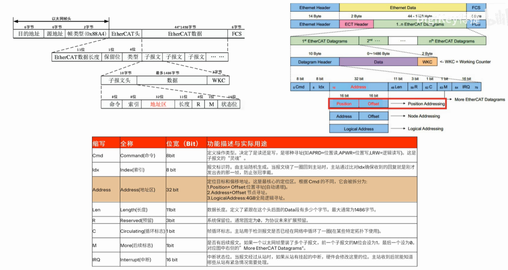

[教程](https://www.bilibili.com/video/BV1SrE96UEGn/?spm_id_from=333.337.search-card.all.click&vd_source=273e8027de9ebc54e86dafcb4ab3f434)
>帧速览
>

>ehterCAT其实有个很特殊的点，就是数据绕一圈会绕给主机，主机会通过这个绕回来的帧来判断从机的状态情况和执行情况，根据绕回来的帧来参与下一步的操作控制